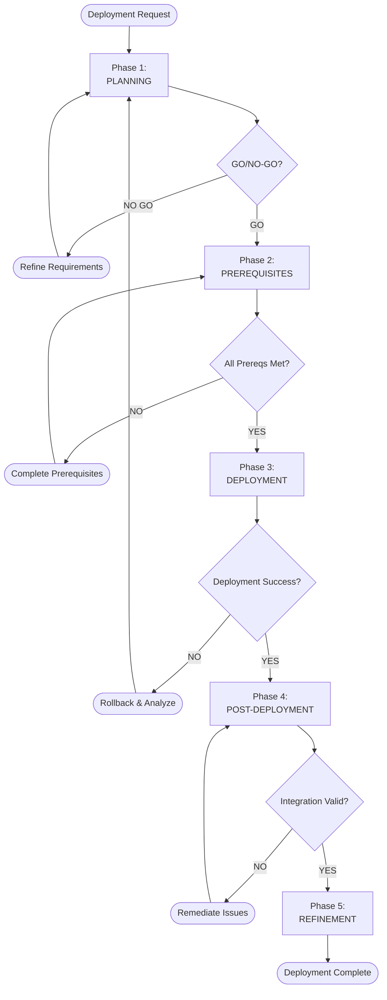
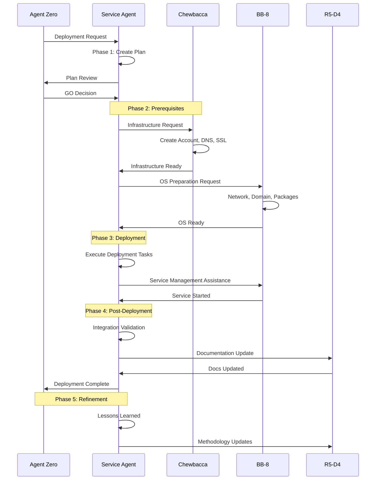

````markdown
# Hana-X Deployment Methodology

**Document Type**: Methodology  
**Created**: November 2, 2025  
**Topic**: Deployment Process & Procedures  
**Purpose**: Define standardized deployment procedures for Hana-X platform services  
**Classification**: Internal - Governance  

---

## Document Purpose

This methodology defines the **systematic process for deploying services** within the Hana-X AI Ecosystem. It provides the step-by-step framework that agents and team members follow to safely, consistently, and successfully deploy new services or update existing ones.

This document **assumes familiarity** with the governance framework and focuses specifically on the deployment process. It references—but does not repeat—information already documented in other governance materials.

---

## 1. Document Context & Prerequisites

### 1.1 Position in Governance Framework

This methodology is a **tier-2 operational document** that implements principles defined in tier-1 governance:

```
Tier 1: Foundational Governance
├── Hana-X Agent Constitution (supreme authority)
├── Hana-X Project Scope (strategic vision)
├── Hana-X Platform Nodes (infrastructure inventory)
└── Hana-X Ecosystem Architecture (system design)

Tier 2: Operational Methodology ← THIS DOCUMENT
└── HX Deployment Methodology (how we deploy)

Tier 3: Execution Artifacts (created during deployment)
├── Deployment Plans (service-specific)
├── Task Documentation (per-deployment)
└── Post-Deployment Reports (lessons learned)
```

### 1.2 Required Reading Before Deployment

**All agents participating in deployment MUST have read:**

1. **Hana-X Agent Constitution** - Understand quality principles, agent coordination, escalation protocols
2. **Hana-X Ecosystem Architecture** - Understand 6-layer architecture, integration patterns, security model
3. **Hana-X Platform Nodes** - Know the 30-server topology and current status

**Reference Locations:**
```
/<project-name>/0.0-governance/
├── hx-agent-constitution.md
├── hana_x_ecosystem_architecture_final.md
├── hana_x_platform_nodes_final.md
└── hana_x_project_scope_final.md
```

### 1.3 Authority & Precedence

**In case of conflict:**
1. Constitution (supreme authority)
2. Architecture (technical design decisions)
3. This Methodology (process guidance)

**If methodology guidance conflicts with Constitution:** Constitution wins. Update this methodology.

**If unsure:** Escalate per Constitution Section XV (Escalation Protocol).

---

## 2. Methodology Overview

### 2.1 The HX Deployment Approach

**Philosophy**: Plan extensively, execute methodically, validate continuously, learn iteratively.

**Core Characteristics:**
- **Task-Based**: Sequential steps with clear entry/exit criteria
- **Validated**: Each task includes validation before proceeding
- **Coordinated**: Multiple agents collaborate using Constitution protocols
- **Documented**: Real-time documentation, not post-facto
- **Iterative**: Each deployment improves the methodology

### 2.2 Deployment Phases



### 2.3 Agent Coordination Model

**Deployment involves multiple specialized agents:**

| Phase | Lead Agent | Supporting Agents | Coordination |
|-------|------------|-------------------|--------------|
| **Planning** | Service specialist | R5-D4 (docs), Architect (future) | Plan creation, template usage |
| **Prerequisites** | Service specialist | Chewbacca (infra), BB-8 (OS) | Serial handoffs per Constitution |
| **Deployment** | Service specialist | BB-8 (service management) | Coordination as needed |
| **Post-Deployment** | Service specialist | All relevant agents | Validation across layers |
| **Refinement** | Service specialist | R5-D4 (documentation) | Lessons learned capture |

**Coordination Protocol**: Follow Constitution Section X-XVIII (Inter-Agent Collaboration)

---

## 3. Phase 1: Planning

### 3.1 Objective

Create a **comprehensive deployment plan** before executing any commands. The plan serves as the contract between agents and provides the roadmap for execution.

### 3.2 Planning Inputs

**Required Information:**
- Service name and version
- Target server (from Platform Nodes document)
- Architecture layer assignment (from Architecture document)
- Integration requirements (APIs, databases, dependencies)
- Security requirements (auth, SSL, network)

**Reference Documents:**
- Platform Nodes: Which server? What's its current status?
- Architecture: Which layer? What integration patterns?
- Constitution: What quality standards apply?

### 3.3 Planning Outputs

**Deployment Plan Document Structure:**

```markdown
# [Service Name] Deployment Plan

## 1. Service Overview
- Name, version, purpose
- Target server and IP
- Architecture layer
- Dependencies

## 2. Prerequisites Checklist
- [ ] Infrastructure requirements (Chewbacca scope)
- [ ] OS requirements (BB-8 scope)
- [ ] Build/runtime dependencies
- [ ] Storage requirements
- [ ] Network/firewall requirements

## 3. Deployment Tasks
Task-by-task breakdown (10-20 tasks typical)

## 4. Validation Plan
How to verify success at each step

## 5. Rollback Procedure
How to safely undo if deployment fails

## 6. Integration Points
How this service connects to ecosystem

## 7. Post-Deployment Validation
End-to-end testing plan

## 8. Documentation Updates
What docs need updating after deployment
```

### 3.4 Task Template

**Each deployment task follows this structure:**

```markdown
### TASK-XX: [Task Name]

**Single Responsibility**: [One clear purpose]

**Prerequisites**:
- [What must be complete before this task]

**Agent Responsible**: [Primary agent for this task]

**Coordination Required**: [Other agents needed, if any]

**Implementation Steps**:
1. [Specific action]
2. [Specific action]
3. [Specific action]

**Validation**:
- [ ] [Check 1]
- [ ] [Check 2]
- [ ] [Check 3]

**Exit Criteria**:
- [What success looks like]

**Rollback**:
- [How to undo this task]

**Reference**: [Link to relevant Architecture section, if applicable]
```

### 3.5 GO/NO-GO Decision

**Before proceeding to Prerequisites phase:**

**Checklist:**
- [ ] Deployment plan complete and reviewed
- [ ] All prerequisites identified
- [ ] Coordination plan clear (which agents, what order)
- [ ] Rollback procedures documented
- [ ] Target server available and ready
- [ ] Agent Zero approval obtained

**If any item is NO:** Return to planning. Do not proceed.

---

## 4. Phase 2: Prerequisites

### 4.1 Objective

Ensure the environment is **ready to receive the deployment**. All dependencies, accounts, infrastructure, and configuration must be in place before deployment begins.

### 4.2 Standard Prerequisites Categories

#### 4.2.1 Infrastructure Foundation
**Agent Responsible**: Chewbacca (per Constitution Section V)

**Scope**:
- Domain service account creation
- DNS record configuration
- SSL/TLS certificate deployment

**Coordination**:
```
Service Agent → Chewbacca
Request: "I need infrastructure foundation for [service] on [server]"
- Service account: [name]@hx.dev.local
- DNS record: [hostname].hx.dev.local → [IP]
- SSL certificate: [hostname].hx.dev.local

Chewbacca → Service Agent
Deliverables:
- Service account created (credentials provided)
- DNS record active (verified)
- SSL certificate deployed (path provided)
```

**Reference**: Constitution Section V (Infrastructure Agent Supremacy)

#### 4.2.2 Operating System Preparation
**Agent Responsible**: BB-8 (per Constitution)

**Scope**:
- Network configuration (static IP, DNS, gateway)
- Domain join verification
- System packages and dependencies
- Storage/filesystem preparation
- Service configuration files

**Coordination**:
```
Service Agent → BB-8
Request: "I need OS preparation for [service] on [server]"
- Network: Verify configuration
- Domain: Verify join status
- Packages: [list of required packages]
- Storage: [disk space, mount points needed]

BB-8 → Service Agent
Deliverables:
- OS ready (all prereqs met)
- Verification results provided
```

**Reference**: Constitution Section X (Agent Coordination Matrix)

#### 4.2.3 Service-Specific Prerequisites
**Agent Responsible**: Service specialist (e.g., Yoda for Ollama, Poe for Redis)

**Scope**:
- Download/acquire source code or binaries
- Verify checksums and signatures
- Prepare configuration files
- Identify service-specific dependencies
- Review integration requirements

**Reference**: Architecture document for integration patterns

### 4.3 Prerequisites Validation

**Before proceeding to Deployment phase:**

**Validation Checklist:**
- [ ] Infrastructure foundation complete (Chewbacca confirms)
- [ ] OS preparation complete (BB-8 confirms)
- [ ] All dependencies available
- [ ] Configuration files prepared
- [ ] Integration endpoints verified
- [ ] No blockers or unresolved issues

**If any validation fails:** Do not proceed. Resolve the issue first.

---

## 5. Phase 3: Deployment

### 5.1 Objective

Execute the deployment plan **task by task**, validating after each step, until the service is operational.

### 5.2 Deployment Principles

**1. One Task at a Time**
- Complete task N fully before starting task N+1
- Validate task N before proceeding

**2. Validate Continuously**
- Run validation checks after every task
- Do not assume success—verify it

**3. Document in Real-Time**
- Update deployment log as you work
- Capture commands, outputs, decisions

**4. Coordinate Transparently**
- When calling another agent, document the handoff
- Wait for confirmation before proceeding

**5. Stop on Error**
- If validation fails twice, STOP
- Escalate per Constitution Section XV

### 5.3 Standard Deployment Task Sequence

**Typical tasks (adapt per service):**

1. **Environment Verification**: Confirm prereqs still valid
2. **Installation/Build**: Install from package, build from source, or extract binary
3. **Configuration**: Apply service-specific configuration
4. **Database Initialization**: If service has database/schema
5. **Service User/Permissions**: Apply ownership (using account from Chewbacca)
6. **Systemd Service Creation**: Create unit file, enable service
7. **Service Startup**: Start the service
8. **Smoke Test**: Basic functionality test (local access)
9. **Network Configuration**: Configure listen addresses, ports
10. **Integration Test**: Test connections to dependencies (databases, APIs)

**Reference Deployment Patterns**: See Section 8 (Deployment Patterns Library)

### 5.4 Validation at Each Task

**Every task must include validation:**

```bash
# Example: After starting a service

# Validation 1: Service Status
sudo systemctl status myservice

# Validation 2: Process Running
ps aux | grep myservice

# Validation 3: Port Listening
ss -tlnp | grep <port>

# Validation 4: Log Check
sudo journalctl -u myservice -n 50 --no-pager

# Validation 5: Smoke Test
curl http://localhost:<port>/health
```

**If any validation fails:**
- Attempt to diagnose (1-2 attempts)
- If unresolved, STOP and escalate

### 5.5 Rollback Triggers

**Execute rollback if:**
- Any critical task fails twice
- Service fails to start after configuration
- Integration tests reveal blocking issues
- Security validation fails
- Data corruption or loss risk identified

**Rollback Process:**
1. Stop the service (if running)
2. Execute rollback procedures (per deployment plan)
3. Restore previous state
4. Document what happened
5. Analyze root cause before retrying

---

## 6. Phase 4: Post-Deployment

### 6.1 Objective

Verify the service is **fully integrated** into the ecosystem and performing as expected.

### 6.2 Integration Verification

**Layer Integration Checks:**

**Layer 1 (Identity & Trust)**:
- [ ] Service authenticates against hx-dc-server
- [ ] TLS certificate valid and in use
- [ ] DNS resolution working

**Layer 2 (Model & Inference)** (if applicable):
- [ ] Service can reach LiteLLM gateway
- [ ] LLM requests successful
- [ ] Routing logic working

**Layer 3 (Data Plane)** (if applicable):
- [ ] Database connections successful
- [ ] Redis cache accessible
- [ ] Qdrant vector operations working

**Layer 4 (Agentic & Toolchain)** (if applicable):
- [ ] MCP endpoints responding
- [ ] Tool calls successful
- [ ] Worker nodes processing jobs

**Layer 5 (Application)** (if applicable):
- [ ] UI accessible through hx-ssl-server
- [ ] User authentication working
- [ ] AG-UI protocol functional (if using CopilotKit)

**Layer 6 (Integration & Governance)**:
- [ ] Service appears in monitoring (future)
- [ ] Logs accessible
- [ ] Documentation updated

### 6.3 End-to-End Testing

**Execute realistic workflows:**

Example for RAG service:
1. User submits query through UI
2. Query routed through LiteLLM
3. Vector search executed in Qdrant
4. Context retrieved
5. LLM generates response
6. Response returned to user

**Validation**: All steps complete without errors

### 6.4 Performance Validation

**Baseline Performance Checks:**
- Response times acceptable (< 5s for typical requests)
- Resource usage normal (CPU, memory, disk)
- No errors in logs
- Service stable over 15-minute observation

### 6.5 Documentation Updates

**Required Updates:**

1. **Platform Nodes Document**:
   - Update server status (⬜ → 🛠️ → ✅)
   - Add service details to server description

2. **Deployment Log**:
   - Final summary of deployment
   - Metrics (time, tasks, issues)
   - Success confirmation

3. **Service-Specific Documentation** (create):
   ```
   /<project-name>/deployments/[service-name]/
   ├── deployment-plan.md
   ├── deployment-log.md
   ├── configuration.md
   ├── operations-guide.md
   └── troubleshooting.md
   ```

4. **Architecture Document** (if needed):
   - Add new integration patterns discovered
   - Update diagrams if topology changed

5. **Governance Artifacts Update** (REQUIRED):
   - **Credentials**: Update `/srv/cc/Governance/0.2-credentials/hx-credentials.md` with:
     - New service account credentials
     - Database passwords
     - API keys or tokens
     - SSL certificate locations
   - **Infrastructure Procedures**: Add service-specific notes to `/srv/cc/Governance/0.3-infrastructure/` if needed:
     - LDAP integration specifics
     - DNS records created
     - SSL certificates deployed
   - **Service Operations**: Create service operations guide in `/srv/cc/Governance/0.4-service-operations/[service-name]-operations.md` with:
     - Start/stop procedures
     - Configuration management
     - Backup/restore procedures
     - Common troubleshooting steps
   - **Integration Matrix**: Update `/srv/cc/Governance/0.5-integrations/service-integration-matrix.md` with:
     - Upstream dependencies
     - Downstream consumers
     - Service endpoints
     - Integration protocols

---

## 7. Phase 5: Refinement

### 7.1 Objective

Capture **lessons learned** and improve the methodology for future deployments.

### 7.2 Post-Deployment Review

**Within 24 hours of deployment completion:**

**Retrospective Questions:**
1. What went well?
2. What was challenging?
3. What was unexpected?
4. What would we do differently?
5. What can be automated?
6. What documentation was missing or unclear?
7. What agent coordination issues arose?

### 7.3 Methodology Updates

**Identify improvements to:**
- Task templates (clarity, completeness)
- Coordination protocols (handoff efficiency)
- Validation procedures (thoroughness)
- Documentation standards (what's needed)
- Tool usage (scripts, automation)

**Process:**
1. Document proposed changes
2. Review with Agent Zero
3. Update methodology (this document)
4. Update version number
5. Communicate changes to all agents

### 7.4 Knowledge Transfer

**Capture for future deployments:**

**New Deployment Pattern:**
If this deployment introduced a new pattern (e.g., first MCP server, first container), document it as a reusable pattern in Section 8 (Deployment Patterns Library).

**New Integration Pattern:**
If service integration revealed new patterns, document in Architecture document and reference from this methodology.

**New Agent Coordination Pattern:**
If agent handoffs required new coordination, document in Constitution and reference from this methodology.

---

## 8. Agent Coordination Patterns

### 8.1 Standard Deployment Coordination Flow



### 8.2 Coordination Guidelines

**When to Call Another Agent:**

| Need | Call Agent | Section Reference |
|------|------------|-------------------|
| Domain accounts, DNS, SSL | Chewbacca | Constitution Section V |
| OS config, packages, services | BB-8 | Constitution Section X |
| Documentation, file organization | R5-D4 | Constitution Section X |
| Uncertain after 2 attempts | Agent Zero | Constitution Section XV |

**Communication Protocol:**
- Use standard format from Constitution Section XVI
- Provide complete context
- Wait for confirmation
- Document the interaction

**Handoff Best Practices:**
- Clear, specific requests
- Complete context provided
- Success criteria defined
- Verification method specified

---

## 9. Deployment Patterns Library

### 9.1 Pattern 1: Package-Based Deployment

**Example**: Most system services (Redis, PostgreSQL from packages)

**Characteristics**:
- Service available in package manager
- Standard installation path
- Systemd unit file included
- Configuration in `/etc/[service]/`

**Typical Steps**:
1. Add repository (if needed)
2. `apt update && apt install [package]`
3. Configure in `/etc/[service]/`
4. `systemctl enable [service]`
5. `systemctl start [service]`
6. Validate

**Pros**: Simple, reliable, well-supported  
**Cons**: Version may lag upstream

---

### 9.2 Pattern 2: Source-Based Deployment

**Example**: PostgreSQL (compiled from source for latest version)

**Characteristics**:
- Download source tarball
- Compile with specific options
- Custom installation path
- Manual systemd unit creation

**Typical Steps**:
1. Install build dependencies
2. Download and verify source
3. `./configure --prefix=/usr/local/[service]`
4. `make && make install`
5. Create systemd unit file
6. Configure service
7. `systemctl enable && start`
8. Validate

**Pros**: Latest version, custom options  
**Cons**: More complex, requires build tools

---

### 9.3 Pattern 3: Binary Deployment

**Example**: Qdrant (pre-compiled binary)

**Characteristics**:
- Download binary release
- Extract to target directory
- Create systemd unit file
- Minimal dependencies

**Typical Steps**:
1. Download binary from GitHub/website
2. Verify checksum
3. Extract to `/usr/local/bin/` or `/opt/[service]/`
4. Set permissions
5. Create systemd unit file
6. Configure (config file or environment vars)
7. `systemctl enable && start`
8. Validate

**Pros**: No compilation, fast deployment  
**Cons**: Specific to architecture (amd64, arm64)

---

### 9.4 Pattern 4: Container Deployment

**Example**: Future containerized services

**Characteristics**:
- Pull container image
- Docker/Podman runtime
- Volume mounts for persistence
- Network configuration

**Typical Steps**:
1. Ensure container runtime installed
2. `docker pull [image]` or `podman pull [image]`
3. Create volume mounts
4. Create container with config
5. `docker/podman start [container]`
6. Validate

**Pros**: Isolation, portability, consistency  
**Cons**: Additional runtime layer

**Status**: Methodology for containers evolving as we gain experience

---

### 9.5 Pattern 5: MCP Server Deployment

**Example**: Docling MCP, Crawl4AI MCP, QMCP

**Characteristics**:
- Python-based MCP servers
- Virtual environment for dependencies
- Systemd unit with environment activation
- Integration with FastMCP gateway (optional)

**Typical Steps**:
1. Create Python virtual environment
2. Install MCP server package
3. Create configuration file
4. Create systemd unit file (activates venv)
5. `systemctl enable && start`
6. Test MCP protocol endpoints
7. Register with FastMCP (if using gateway)
8. Validate tool calls

**Special Considerations**:
- MCP protocol compliance testing
- Tool discovery verification
- Integration with LiteLLM (tool call brokering)

**Reference**: Architecture Section 3.3 (MCP Integration Backbone)

---

## 10. Living Document

### 10.1 Growth Model

This methodology is a **living document** that evolves with the project:

**When This Document Grows:**
- New deployment pattern discovered → Add to Section 8
- New agent coordination pattern → Add to Section 7
- New prerequisite category → Add to Section 4
- New validation technique → Add to Section 5

**When This Document References New Documents:**
- New governance doc created → Add to Section 1.2
- New architecture pattern documented → Add references throughout
- New operational runbook created → Link from relevant sections

### 10.2 Update Process

**After Each Deployment:**
1. Service agent captures lessons learned
2. Agent Zero reviews proposed changes
3. R5-D4 updates methodology document
4. Version number incremented
5. All agents notified of changes

**Major Updates** (new patterns, significant changes):
- Increment major version (e.g., 1.x → 2.0)
- Document in version history

**Minor Updates** (clarifications, small additions):
- Increment minor version (e.g., 1.2 → 1.3)
- Document in version history

### 10.3 Future Additions

**Planned Sections** (to be added as we gain experience):

**Section 11: Container Orchestration** (when we deploy Kubernetes/Docker Swarm)  
**Section 12: High Availability Patterns** (when we implement HA)  
**Section 13: Backup & Recovery** (standardized procedures)  
**Section 14: Monitoring Integration** (when hx-metric-server deployed)  
**Section 15: CI/CD Pipeline** (automated deployments)

---

## 11. Quick Reference

### 11.1 Pre-Deployment Checklist

**Before starting any deployment:**

- [ ] Deployment plan created and reviewed
- [ ] Target server identified (from Platform Nodes doc)
- [ ] Architecture layer assigned (from Architecture doc)
- [ ] Prerequisites identified (infra, OS, service-specific)
- [ ] Agent coordination plan clear
- [ ] Rollback procedures documented
- [ ] Agent Zero approval obtained

### 11.2 During Deployment Checklist

**For each task:**

- [ ] Prerequisites met
- [ ] Implementation steps clear
- [ ] Execute task
- [ ] Run validation checks
- [ ] Document results
- [ ] Verify exit criteria met

### 11.3 Post-Deployment Checklist

**After deployment complete:**

- [ ] Service operational
- [ ] Integration tests passed
- [ ] Performance acceptable
- [ ] Documentation updated (Platform Nodes, service docs)
- [ ] Deployment log completed
- [ ] Lessons learned captured
- [ ] Methodology updates identified

### 11.4 Critical Checkpoints

**STOP points - do not proceed if:**

- [ ] Any GO/NO-GO decision is NO
- [ ] Any prerequisite validation fails
- [ ] Any deployment task fails twice
- [ ] Any rollback trigger activated
- [ ] Any integration test fails
- [ ] Agent Zero intervention required

**At each STOP point**: Diagnose, resolve, or escalate. Never proceed with failures.

---

## 12. Metrics & Success Criteria

### 12.1 Deployment Success Metrics

**A deployment is successful when:**

✅ **Functional**: Service operational and responding correctly  
✅ **Integrated**: All ecosystem integration points verified  
✅ **Validated**: All validation checks passed  
✅ **Documented**: All required documentation complete and accurate  
✅ **Stable**: Service stable for 24 hours post-deployment  

### 12.2 Quality Metrics

**Track for continuous improvement:**

| Metric | Target | Measurement |
|--------|--------|-------------|
| Deployment Success Rate | 100% | Successful deployments / Total attempts |
| Average Deployment Time | Varies by service | Planning start → Post-deployment complete |
| Rollback Rate | < 5% | Rollbacks / Total deployments |
| Rework Rate | 0% | Services requiring immediate fixes |
| Agent Coordination Efficiency | High | Handoff time, clarity of communication |
| Documentation Quality | Complete | All required docs present and accurate |

### 12.3 Methodology Effectiveness

**Indicators the methodology is working:**

- Deployments complete without surprises
- Agent coordination smooth and predictable
- Issues caught early (in planning or prerequisites)
- Rollbacks are clean and successful (when needed)
- Each deployment faster/smoother than previous
- Lessons learned actively incorporated

---

## 13. Escalation & Support

### 13.1 When to Escalate

**Escalate to Agent Zero when:**

- Unable to resolve issue after 2 attempts (per Constitution)
- Multiple agents disagree on approach
- Deployment reveals architectural issue
- Security concern identified
- Major deviation from plan required
- Uncertain about proper procedure

**Reference**: Constitution Section XV (Escalation Protocol)

### 13.2 Escalation Format

```markdown
TO: Agent Zero
FROM: [Service Agent]
RE: Escalation - [Service] Deployment

SITUATION:
[Clear description of the issue]

ATTEMPTED:
1. [What was tried]
2. [What was tried]

RESULTS:
[Why attempts did not resolve issue]

REQUEST:
[Specific guidance or decision needed]

IMPACT:
[What's blocked, severity, urgency]
```

---

## 14. Version History

| Version | Date | Changes | Notes |
|---------|------|---------|-------|
| 1.0 | 2025-11-02 | Initial methodology aligned with governance framework | Clean foundation, references Constitution, Scope, Platform Nodes, Architecture |

---

## 15. Summary: The HX Deployment Way

**Systematic → Coordinated → Validated → Documented → Refined**

### Core Principles:

1. **Read the Governance First** - Constitution, Architecture, Platform Nodes
2. **Plan Before Executing** - Framework before commands
3. **Coordinate Transparently** - Follow Constitution protocols
4. **Validate Continuously** - After every task
5. **Document in Real-Time** - Not post-facto
6. **Stop on Failure** - Never push through errors
7. **Learn from Each Deployment** - Improve the methodology
8. **Reference, Don't Repeat** - Leverage governance documents
9. **Agent Collaboration** - Multiple agents, one team
10. **Quality Always** - Per Constitution Principle I

### The Formula:

```
Quality Deployment = 
    (Thorough Planning) 
    × (Agent Coordination) 
    × (Continuous Validation) 
    × (Real-Time Documentation)
    × (Iterative Learning)
```

**"Follow the governance, coordinate with peers, validate every step."**

---

**Version**: 1.1  
**Maintained By**: Hana-X Governance Team  
**Related Documents**:  
- [Agent Constitution](../../0.1-agents/hx-agent-constitution.md)  
- [Project Scope](./0.0.1.1-project-scope.md)  
- [Ecosystem Architecture](../0.0.2-Architecture/0.0.2.1-ecosystem-architecture.md)  
- [Platform Nodes](../0.0.2-Architecture/0.0.2.2-platform-nodes.md)  
- [Work Methodology](./0.0.1.3-work-methodology.md)  
**Classification**: Internal - Governance  
**Status**: LIVING DOCUMENT  
**Last Review**: November 6, 2025

---

**End of HX Deployment Methodology**

````

---

**Document Status**: LIVING DOCUMENT - Will Evolve with Project  
**Next Update**: After next deployment  
**Methodology Version**: 1.1  
**Framework Status**: Aligned with all governance documents ✅

---

**Location**: `/<project-name>/0.0-governance/hx-deployment-methodology_final.md`  

**Cross-References**:
- Hana-X Agent Constitution
- Hana-X Project Scope (Final)
- Hana-X Platform Nodes (Final)
- Hana-X Ecosystem Architecture (Final)

---

**End of HX Deployment Methodology**
