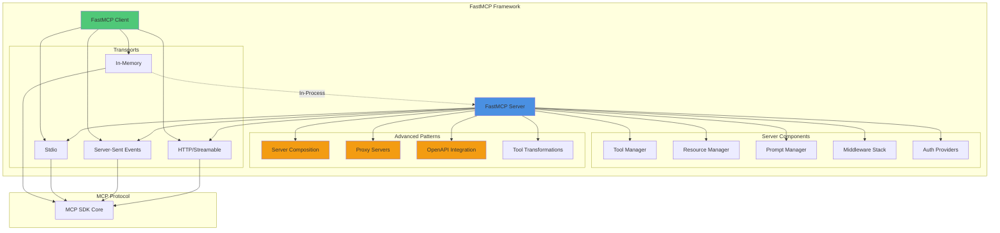
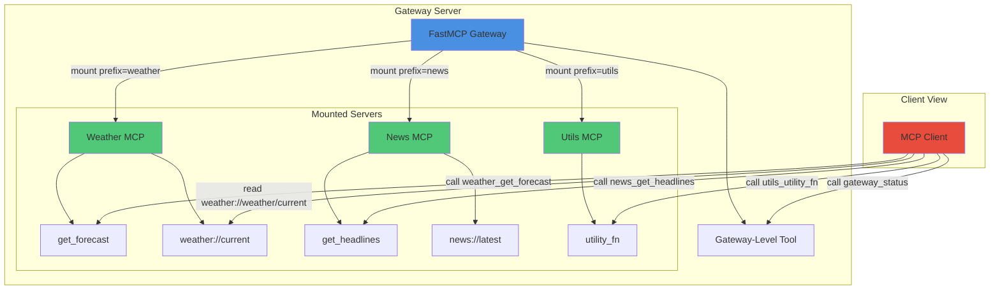
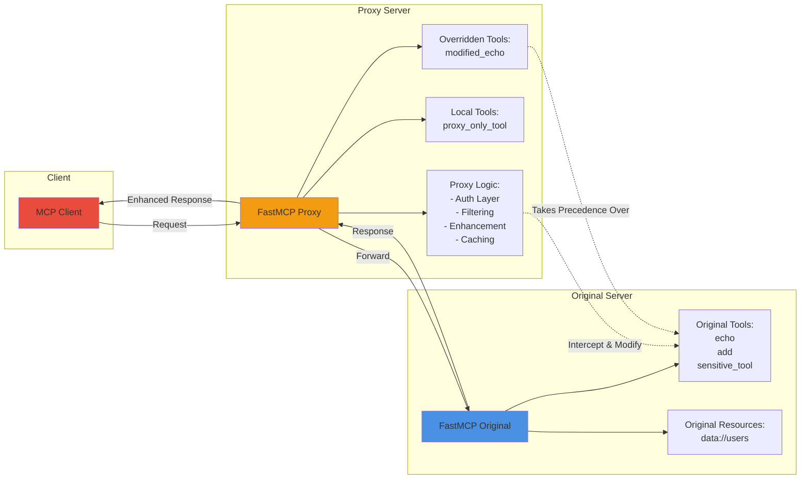
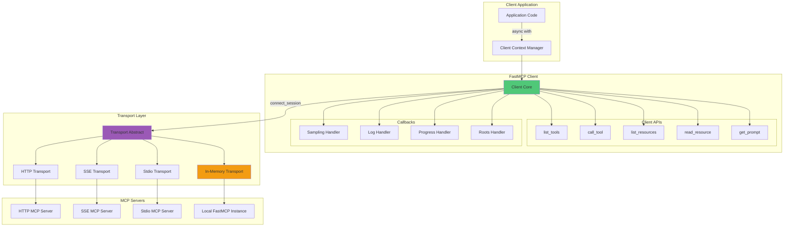
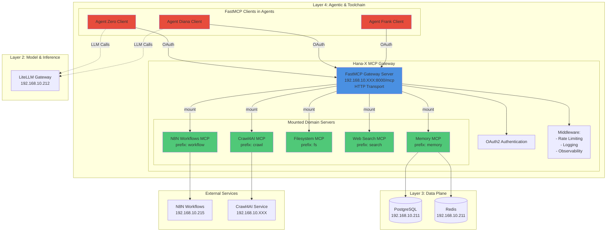

# FastMCP Capabilities Analysis

**Document Version**: 1.0
**Date**: 2025-11-06
**Author**: Agent Alex Rivera (Platform Architect)
**Source Repository**: `/srv/knowledge/vault/fastmcp-main`
**Purpose**: Authoritative knowledge source for FastMCP integration within Hana-X Layer 4 (Agentic & Toolchain)

---

## Executive Summary

FastMCP is a production-ready Python framework for building Model Context Protocol (MCP) servers and clients. It extends the official MCP SDK with advanced patterns for server composition, proxying, OpenAPI integration, enterprise authentication, and comprehensive testing capabilities. FastMCP v2.0 provides the complete ecosystem needed for MCP-based agentic applications in production environments.

**Key Capabilities**:
- **Server Framework**: Pythonic interface for creating MCP servers with tools, resources, and prompts
- **Client Library**: Full-featured client supporting multiple transports (HTTP, SSE, Stdio, In-Memory)
- **Server Composition**: Mount and compose multiple MCP servers into unified gateways
- **Proxy Servers**: Create intermediary servers that wrap and extend existing MCP servers
- **OpenAPI/FastAPI Integration**: Generate MCP servers from OpenAPI specs or FastAPI apps
- **Enterprise Authentication**: OAuth2 support (Google, GitHub, Azure, WorkOS, Auth0, etc.)
- **Transport Flexibility**: Stdio, HTTP, SSE, and in-memory transports for all deployment scenarios
- **Testing Framework**: In-memory testing with FastMCPTransport eliminates process management overhead

**Hana-X Integration Context**: FastMCP serves as the foundational library for Layer 4 (Agentic & Toolchain) MCP server development and orchestration, enabling the FastMCP Gateway pattern for unified tool access across the platform.

---

## 1. Architecture Overview

### 1.1 Core Components

FastMCP architecture consists of five primary subsystems:

```
┌─────────────────────────────────────────────────────────────────┐
│                        FastMCP Framework                        │
├─────────────────────────────────────────────────────────────────┤
│                                                                 │
│  ┌──────────────┐  ┌──────────────┐  ┌──────────────┐         │
│  │   FastMCP    │  │    Client    │  │  Transports  │         │
│  │    Server    │  │   Library    │  │   (Stdio/    │         │
│  │              │  │              │  │   HTTP/SSE)  │         │
│  └──────┬───────┘  └──────┬───────┘  └──────┬───────┘         │
│         │                 │                 │                  │
│  ┌──────▼──────────────────▼─────────────────▼─────────┐       │
│  │           Component Management Layer                │       │
│  │  - ToolManager      - ResourceManager              │       │
│  │  - PromptManager    - Middleware System            │       │
│  └─────────────────────────────────────────────────────┘       │
│                                                                 │
│  ┌─────────────────────────────────────────────────────┐       │
│  │              Advanced Patterns Layer                │       │
│  │  - Server Composition (mount/import_server)        │       │
│  │  - Proxy Servers (FastMCPProxy)                    │       │
│  │  - OpenAPI Integration (from_openapi/from_fastapi) │       │
│  │  - Tool Transformations                            │       │
│  └─────────────────────────────────────────────────────┘       │
│                                                                 │
│  ┌─────────────────────────────────────────────────────┐       │
│  │             Enterprise Features Layer               │       │
│  │  - OAuth2 Providers (9+ providers)                 │       │
│  │  - Dynamic Client Registration (DCR)               │       │
│  │  - Bearer Token Auth                               │       │
│  │  - Rate Limiting & Middleware                      │       │
│  └─────────────────────────────────────────────────────┘       │
│                                                                 │
└─────────────────────────────────────────────────────────────────┘
                            │
                            ▼
                   ┌─────────────────┐
                   │  MCP Protocol   │
                   │  (Official SDK) │
                   └─────────────────┘
```

### 1.2 Module Structure

The FastMCP codebase is organized into functional domains:

**Source Structure** (`/srv/knowledge/vault/fastmcp-main/src/fastmcp/`):
- `server/` - Server implementation, HTTP handlers, auth, middleware, proxy, OpenAPI
- `client/` - Client implementation, transports, auth, callbacks
- `tools/` - Tool management, transformation, serialization
- `resources/` - Resource management, templates, file resources
- `prompts/` - Prompt management and rendering
- `utilities/` - Shared utilities (types, logging, JSON schema, MCP config)
- `cli/` - Command-line interface for running servers
- `contrib/` - Community contributions and integrations
- `experimental/` - Experimental features (new OpenAPI engine, etc.)

**Test Structure**: 148 test files covering:
- Component tests (tools, resources, prompts)
- Server patterns (proxy, composition, middleware)
- Client tests (transports, auth, callbacks)
- OpenAPI integration (parameter serialization, route mapping)
- Examples validation

---

## 2. Core Capabilities

### 2.1 FastMCP Server

The `FastMCP` class is the central object for building MCP applications.

**Initialization**:
```python
from fastmcp import FastMCP

mcp = FastMCP(
    name="MyServer",                      # Server name
    instructions="Server description",     # Optional instructions
    version="1.0.0",                      # Semantic version
    auth=None,                            # AuthProvider or None
    middleware=[],                        # Middleware stack
    lifespan=None,                        # Async context manager for lifecycle
    dependencies=[],                      # Python dependencies for deployment
    resource_prefix_format="protocol",    # URI prefix format
    mask_error_details=False,            # Error masking for production
    tool_serializer=None,                # Custom serializer for tool returns
    include_tags=None,                   # Filter by tags (whitelist)
    exclude_tags=None,                   # Filter by tags (blacklist)
    on_duplicate_tools="warn",           # Behavior: warn/error/replace/ignore
    on_duplicate_resources="warn",
    on_duplicate_prompts="warn"
)
```

**Key Server Methods**:
- `mcp.tool(fn)` - Decorator to register tools
- `mcp.resource(uri)(fn)` - Decorator to register resources
- `mcp.prompt(fn)` - Decorator to register prompts
- `mcp.mount(server, prefix)` - Live mount of sub-server
- `mcp.import_server(server, prefix)` - Static copy of sub-server
- `mcp.run(transport="stdio")` - Run server with specified transport
- `mcp.as_proxy(target)` - Create proxy wrapping another server
- `mcp.from_openapi(spec, client)` - Generate server from OpenAPI spec
- `mcp.from_fastapi(app, client)` - Generate server from FastAPI app

### 2.2 Tools

Tools allow LLMs to execute actions via Python functions.

**Basic Tool Registration**:
```python
@mcp.tool
def add(a: int, b: int) -> int:
    """Add two numbers together."""
    return a + b

@mcp.tool
async def async_operation(url: str) -> dict:
    """Perform async operation."""
    async with httpx.AsyncClient() as client:
        response = await client.get(url)
        return response.json()
```

**Tool Features**:
- Automatic schema generation from type hints and docstrings
- Sync and async function support
- Complex return types (text, JSON, images, audio via media helpers)
- Error handling with `ToolError` exceptions
- Tags for categorization and filtering
- Enable/disable functionality
- Custom serializers for non-JSON types

**Advanced Tool Options**:
```python
@mcp.tool(
    name="custom_name",           # Override function name
    description="Description",    # Override docstring
    enabled=True,                # Enable/disable
    tags={"category1", "tag2"},  # Categorization
    annotations={}               # MCP annotations
)
def tool_function(param: str) -> str:
    return param
```

**Tool Transformations**:
```python
# Apply transformations to modify tool behavior
mcp.add_tool_transformation(
    "original_tool_name",
    ToolTransformConfig(
        name="new_tool_name",
        description="New description",
        # ... other overrides
    )
)
```

### 2.3 Resources and Resource Templates

Resources expose read-only data sources (conceptually like GET endpoints).

**Static Resources**:
```python
@mcp.resource(uri="config://version")
def get_version() -> str:
    """Return the application version."""
    return "2.0.1"

@mcp.resource(uri="data://users")
async def get_users() -> list[dict]:
    """Return all users."""
    return [{"id": 1, "name": "Alice"}, {"id": 2, "name": "Bob"}]
```

**Dynamic Resource Templates** (parameterized URIs):
```python
@mcp.resource(uri="users://{user_id}/profile")
def get_profile(user_id: int) -> dict:
    """Fetch user profile by ID."""
    return database.get_user_profile(user_id)

# Client reads: "users://123/profile"
# Calls: get_profile(user_id=123)
```

**File Resources**:
```python
from fastmcp.resources import FileResource

# Single file
mcp.add_resource(FileResource(uri="file:///path/to/file.txt"))

# Directory of files
mcp.add_resource(FileResource(uri="files://project/", path="/path/to/dir"))
```

**Resource Features**:
- URI-based addressing with custom protocols
- Parameter extraction from URI templates with `{placeholders}`
- Sync and async support
- Tags and metadata
- Enable/disable functionality
- Auto-detection of MIME types for file resources

### 2.4 Prompts

Prompts define reusable message templates for LLM interactions.

**Basic Prompts**:
```python
@mcp.prompt
def summarize_request(text: str) -> str:
    """Generate a prompt asking for a summary."""
    return f"Please summarize the following text:\n\n{text}"

@mcp.prompt
def code_review(language: str, code: str) -> str:
    """Generate code review prompt."""
    return f"Review this {language} code:\n\n```{language}\n{code}\n```"
```

**Advanced Prompts** (returning Message objects):
```python
from fastmcp import Message

@mcp.prompt
def multi_turn_prompt(topic: str) -> list[Message]:
    """Generate multi-turn conversation."""
    return [
        Message(role="system", content="You are a helpful assistant."),
        Message(role="user", content=f"Tell me about {topic}"),
    ]
```

**Prompt Features**:
- String or Message return types
- Parameter extraction from prompt arguments
- Tags and metadata
- Enable/disable functionality
- Automatic schema generation for prompt arguments

### 2.5 Context Object

The `Context` object provides access to MCP session capabilities within tools, resources, and prompts.

**Context Injection**:
```python
from fastmcp import Context

@mcp.tool
async def process_data(uri: str, ctx: Context):
    """Process data with context access."""

    # Logging to client
    await ctx.info(f"Processing {uri}...")
    await ctx.error("Error occurred") if error else None
    await ctx.debug("Debug info")

    # Read resources on the server
    resource_data = await ctx.read_resource(uri)

    # Request LLM completions from client
    summary = await ctx.sample(
        messages=[{"role": "user", "content": f"Summarize: {resource_data.content[:500]}"}],
        max_tokens=100
    )

    # Progress reporting
    await ctx.report_progress(50, "Halfway done")

    # HTTP requests
    response = await ctx.http_request("GET", "https://api.example.com/data")

    return summary.text
```

**Context Capabilities**:
- **Logging**: `ctx.info()`, `ctx.error()`, `ctx.warning()`, `ctx.debug()`, `ctx.critical()`
- **LLM Sampling**: `ctx.sample()` - Request completions from client's LLM
- **Resource Access**: `ctx.read_resource()` - Access server resources
- **Progress Reporting**: `ctx.report_progress()` - Report progress to client
- **HTTP Requests**: `ctx.http_request()` - Make HTTP requests via MCP
- **Session Info**: Access to session metadata and client capabilities

---

## 3. Server Composition Patterns

### 3.1 Mounting Servers (Live Link)

`mcp.mount()` creates a live link to another FastMCP server, allowing dynamic composition.

**Pattern**:
```python
# Sub-application 1
weather_app = FastMCP("Weather App")

@weather_app.tool
def get_forecast(location: str) -> str:
    return f"Sunny in {location}"

@weather_app.resource(uri="weather://current")
def current_weather():
    return {"temp": 72, "conditions": "sunny"}

# Sub-application 2
news_app = FastMCP("News App")

@news_app.tool
def get_headlines() -> list[str]:
    return ["Headline 1", "Headline 2"]

# Main application
gateway = FastMCP("Gateway")

# Mount with prefixes
gateway.mount(server=weather_app, prefix="weather")
gateway.mount(server=news_app, prefix="news")

# Native gateway tool
@gateway.tool
def gateway_status() -> str:
    return "Gateway operational"
```

**Mounted Component Addressing**:
- **Tools**: Prefixed by mount prefix: `weather_get_forecast`, `news_get_headlines`
- **Resources**: URI netloc becomes prefix: `weather://weather/current`
- **Prompts**: Prefixed like tools

**Characteristics**:
- **Live Link**: Changes to sub-servers reflect immediately
- **Shared State**: Sub-servers maintain their own state
- **Dynamic**: Can mount/unmount at runtime (with care)
- **Use Case**: Microservice composition, plugin architectures

### 3.2 Importing Servers (Static Copy)

`mcp.import_server()` creates a static copy of components from another server.

**Pattern**:
```python
# Source server
source_app = FastMCP("Source")

@source_app.tool
def utility_function() -> str:
    return "Utility output"

# Destination server
dest_app = FastMCP("Destination")

# Import all components with prefix
dest_app.import_server(server=source_app, prefix="util")

# Tool is now: util_utility_function
# Changes to source_app DO NOT affect dest_app
```

**Characteristics**:
- **Static Copy**: Snapshot taken at import time
- **Independence**: Source and destination servers are decoupled
- **Performance**: No indirection overhead
- **Use Case**: Shared component libraries, template servers

### 3.3 Composition Use Cases in Hana-X

**FastMCP Gateway Pattern** (recommended for Hana-X):
```python
from fastmcp import FastMCP

# Layer 4 Gateway Server
hx_gateway = FastMCP(
    "Hana-X MCP Gateway",
    instructions="Unified MCP tool access for Hana-X agents"
)

# Mount domain-specific servers
hx_gateway.mount(server=crawl4ai_server, prefix="crawl")     # Web crawling tools
hx_gateway.mount(server=memory_server, prefix="memory")      # Memory operations
hx_gateway.mount(server=filesystem_server, prefix="fs")      # File operations
hx_gateway.mount(server=web_search_server, prefix="search")  # Web search
hx_gateway.mount(server=n8n_server, prefix="workflow")       # N8N workflows

# Gateway-level tools
@hx_gateway.tool
def list_available_domains() -> list[str]:
    """List all mounted MCP domains."""
    return ["crawl", "memory", "fs", "search", "workflow"]

# Run gateway on HTTP transport
hx_gateway.run(transport="http", host="192.168.10.XXX", port=8000)
```

**Benefits for Hana-X**:
- **Unified Interface**: Single MCP endpoint for all agents
- **Modular Development**: Each domain server developed independently
- **Selective Access**: Mount/unmount servers based on agent permissions
- **Testing**: Test domain servers in isolation before gateway integration
- **Scalability**: Add new capabilities by mounting new servers

---

## 4. Proxy Servers

### 4.1 Proxy Server Pattern

`FastMCP.as_proxy()` creates a proxy server that wraps another MCP server, enabling interception, modification, and extension of server capabilities.

**Basic Proxy**:
```python
from fastmcp import FastMCP

# Original server
original_server = FastMCP("Original")

@original_server.tool
def echo(message: str) -> str:
    return f"Echo: {message}"

# Create proxy
proxy_server = FastMCP.as_proxy(original_server, name="Proxy")

# Proxy forwards all original server capabilities
# Client -> Proxy -> Original
```

**Proxy with URL**:
```python
# Proxy a remote server
proxy = FastMCP.as_proxy("http://remote-server.example.com/mcp")

# Clients connect to proxy, which forwards to remote server
```

**Proxy with Transport Bridging**:
```python
from fastmcp.client import FastMCPTransport

# Bridge Stdio to HTTP
proxy = FastMCP.as_proxy(
    FastMCPTransport(local_stdio_server),
    name="HTTP Bridge"
)

# Run proxy with HTTP transport
proxy.run(transport="http", host="0.0.0.0", port=8000)

# Clients can now access Stdio server via HTTP
```

### 4.2 Proxy Capabilities

**Interception and Modification**:
```python
proxy = FastMCP.as_proxy(original_server)

# Override specific tools
@proxy.tool
def echo(message: str, extra: str = "") -> str:
    """Override echo with additional parameter."""
    return f"Proxied Echo: {message} {extra}"

# Add new tools
@proxy.tool
def proxy_only_tool() -> str:
    """Tool only available on proxy."""
    return "Proxy-specific functionality"

# Original echo is overridden, proxy_only_tool is added
```

**Mirrored Components**:
- Components from proxied server are "mirrored" (read-only references)
- Mirrored components cannot be modified directly (raises `RuntimeError`)
- Use `component.copy()` to create local modifiable copy
- Local copies take precedence over mirrored components

**Proxy Component Precedence**:
1. **Local Components**: Defined directly on proxy server
2. **Mirrored Components**: Forwarded from proxied server
3. **Disabled Local**: Local disabled components hide mirrored ones

**Example - Selective Tool Disabling**:
```python
proxy = FastMCP.as_proxy(original_server)

# Get mirrored tool
tools = await proxy.get_tools()
mirrored_tool = tools["sensitive_tool"]

# Create local copy and disable
local_tool = mirrored_tool.copy()
proxy.add_tool(local_tool)
local_tool.disable()

# "sensitive_tool" is now hidden from clients
```

### 4.3 Proxy Use Cases

**Transport Bridging**:
- Stdio → HTTP: Expose local servers to network
- Remote SSE → Local Stdio: Integrate cloud servers locally
- In-Memory → HTTP: Testing and development

**Security Layer**:
- Add authentication to unauthenticated servers
- Filter or disable sensitive tools
- Audit and log all tool calls
- Rate limiting and access control

**Enhancement Layer**:
- Add caching to expensive operations
- Aggregate multiple servers
- Transform tool schemas or outputs
- Add monitoring and observability

**Hana-X Proxy Scenarios**:
- **Agent-Specific Filtering**: Create per-agent proxies with different tool subsets
- **Security Zones**: Proxy servers in different zones with zone-appropriate tools
- **Observability**: Centralized logging proxy for all MCP interactions
- **Development/Production**: Development proxy with debug tools, production proxy without

---

## 5. Client Capabilities

### 5.1 FastMCP Client

The `Client` class provides programmatic access to any MCP server.

**Basic Client Usage**:
```python
from fastmcp import Client

async def main():
    # Connect to server (auto-detects transport)
    async with Client("http://localhost:8000/mcp") as client:

        # List available tools
        tools = await client.list_tools()
        print(f"Tools: {[t.name for t in tools]}")

        # Call a tool
        result = await client.call_tool("add", {"a": 5, "b": 3})
        print(f"Result: {result.content[0].text}")

        # List resources
        resources = await client.list_resources()

        # Read a resource
        resource_data = await client.read_resource("config://version")
        print(f"Version: {resource_data[0].text}")

        # Get a prompt
        prompt = await client.get_prompt("summarize", {"text": "Long text..."})
        print(f"Prompt: {prompt.messages[0].content.text}")
```

**Client Initialization Options**:
```python
client = Client(
    transport,                    # Transport specification
    roots=None,                   # Filesystem roots for server access
    sampling_handler=None,        # Handler for LLM sampling requests
    log_handler=None,            # Handler for log messages
    message_handler=None,        # Handler for protocol messages
    progress_handler=None,       # Handler for progress notifications
    timeout=None,                # Request timeout (seconds or timedelta)
    init_timeout=None            # Initialization timeout
)
```

### 5.2 Transport Types

FastMCP Client supports multiple transport mechanisms.

**HTTP/Streamable HTTP** (recommended for network deployments):
```python
from fastmcp.client import StreamableHttpTransport

transport = StreamableHttpTransport(
    url="http://192.168.10.212:8000/mcp",
    headers={"X-Custom": "value"},
    auth=None  # or OAuth/BearerAuth
)

async with Client(transport) as client:
    tools = await client.list_tools()
```

**SSE (Server-Sent Events)**:
```python
from fastmcp.client import SSETransport

transport = SSETransport(
    url="http://example.com/sse",
    headers={},
    auth=None,
    sse_read_timeout=300  # seconds
)

async with Client(transport) as client:
    ...
```

**Stdio** (for local command-line servers):
```python
from fastmcp.client import StdioTransport, PythonStdioTransport

# Generic stdio
transport = StdioTransport(command="python", args=["server.py"])

# Python-specific
transport = PythonStdioTransport(script_path="server.py")

# Node-specific
from fastmcp.client import NodeStdioTransport
transport = NodeStdioTransport(script_path="server.js")

# Uvx-specific (for packaged servers)
from fastmcp.client import UvxStdioTransport
transport = UvxStdioTransport(package="fastmcp-server")

async with Client(transport) as client:
    ...
```

**FastMCPTransport** (in-memory, for testing):
```python
from fastmcp.client import FastMCPTransport

# Connect directly to FastMCP server instance
server = FastMCP("Test Server")

@server.tool
def test_tool() -> str:
    return "test"

transport = FastMCPTransport(server)

async with Client(transport) as client:
    # No process spawning, no network overhead
    result = await client.call_tool("test_tool", {})
```

**Auto-Detection**:
```python
# Client auto-detects transport from argument type

# URL string -> StreamableHttpTransport
client = Client("http://localhost:8000/mcp")

# Path to script -> PythonStdioTransport
client = Client("./server.py")

# FastMCP instance -> FastMCPTransport
client = Client(server_instance)

# MCPConfig dict -> MCPConfigTransport (multi-server)
client = Client({"mcpServers": {...}})
```

### 5.3 Multi-Server Client

The Client can connect to multiple servers simultaneously using MCP configuration format.

**MCP Config Pattern**:
```python
config = {
    "mcpServers": {
        "weather": {
            "url": "https://weather-api.example.com/mcp"
        },
        "assistant": {
            "command": "python",
            "args": ["./assistant_server.py"]
        },
        "memory": {
            "command": "uvx",
            "args": ["memory-server"]
        }
    }
}

async with Client(config) as client:
    # Tools are prefixed by server name
    forecast = await client.call_tool("weather_get_forecast", {"city": "London"})
    answer = await client.call_tool("assistant_answer_question", {"query": "What is MCP?"})

    # Resources are also prefixed
    weather_data = await client.read_resource("weather://weather/current")
```

**Multi-Server Capabilities**:
- Automatic tool/resource prefixing by server name
- Unified interface across heterogeneous servers
- Concurrent connection management
- Per-server authentication and configuration
- Automatic transport detection per server

### 5.4 Client Callbacks and Handlers

Clients support various callback mechanisms for server-initiated requests.

**Sampling Handler** (LLM completion requests from server):
```python
async def sampling_handler(messages, max_tokens=100):
    """Handle LLM sampling requests from server."""
    # Call your LLM API
    response = await openai_client.chat.completions.create(
        model="gpt-4",
        messages=messages,
        max_tokens=max_tokens
    )
    return response.choices[0].message.content

client = Client(transport, sampling_handler=sampling_handler)
```

**Log Handler** (server log messages):
```python
async def log_handler(level: str, message: str, logger_name: str):
    """Handle log messages from server."""
    print(f"[{logger_name}] {level}: {message}")

client = Client(transport, log_handler=log_handler)
```

**Progress Handler** (long-running operation progress):
```python
async def progress_handler(progress: int, total: int, message: str):
    """Handle progress updates."""
    percent = (progress / total * 100) if total else 0
    print(f"Progress: {percent:.1f}% - {message}")

client = Client(transport, progress_handler=progress_handler)
```

**Roots Handler** (filesystem access permissions):
```python
from fastmcp.client.roots import RootsList

roots = RootsList([
    {"uri": "file:///allowed/path", "name": "Allowed Directory"}
])

client = Client(transport, roots=roots)
```

### 5.5 Client Use Cases in Hana-X

**Testing MCP Servers**:
```python
# In-memory testing with FastMCPTransport
async def test_server():
    server = create_my_mcp_server()

    async with Client(server) as client:
        # No process spawning, instant connection
        tools = await client.list_tools()
        assert "expected_tool" in [t.name for t in tools]

        result = await client.call_tool("expected_tool", {})
        assert result.content[0].text == "expected output"
```

**Gateway Testing** (validating composed servers):
```python
async def test_gateway_composition():
    gateway = create_hx_gateway()

    async with Client(gateway) as client:
        tools = await client.list_tools()

        # Verify mounted servers are accessible
        assert any(t.name.startswith("crawl_") for t in tools)
        assert any(t.name.startswith("memory_") for t in tools)

        # Test cross-server workflow
        crawl_result = await client.call_tool("crawl_fetch", {"url": "..."})
        memory_result = await client.call_tool("memory_store", {"data": crawl_result})
```

**Agent Client Integration**:
```python
# Agent using FastMCP Client to access gateway
class HanaXAgent:
    def __init__(self, gateway_url: str):
        self.client = Client(gateway_url, auth="oauth")

    async def execute_task(self, task: str):
        async with self.client:
            # Discover available tools
            tools = await self.client.list_tools()

            # Use LLM to select tools and construct plan
            plan = await self.llm.create_plan(task, tools)

            # Execute plan using MCP tools
            for step in plan:
                result = await self.client.call_tool(
                    step.tool_name,
                    step.arguments
                )
                # Process result...
```

---

## 6. Transport Mechanisms

### 6.1 Transport Comparison

| Transport | Use Case | Network | Process | Auth | Hana-X Fit |
|-----------|----------|---------|---------|------|------------|
| **Stdio** | Local CLI tools | No | Separate | No | Development, isolated services |
| **HTTP** | Web deployments | Yes | Same/Remote | Yes | Production gateway, inter-service |
| **SSE** | Legacy compatibility | Yes | Same/Remote | Yes | External integrations |
| **In-Memory** | Testing, embedded | No | Same | No | Unit tests, agent embedding |

### 6.2 Running Servers with Different Transports

**Stdio (default)**:
```python
# Best for: Claude Desktop integration, local tooling
mcp.run(transport="stdio")
# or
mcp.run()  # stdio is default
```

**HTTP/Streamable HTTP (recommended for Hana-X)**:
```python
# Best for: Production deployments, network access, multiple clients
mcp.run(
    transport="http",
    host="192.168.10.212",        # Bind to specific interface
    port=8000,                     # Port number
    path="/mcp"                    # Optional path prefix
)
```

**SSE**:
```python
# Best for: Compatibility with existing SSE clients
mcp.run(
    transport="sse",
    host="0.0.0.0",
    port=8000
)
```

**Production HTTP Deployment**:
```python
# With authentication and middleware
from fastmcp.server.auth import GoogleProvider
from fastmcp.server.middleware import RateLimitingMiddleware

auth = GoogleProvider(
    client_id=os.environ["GOOGLE_CLIENT_ID"],
    client_secret=os.environ["GOOGLE_CLIENT_SECRET"],
    base_url="https://mcp-server.hx.dev.local"
)

mcp = FastMCP(
    "Production Server",
    auth=auth,
    middleware=[
        RateLimitingMiddleware(max_requests=100, window_seconds=60)
    ]
)

mcp.run(
    transport="http",
    host="0.0.0.0",
    port=8000,
    path="/mcp"
)
```

### 6.3 Transport Selection for Hana-X

**Recommended Transport Strategy**:

1. **Gateway Servers** (Layer 4): HTTP transport on fixed IPs
   - `hx-mcp-gateway-server.hx.dev.local` (192.168.10.XXX) on port 8000
   - Accessible to all agents via HTTP
   - OAuth authentication for agent identity
   - Rate limiting and middleware for observability

2. **Domain Servers** (mounted to gateway): In-Memory or HTTP
   - **Option A**: In-Memory via `FastMCPTransport` (lower latency, same process)
   - **Option B**: HTTP on different ports (isolation, independent deployment)
   - Decision based on: isolation requirements, resource usage, failure domains

3. **Development/Testing**: In-Memory transport exclusively
   - Fastest test execution
   - No port conflicts
   - No process management overhead

4. **External Integrations**: SSE or HTTP based on third-party requirements

---

## 7. OpenAPI and FastAPI Integration

### 7.1 OpenAPI to MCP

FastMCP can generate MCP servers from OpenAPI specifications, converting HTTP endpoints to MCP tools and resources.

**Basic OpenAPI Integration**:
```python
from fastmcp import FastMCP
import httpx

# Load OpenAPI spec
openapi_spec = {
    "openapi": "3.1.0",
    "info": {"title": "Pet Store API", "version": "1.0.0"},
    "servers": [{"url": "https://api.petstore.com"}],
    "paths": {
        "/pets": {
            "get": {
                "operationId": "listPets",
                "summary": "List all pets",
                "responses": {"200": {...}}
            }
        },
        "/pets/{petId}": {
            "get": {
                "operationId": "getPet",
                "summary": "Get a pet by ID",
                "parameters": [{"name": "petId", "in": "path", "required": true}],
                "responses": {"200": {...}}
            }
        }
    }
}

# Create HTTP client for API
http_client = httpx.AsyncClient()

# Generate MCP server from OpenAPI
mcp = FastMCP.from_openapi(
    openapi_spec=openapi_spec,
    http_client=http_client,
    name="Pet Store MCP"
)

# Tools are generated from OpenAPI operations:
# - listPets (tool)
# - getPet (tool)

# Run the server
mcp.run(transport="http", port=8001)
```

**Route Mapping** (control MCP component types):
```python
from fastmcp.server.openapi import RouteMap, MCPType

mcp = FastMCP.from_openapi(
    openapi_spec=openapi_spec,
    http_client=http_client,
    route_maps=[
        # Map GET endpoints to resources
        RouteMap(
            methods=["GET"],
            pattern=r"/pets/.*",
            mcp_type=MCPType.RESOURCE_TEMPLATE
        ),
        # Map POST/PUT/DELETE to tools (default)
        RouteMap(
            methods=["POST", "PUT", "DELETE"],
            mcp_type=MCPType.TOOL
        ),
        # Exclude admin endpoints
        RouteMap(
            pattern=r"/admin/.*",
            mcp_type=MCPType.EXCLUDE
        )
    ]
)
```

**Custom Route Mapping Function**:
```python
from fastmcp.utilities.openapi import HTTPRoute

def custom_route_mapper(route: HTTPRoute, current_type: MCPType) -> MCPType:
    """Custom logic for route classification."""
    if route.path.startswith("/admin"):
        return MCPType.EXCLUDE
    if route.method == "GET" and "{" in route.path:
        return MCPType.RESOURCE_TEMPLATE
    if route.method == "GET":
        return MCPType.RESOURCE
    return MCPType.TOOL

mcp = FastMCP.from_openapi(
    openapi_spec=openapi_spec,
    http_client=http_client,
    route_map_fn=custom_route_mapper
)
```

### 7.2 FastAPI to MCP

Convert FastAPI applications directly to MCP servers.

**Basic FastAPI Integration**:
```python
from fastapi import FastAPI
from fastmcp import FastMCP
import httpx

# Existing FastAPI app
app = FastAPI()

@app.get("/items/{item_id}")
def read_item(item_id: int, q: str = None):
    return {"item_id": item_id, "q": q}

@app.post("/items/")
def create_item(name: str, price: float):
    return {"name": name, "price": price, "id": 123}

# Convert to MCP
http_client = httpx.AsyncClient(base_url="http://localhost:8000")

mcp = FastMCP.from_fastapi(
    app=app,
    http_client=http_client,
    name="FastAPI MCP"
)

# MCP server now exposes:
# - read_item (resource template for GET)
# - create_item (tool for POST)
```

**FastAPI + MCP Co-deployment**:
```python
from fastapi import FastAPI
from fastmcp import FastMCP

# FastAPI app for traditional HTTP API
fastapi_app = FastAPI()

@fastapi_app.get("/health")
def health():
    return {"status": "ok"}

# FastMCP server for MCP protocol
mcp_server = FastMCP("My Service")

@mcp_server.tool
def mcp_tool() -> str:
    return "MCP-specific tool"

# Mount MCP server as FastAPI routes (for HTTP transport)
from fastmcp.server.http import create_streamable_http_app
mcp_app = create_streamable_http_app(mcp_server)

# Combine with FastAPI using mount
fastapi_app.mount("/mcp", mcp_app)

# Single uvicorn server serving both:
# - Traditional API at /health, etc.
# - MCP at /mcp
import uvicorn
uvicorn.run(fastapi_app, host="0.0.0.0", port=8000)
```

### 7.3 OpenAPI Capabilities and Limitations

**Supported Features** (see `/srv/knowledge/vault/fastmcp-main/README_OPENAPI.md`):
- Parameter locations: query, path, header, cookie
- Parameter styles: form, deepObject, simple
- Explode parameter: true/false
- Request bodies: application/json
- Response types: JSON, text, binary
- Schema references ($ref to local schemas)
- Required properties and default values

**Known Limitations**:
- External schema references ($ref to external files) not supported
- Complex parameter serialization (arrays of objects) limited
- Multiple content types: only first available used
- Binary uploads (multipart/form-data) not supported
- Circular schema references may cause issues
- oneOf/anyOf/allOf limited support

**Parameter Edge Cases**:
- Name collisions: Non-body parameters get `__location` suffix
- deepObject with explode=false: Falls back to JSON string (logs warning)
- Cookie parameters: Parsed but not used in requests

**Best Practices for OpenAPI Integration**:
1. Use simple parameter serialization (form/simple styles)
2. Avoid deeply nested objects in request bodies
3. Use explicit operationId for predictable tool names
4. Test generated MCP server thoroughly for edge cases
5. Implement route_map_fn for complex API categorization

### 7.4 OpenAPI Use Cases in Hana-X

**Existing HTTP APIs → MCP Tools**:
```python
# Expose Hana-X REST APIs as MCP tools
async def integrate_hx_api():
    openapi_spec = load_spec("/srv/cc/api-spec.json")
    http_client = httpx.AsyncClient(base_url="http://hx-api-server.hx.dev.local")

    hx_api_server = FastMCP.from_openapi(
        openapi_spec=openapi_spec,
        http_client=http_client,
        name="Hana-X API"
    )

    # Mount to gateway
    gateway.mount(server=hx_api_server, prefix="api")
```

**Third-Party API Integration**:
```python
# Integrate external APIs (e.g., Stripe, GitHub) as MCP tools
stripe_spec = fetch_openapi_spec("https://raw.githubusercontent.com/stripe/openapi/master/openapi/spec3.yaml")
stripe_client = httpx.AsyncClient(
    base_url="https://api.stripe.com",
    headers={"Authorization": f"Bearer {stripe_api_key}"}
)

stripe_mcp = FastMCP.from_openapi(
    openapi_spec=stripe_spec,
    http_client=stripe_client,
    route_maps=[
        RouteMap(methods=["GET"], mcp_type=MCPType.RESOURCE),
        RouteMap(methods=["POST", "PUT", "DELETE"], mcp_type=MCPType.TOOL)
    ]
)

gateway.mount(server=stripe_mcp, prefix="stripe")
```

**N8N Workflow API Integration**:
```python
# Expose N8N workflows as MCP tools via OpenAPI
n8n_spec = generate_n8n_openapi_spec()  # Custom generator
n8n_client = httpx.AsyncClient(
    base_url="http://192.168.10.215:5678",
    headers={"X-N8N-API-KEY": n8n_api_key}
)

n8n_mcp = FastMCP.from_openapi(
    openapi_spec=n8n_spec,
    http_client=n8n_client,
    name="N8N Workflows"
)

gateway.mount(server=n8n_mcp, prefix="workflow")
```

---

## 8. Enterprise Authentication

FastMCP provides comprehensive OAuth2 authentication for both servers and clients.

### 8.1 Server Authentication

**OAuth Providers Supported**:
- Google OAuth
- GitHub OAuth
- Microsoft Azure AD
- Auth0
- WorkOS (SSO)
- Descope
- AWS Cognito
- Scalekit
- Custom JWT/OAuth

**Google OAuth Example**:
```python
from fastmcp.server.auth import GoogleProvider

auth = GoogleProvider(
    client_id=os.environ["GOOGLE_CLIENT_ID"],
    client_secret=os.environ["GOOGLE_CLIENT_SECRET"],
    base_url="https://mcp-server.hx.dev.local"  # OAuth redirect base
)

mcp = FastMCP("Protected Server", auth=auth)

@mcp.tool
def protected_tool() -> str:
    """Only accessible with valid OAuth token."""
    return "Authenticated access"

mcp.run(transport="http", host="0.0.0.0", port=8000)
```

**GitHub OAuth Example**:
```python
from fastmcp.server.auth import GitHubProvider

auth = GitHubProvider(
    client_id=os.environ["GITHUB_CLIENT_ID"],
    client_secret=os.environ["GITHUB_CLIENT_SECRET"],
    base_url="https://mcp-server.hx.dev.local"
)

mcp = FastMCP("GitHub Protected", auth=auth)
```

**API Key Authentication**:
```python
from fastmcp.server.auth import APIKeyProvider

auth = APIKeyProvider(
    api_keys={"agent-key-123": "Agent Zero", "agent-key-456": "Agent Diana"}
)

mcp = FastMCP("API Key Protected", auth=auth)
mcp.run(transport="http", host="0.0.0.0", port=8000)

# Clients must include: Authorization: Bearer agent-key-123
```

### 8.2 Client Authentication

**OAuth Client** (automatic browser flow):
```python
from fastmcp import Client

# Client handles OAuth flow automatically
async with Client("https://protected-server.com/mcp", auth="oauth") as client:
    # First call triggers OAuth flow:
    # 1. Opens browser for user authentication
    # 2. Starts local callback server
    # 3. Receives and stores tokens
    # 4. Subsequent requests use stored tokens
    tools = await client.list_tools()
```

**Bearer Token Client**:
```python
from fastmcp.client import BearerAuth

auth = BearerAuth("api-key-123")

async with Client("https://protected-server.com/mcp", auth=auth) as client:
    tools = await client.list_tools()
```

**Custom OAuth Client**:
```python
from fastmcp.client import OAuth

# Custom OAuth configuration
oauth = OAuth(
    server_url="https://protected-server.com/mcp",
    client_id="custom-client-id",
    # ... other OAuth parameters
)

async with Client("https://protected-server.com/mcp", auth=oauth) as client:
    tools = await client.list_tools()
```

### 8.3 Authentication Features

**Dynamic Client Registration (DCR)**:
- FastMCP supports OAuth DCR for automatic client registration
- Enables zero-configuration OAuth for compatible providers
- Unique proxy pattern allows DCR with any provider

**Token Management**:
- Persistent token storage (OS keyring or file-based)
- Automatic token refresh
- Concurrent request handling
- Token revocation support

**Security Features**:
- PKCE (Proof Key for Code Exchange) support
- State parameter validation
- Nonce verification
- HTTPS enforcement for OAuth

### 8.4 Authentication for Hana-X

**Recommended Strategy**:

**Gateway-Level Authentication**:
```python
# Gateway uses OAuth for agent identity
from fastmcp.server.auth import GoogleProvider

gateway_auth = GoogleProvider(
    client_id=os.environ["HX_GOOGLE_CLIENT_ID"],
    client_secret=os.environ["HX_GOOGLE_CLIENT_SECRET"],
    base_url="https://hx-mcp-gateway.hx.dev.local",
    allowed_domains=["hx.dev.local"]  # Restrict to Hana-X domain
)

gateway = FastMCP("Hana-X Gateway", auth=gateway_auth)
```

**Agent-to-Gateway Authentication**:
```python
# Agents authenticate to gateway using OAuth
class HanaXAgent:
    def __init__(self):
        self.client = Client(
            "https://hx-mcp-gateway.hx.dev.local/mcp",
            auth="oauth"  # Automatic OAuth flow
        )

    async def execute(self):
        async with self.client:
            # Authenticated access to gateway
            tools = await self.client.list_tools()
```

**API Key for Service-to-Service**:
```python
# Internal services use API keys
from fastmcp.server.auth import APIKeyProvider

service_auth = APIKeyProvider(
    api_keys={
        os.environ["CRAWL4AI_API_KEY"]: "Crawl4AI Service",
        os.environ["N8N_API_KEY"]: "N8N Service"
    }
)

internal_server = FastMCP("Internal Service", auth=service_auth)
```

**No Authentication for Development**:
```python
# Development environment: no auth
dev_gateway = FastMCP("Dev Gateway", auth=None)
```

**Note**: Reference `/srv/cc/Governance/0.2-credentials/hx-credentials.md` for credential management standards.

---

## 9. Mermaid Architecture Diagrams

### 9.1 FastMCP Architecture Overview



### 9.2 Server Composition Pattern



### 9.3 Proxy Server Pattern



### 9.4 FastMCP Client Architecture



### 9.5 Hana-X FastMCP Integration



---

## 10. Integration Patterns for Hana-X

### 10.1 Layer 4 FastMCP Gateway Architecture

**Recommended Pattern**: Centralized gateway with mounted domain servers.

**Implementation**:
```python
# /srv/hx-mcp-gateway/gateway.py
from fastmcp import FastMCP
from fastmcp.server.auth import GoogleProvider
from fastmcp.server.middleware import RateLimitingMiddleware, LoggingMiddleware
import os

# Domain servers (imported from respective modules)
from hx_crawl4ai_mcp import crawl4ai_server
from hx_memory_mcp import memory_server
from hx_filesystem_mcp import filesystem_server
from hx_websearch_mcp import websearch_server
from hx_n8n_mcp import n8n_server

# Gateway server configuration
gateway = FastMCP(
    name="Hana-X MCP Gateway",
    instructions="Unified MCP tool and resource access for Hana-X agents",
    version="1.0.0",
    auth=GoogleProvider(
        client_id=os.environ["HX_GOOGLE_CLIENT_ID"],
        client_secret=os.environ["HX_GOOGLE_CLIENT_SECRET"],
        base_url="https://hx-mcp-gateway.hx.dev.local",
        allowed_domains=["hx.dev.local"]
    ),
    middleware=[
        LoggingMiddleware(log_level="INFO"),
        RateLimitingMiddleware(max_requests=1000, window_seconds=60)
    ],
    resource_prefix_format="protocol",
    mask_error_details=True,  # Production setting
    on_duplicate_tools="error",
    on_duplicate_resources="error"
)

# Mount domain servers with prefixes
gateway.mount(server=crawl4ai_server, prefix="crawl")
gateway.mount(server=memory_server, prefix="memory")
gateway.mount(server=filesystem_server, prefix="fs")
gateway.mount(server=websearch_server, prefix="search")
gateway.mount(server=n8n_server, prefix="workflow")

# Gateway-level tools
@gateway.tool
def list_domains() -> dict:
    """List all available MCP domains and their tool counts."""
    return {
        "domains": [
            {"name": "crawl", "description": "Web crawling and extraction"},
            {"name": "memory", "description": "Persistent memory operations"},
            {"name": "fs", "description": "Filesystem access"},
            {"name": "search", "description": "Web search"},
            {"name": "workflow", "description": "N8N workflow execution"}
        ]
    }

@gateway.tool
def gateway_health() -> dict:
    """Check gateway health and mounted server status."""
    return {
        "status": "operational",
        "mounted_servers": len(gateway._mounted_servers),
        "version": "1.0.0"
    }

# Run gateway
if __name__ == "__main__":
    gateway.run(
        transport="http",
        host="192.168.10.XXX",  # Assign from Platform Nodes (0.2)
        port=8000,
        path="/mcp"
    )
```

**Deployment**:
1. Create systemd service: `/etc/systemd/system/hx-mcp-gateway.service`
2. Configure environment variables in `/etc/environment` or systemd EnvironmentFile
3. Enable and start: `systemctl enable hx-mcp-gateway && systemctl start hx-mcp-gateway`
4. Register in DNS: `hx-mcp-gateway.hx.dev.local` → `192.168.10.XXX`
5. Update Platform Nodes (0.2) with gateway server entry

### 10.2 Domain Server Development Pattern

**Example: Memory MCP Server**
```python
# /srv/hx-memory-mcp/memory_server.py
from fastmcp import FastMCP, Context
import asyncpg
import json

memory_server = FastMCP(
    name="Hana-X Memory MCP",
    instructions="Persistent memory storage and retrieval for agents"
)

# PostgreSQL connection pool (Layer 3: Data Plane)
DB_CONFIG = {
    "host": "192.168.10.211",
    "database": "hx_memory",
    "user": "hx_memory_user",
    "password": os.environ["HX_MEMORY_DB_PASSWORD"]
}

@memory_server.tool
async def store_memory(
    agent_id: str,
    key: str,
    value: dict,
    ctx: Context
) -> dict:
    """Store a memory entry for an agent."""
    await ctx.info(f"Storing memory for agent {agent_id}: {key}")

    async with asyncpg.create_pool(**DB_CONFIG) as pool:
        async with pool.acquire() as conn:
            await conn.execute(
                "INSERT INTO memories (agent_id, key, value, timestamp) VALUES ($1, $2, $3, NOW())",
                agent_id, key, json.dumps(value)
            )

    return {"status": "stored", "agent_id": agent_id, "key": key}

@memory_server.tool
async def retrieve_memory(
    agent_id: str,
    key: str,
    ctx: Context
) -> dict:
    """Retrieve a memory entry for an agent."""
    await ctx.info(f"Retrieving memory for agent {agent_id}: {key}")

    async with asyncpg.create_pool(**DB_CONFIG) as pool:
        async with pool.acquire() as conn:
            row = await conn.fetchrow(
                "SELECT value FROM memories WHERE agent_id = $1 AND key = $2 ORDER BY timestamp DESC LIMIT 1",
                agent_id, key
            )

    if row:
        return {"status": "found", "value": json.loads(row["value"])}
    else:
        return {"status": "not_found"}

@memory_server.resource(uri="memory://{agent_id}/all")
async def list_memories(agent_id: str) -> list[dict]:
    """List all memory keys for an agent."""
    async with asyncpg.create_pool(**DB_CONFIG) as pool:
        async with pool.acquire() as conn:
            rows = await conn.fetch(
                "SELECT DISTINCT key FROM memories WHERE agent_id = $1",
                agent_id
            )
    return [{"key": row["key"]} for row in rows]

# Can be run standalone for testing
if __name__ == "__main__":
    memory_server.run(transport="http", host="0.0.0.0", port=8001)
```

**Testing Pattern**:
```python
# /srv/hx-memory-mcp/test_memory_server.py
import pytest
from fastmcp import Client
from memory_server import memory_server

@pytest.mark.asyncio
async def test_memory_storage():
    """Test memory storage and retrieval."""
    async with Client(memory_server) as client:
        # Store memory
        store_result = await client.call_tool("store_memory", {
            "agent_id": "agent-zero",
            "key": "test-key",
            "value": {"data": "test value"}
        })
        assert store_result.data["status"] == "stored"

        # Retrieve memory
        retrieve_result = await client.call_tool("retrieve_memory", {
            "agent_id": "agent-zero",
            "key": "test-key"
        })
        assert retrieve_result.data["status"] == "found"
        assert retrieve_result.data["value"]["data"] == "test value"

        # List memories
        memories = await client.read_resource("memory://agent-zero/all")
        memory_list = json.loads(memories[0].text)
        assert any(m["key"] == "test-key" for m in memory_list)
```

### 10.3 Agent Integration Pattern

**Agent Using FastMCP Client**:
```python
# /srv/agents/agent_zero/mcp_client.py
from fastmcp import Client
from typing import AsyncContextManager
import os

class HanaXMCPClient:
    """Hana-X agent MCP client wrapper."""

    def __init__(self, agent_id: str):
        self.agent_id = agent_id
        self.gateway_url = "https://hx-mcp-gateway.hx.dev.local/mcp"
        self.client = Client(
            self.gateway_url,
            auth="oauth"  # Automatic OAuth flow
        )

    async def __aenter__(self):
        await self.client.__aenter__()
        return self

    async def __aexit__(self, *args):
        await self.client.__aexit__(*args)

    async def discover_tools(self, domain: str = None) -> list[str]:
        """Discover available tools, optionally filtered by domain."""
        tools = await self.client.list_tools()
        if domain:
            return [t.name for t in tools if t.name.startswith(f"{domain}_")]
        return [t.name for t in tools]

    async def call_tool(self, tool_name: str, arguments: dict) -> dict:
        """Call a gateway tool and return structured result."""
        result = await self.client.call_tool(tool_name, arguments)
        # Handle different content types
        if hasattr(result, 'data'):
            return result.data
        elif result.content:
            return {"content": result.content[0].text}
        else:
            return {"error": "Unknown result format"}

    async def read_resource(self, uri: str) -> dict:
        """Read a resource from the gateway."""
        contents = await self.client.read_resource(uri)
        if contents:
            return {"text": contents[0].text if hasattr(contents[0], 'text') else str(contents[0])}
        return {"error": "Resource not found"}

    async def store_memory(self, key: str, value: dict):
        """Convenience method for memory storage."""
        return await self.call_tool("memory_store_memory", {
            "agent_id": self.agent_id,
            "key": key,
            "value": value
        })

    async def retrieve_memory(self, key: str):
        """Convenience method for memory retrieval."""
        return await self.call_tool("memory_retrieve_memory", {
            "agent_id": self.agent_id,
            "key": key
        })

# Usage in agent
async def agent_workflow():
    async with HanaXMCPClient("agent-zero") as mcp:
        # Discover available tools
        tools = await mcp.discover_tools()
        print(f"Available tools: {len(tools)}")

        # Use domain-specific tools
        crawl_result = await mcp.call_tool("crawl_fetch_page", {
            "url": "https://example.com"
        })

        # Store result in memory
        await mcp.store_memory("last_crawl", crawl_result)

        # Retrieve later
        stored_crawl = await mcp.retrieve_memory("last_crawl")
```

### 10.4 Testing Strategy for Hana-X MCP

**Three-Tier Testing Approach**:

**1. Unit Tests (In-Memory Transport)**:
```python
# Test individual domain servers in isolation
@pytest.mark.asyncio
async def test_crawl4ai_server():
    from hx_crawl4ai_mcp import crawl4ai_server

    async with Client(crawl4ai_server) as client:
        # Fast, in-memory testing
        tools = await client.list_tools()
        assert "fetch_page" in [t.name for t in tools]

        # Mock external dependencies
        with patch('httpx.AsyncClient.get') as mock_get:
            mock_get.return_value.text = "<html>Test</html>"
            result = await client.call_tool("fetch_page", {"url": "http://test.com"})
            assert "Test" in result.data
```

**2. Integration Tests (HTTP Transport)**:
```python
# Test gateway with mounted servers via HTTP
import httpx

@pytest.mark.asyncio
async def test_gateway_integration():
    # Gateway running in test mode on localhost:9000
    client = Client("http://localhost:9000/mcp")

    async with client:
        # Verify all domains mounted
        tools = await client.list_tools()
        assert any(t.name.startswith("crawl_") for t in tools)
        assert any(t.name.startswith("memory_") for t in tools)

        # Test cross-domain workflow
        crawl_result = await client.call_tool("crawl_fetch_page", {"url": "..."})
        memory_result = await client.call_tool("memory_store_memory", {
            "agent_id": "test-agent",
            "key": "test",
            "value": crawl_result.data
        })
        assert memory_result.data["status"] == "stored"
```

**3. End-to-End Tests (Full Stack)**:
```python
# Test agents using gateway in staging environment
@pytest.mark.e2e
@pytest.mark.asyncio
async def test_agent_mcp_workflow():
    # Requires staging gateway at hx-mcp-gateway-staging.hx.dev.local
    from agent_zero.mcp_client import HanaXMCPClient

    async with HanaXMCPClient("test-agent") as mcp:
        # Real OAuth flow (or test credentials)
        tools = await mcp.discover_tools()
        assert len(tools) > 0

        # Real external API calls
        search_result = await mcp.call_tool("search_web", {"query": "test"})
        assert "results" in search_result
```

**Test Fixtures**:
```python
# conftest.py
import pytest
from fastmcp import FastMCP

@pytest.fixture
def mock_crawl4ai_server():
    """Mock Crawl4AI server for testing."""
    server = FastMCP("Mock Crawl4AI")

    @server.tool
    def fetch_page(url: str) -> dict:
        return {"url": url, "content": "Mock content", "status": 200}

    return server

@pytest.fixture
def mock_gateway(mock_crawl4ai_server):
    """Mock gateway with mocked domain servers."""
    gateway = FastMCP("Mock Gateway")
    gateway.mount(server=mock_crawl4ai_server, prefix="crawl")
    return gateway

@pytest.fixture
async def gateway_client(mock_gateway):
    """Client connected to mock gateway."""
    async with Client(mock_gateway) as client:
        yield client
```

### 10.5 Deployment Methodology Integration

**Phase 1: Plan**
- Define domain server scope and capabilities
- Design tool schemas and resource URIs
- Document gateway architecture (update 0.3)
- Create ADR for MCP design decisions

**Phase 2: Prepare**
- Implement domain servers with FastMCP
- Write unit tests with in-memory transport
- Configure authentication providers
- Set up CI/CD pipelines

**Phase 3: Deploy**
- Deploy domain servers to assigned IPs (reference Platform Nodes 0.2)
- Deploy gateway server with mounts
- Configure systemd services
- Update DNS entries (reference Network Topology 0.3.1)
- Configure SSL/TLS certificates (reference Infrastructure 0.3)

**Phase 4: Validate**
- Run integration test suite
- Verify OAuth flows
- Test agent-to-gateway connectivity
- Monitor performance and error rates
- Validate cross-layer dependencies (Traceability Matrix 0.5)

**Phase 5: Learn**
- Document lessons learned
- Update architecture knowledge (this document)
- Optimize based on performance data
- Plan next iteration

---

## 11. Use Cases and Patterns

### 11.1 Common MCP Patterns

**Pattern: Tool with Side Effects**
```python
@mcp.tool
async def send_email(to: str, subject: str, body: str, ctx: Context) -> dict:
    """Send an email (side effect operation)."""
    await ctx.info(f"Sending email to {to}")

    # Perform side effect
    result = await email_service.send(to, subject, body)

    await ctx.info(f"Email sent: {result.message_id}")
    return {"status": "sent", "message_id": result.message_id}
```

**Pattern: Resource with Dynamic Data**
```python
@mcp.resource(uri="data://metrics/current")
async def current_metrics() -> dict:
    """Return current system metrics (dynamic data)."""
    return {
        "cpu_percent": psutil.cpu_percent(),
        "memory_percent": psutil.virtual_memory().percent,
        "timestamp": datetime.now().isoformat()
    }
```

**Pattern: Parameterized Resource Template**
```python
@mcp.resource(uri="api://users/{user_id}/orders/{order_id}")
async def get_order(user_id: int, order_id: int) -> dict:
    """Fetch specific order for a user."""
    order = await database.get_order(user_id, order_id)
    return order.to_dict() if order else {"error": "Order not found"}
```

**Pattern: Context-Aware Tool**
```python
@mcp.tool
async def analyze_document(document_uri: str, ctx: Context) -> dict:
    """Analyze a document using LLM via context."""
    # Read document from resources
    doc_content = await ctx.read_resource(document_uri)

    # Request LLM analysis
    analysis = await ctx.sample(
        messages=[{
            "role": "user",
            "content": f"Analyze this document:\n\n{doc_content.content[:1000]}"
        }],
        max_tokens=500
    )

    return {"analysis": analysis.text, "document": document_uri}
```

**Pattern: Progress Reporting for Long Operations**
```python
@mcp.tool
async def batch_process(items: list[str], ctx: Context) -> dict:
    """Process items with progress reporting."""
    total = len(items)
    results = []

    for i, item in enumerate(items):
        await ctx.report_progress(i, total, f"Processing {item}")
        result = await process_item(item)
        results.append(result)

    await ctx.report_progress(total, total, "Complete")
    return {"processed": len(results), "results": results}
```

### 11.2 Anti-Patterns to Avoid

**Anti-Pattern: Stateful Tools Without Proper State Management**
```python
# BAD: Global state in tool
counter = 0

@mcp.tool
def increment() -> int:
    global counter
    counter += 1  # Race conditions, not thread-safe
    return counter

# GOOD: Use proper state management (database, Redis, etc.)
@mcp.tool
async def increment_counter(key: str) -> int:
    async with redis_pool.acquire() as redis:
        return await redis.incr(key)
```

**Anti-Pattern: Blocking I/O in Async Context**
```python
# BAD: Blocking call in async function
@mcp.tool
async def fetch_data(url: str) -> dict:
    response = requests.get(url)  # Blocks event loop
    return response.json()

# GOOD: Use async libraries
@mcp.tool
async def fetch_data(url: str) -> dict:
    async with httpx.AsyncClient() as client:
        response = await client.get(url)
        return response.json()
```

**Anti-Pattern: Unbounded Resource Consumption**
```python
# BAD: No limits on resource consumption
@mcp.tool
async def process_all_users() -> list:
    users = await database.fetch("SELECT * FROM users")  # Could be millions
    return [process_user(u) for u in users]

# GOOD: Pagination and limits
@mcp.tool
async def process_users(limit: int = 100, offset: int = 0) -> dict:
    users = await database.fetch(
        "SELECT * FROM users LIMIT $1 OFFSET $2",
        limit, offset
    )
    return {
        "users": [process_user(u) for u in users],
        "count": len(users),
        "offset": offset
    }
```

**Anti-Pattern: Exposing Sensitive Data**
```python
# BAD: Exposing credentials in responses
@mcp.tool
def get_database_config() -> dict:
    return {
        "host": "192.168.10.211",
        "password": "secret123"  # Exposed!
    }

# GOOD: Never expose credentials
@mcp.tool
def get_database_info() -> dict:
    return {
        "host": "192.168.10.211",
        "status": "connected"
    }
```

---

## 12. Limitations and Constraints

### 12.1 FastMCP Limitations

**Server Limitations**:
- **Lifespan State**: Lifespan context not accessible in tools/resources (by design)
- **Middleware Scope**: Middleware cannot modify MCP protocol messages, only HTTP layer
- **Tool Return Types**: Must be JSON-serializable or use FastMCP media helpers
- **Resource URIs**: Must follow URI format with protocol (e.g., `scheme://path`)
- **Prompt Complexity**: Limited to string or Message returns, no streaming

**Composition Limitations**:
- **Mount Prefixes**: Must be unique across all mounts
- **Dynamic Mounting**: Runtime mount/unmount requires care with active clients
- **Circular Mounts**: Not detected, can cause infinite loops
- **State Isolation**: Mounted servers share event loop but not state (unless explicitly shared)

**Proxy Limitations**:
- **Mirrored Components**: Cannot be modified directly (must copy first)
- **Proxy Depth**: No built-in limit, deep proxy chains can have performance impact
- **Error Propagation**: Errors from proxied servers may lose context in stack traces
- **Async Factory Support**: Async client factories supported but add complexity

**OpenAPI Limitations** (detailed in section 7.3):
- External $ref not supported
- Complex parameter serialization limited
- Binary uploads not supported
- Multiple content types: only first used

**Client Limitations**:
- **Stdio Transport**: Requires process management, can't be shared across async contexts easily
- **Multi-Server Config**: Tool/resource name conflicts resolved by last-wins (not configurable)
- **Reentrant Context**: While supported, deeply nested contexts can be confusing
- **Authentication**: OAuth requires browser access (not suitable for headless servers)

### 12.2 MCP Protocol Limitations

**General MCP Constraints**:
- **Stateless Protocol**: No built-in session state persistence
- **Request-Response**: No native event streaming (workarounds: SSE, HTTP streaming)
- **Tool Execution**: Synchronous from client perspective (can't cancel mid-execution)
- **Schema Rigidity**: Tool schemas must be defined upfront (no dynamic schemas)
- **Resource Addressing**: URI-based only, no alternative addressing schemes

**Security Considerations**:
- **Tool Execution**: Tools execute with server permissions (no sandboxing)
- **Resource Access**: Resources must validate access permissions explicitly
- **Input Validation**: Tools must validate inputs (MCP schema validation is basic)
- **Error Details**: Detailed errors can leak information (use `mask_error_details=True`)

### 12.3 Hana-X Specific Constraints

**Network Topology Constraints** (reference 0.3.1):
- Gateway must be on accessible IP in 192.168.10.200-229 range
- Security zone boundaries limit cross-zone MCP communication
- DNS resolution required for FQDN-based access

**Authentication Constraints** (reference 0.2 credentials):
- OAuth requires browser access (not suitable for all agents)
- API key management must follow credential standards
- Inter-service auth should use service accounts, not user OAuth

**Resource Constraints**:
- Gateway server: CPU/memory limits for all mounted servers
- Concurrent client limits based on HTTP server configuration
- Database connection pooling for data-backed tools

**Deployment Constraints** (reference 0.4 methodology):
- Systemd service management on Linux only
- Requires Python 3.10+ environment
- Dependencies must be managed with uv or pip
- SSL/TLS certificates required for production OAuth

---

## 13. Recommendations and Best Practices

### 13.1 Server Development Best Practices

**1. Use Type Hints Extensively**
```python
from typing import Literal

@mcp.tool
def create_user(
    name: str,
    email: str,
    role: Literal["admin", "user", "guest"] = "user"
) -> dict:
    """Type hints improve auto-generated schemas."""
    return {"name": name, "email": email, "role": role}
```

**2. Write Comprehensive Docstrings**
```python
@mcp.tool
async def search_documents(
    query: str,
    limit: int = 10,
    filters: dict = None
) -> list[dict]:
    """Search documents using full-text search.

    Args:
        query: Search query string (supports AND, OR, NOT operators)
        limit: Maximum number of results to return (1-100)
        filters: Optional filters (e.g., {"category": "tech", "date_from": "2024-01-01"})

    Returns:
        List of matching documents with relevance scores

    Examples:
        - search_documents("fastmcp AND python", limit=5)
        - search_documents("architecture", filters={"category": "docs"})
    """
    # Implementation
```

**3. Implement Proper Error Handling**
```python
from fastmcp.exceptions import ToolError, ResourceError

@mcp.tool
async def risky_operation(param: str) -> dict:
    """Operation that may fail."""
    try:
        result = await external_api_call(param)
        return result
    except ValueError as e:
        # Raise MCP-aware errors
        raise ToolError(f"Invalid parameter: {e}")
    except Exception as e:
        # Log unexpected errors, raise generic message
        logger.error(f"Unexpected error in risky_operation: {e}")
        raise ToolError("Operation failed due to internal error")
```

**4. Use Tags for Organization**
```python
@mcp.tool(tags={"data", "write"})
async def update_record(id: int, data: dict) -> dict:
    """Update a database record."""
    ...

@mcp.tool(tags={"data", "read"})
async def get_record(id: int) -> dict:
    """Retrieve a database record."""
    ...

# Filter tools by tags
mcp = FastMCP("My Server", include_tags={"data", "read"})  # Only read operations
```

**5. Leverage Context for Observability**
```python
@mcp.tool
async def complex_workflow(input: dict, ctx: Context) -> dict:
    """Multi-step workflow with logging."""
    await ctx.info("Starting workflow")

    try:
        await ctx.debug(f"Processing input: {input}")

        step1 = await process_step1(input)
        await ctx.info("Step 1 complete")

        step2 = await process_step2(step1)
        await ctx.info("Step 2 complete")

        return {"status": "success", "result": step2}
    except Exception as e:
        await ctx.error(f"Workflow failed: {e}")
        raise
```

**6. Design Idempotent Tools**
```python
@mcp.tool
async def create_or_update_entity(id: str, data: dict) -> dict:
    """Idempotent create/update operation.

    Safe to call multiple times with same parameters.
    """
    existing = await db.get(id)
    if existing:
        await db.update(id, data)
        return {"action": "updated", "id": id}
    else:
        await db.create(id, data)
        return {"action": "created", "id": id}
```

### 13.2 Gateway Architecture Best Practices

**1. Use Consistent Prefix Naming**
```python
# GOOD: Clear, domain-based prefixes
gateway.mount(server=crawl_server, prefix="crawl")
gateway.mount(server=memory_server, prefix="memory")
gateway.mount(server=filesystem_server, prefix="fs")

# AVOID: Inconsistent or unclear prefixes
gateway.mount(server=crawl_server, prefix="c4ai")  # Not obvious
gateway.mount(server=memory_server, prefix="mem")   # Inconsistent abbreviation
```

**2. Implement Gateway Health Checks**
```python
@gateway.tool
async def health_check() -> dict:
    """Comprehensive gateway health check."""
    mounted = gateway._mounted_servers

    health = {
        "status": "operational",
        "timestamp": datetime.now().isoformat(),
        "mounted_servers": len(mounted),
        "servers": []
    }

    for mount in mounted:
        try:
            # Test each mounted server
            async with Client(mount.server) as client:
                tools = await client.list_tools()
                health["servers"].append({
                    "prefix": mount.prefix,
                    "name": mount.server.name,
                    "status": "healthy",
                    "tool_count": len(tools)
                })
        except Exception as e:
            health["servers"].append({
                "prefix": mount.prefix,
                "name": mount.server.name,
                "status": "unhealthy",
                "error": str(e)
            })
            health["status"] = "degraded"

    return health
```

**3. Document Gateway Capabilities**
```python
@gateway.resource(uri="gateway://capabilities")
async def gateway_capabilities() -> dict:
    """Self-documenting gateway capabilities."""
    tools = await gateway.get_tools()
    resources = await gateway.get_resources()

    by_domain = {}
    for tool_name, tool in tools.items():
        if "_" in tool_name:
            domain = tool_name.split("_")[0]
            if domain not in by_domain:
                by_domain[domain] = {"tools": [], "resources": []}
            by_domain[domain]["tools"].append(tool_name)

    for uri, resource in resources.items():
        domain = str(uri).split("://")[0]
        if domain not in by_domain:
            by_domain[domain] = {"tools": [], "resources": []}
        by_domain[domain]["resources"].append(str(uri))

    return {
        "gateway": gateway.name,
        "total_tools": len(tools),
        "total_resources": len(resources),
        "domains": by_domain
    }
```

**4. Implement Graceful Degradation**
```python
# Allow gateway to function even if some mounted servers fail
@gateway.tool
async def resilient_search(query: str) -> dict:
    """Search across multiple sources with fallback."""
    results = {"sources": [], "errors": []}

    # Try primary search
    try:
        async with Client(search_server) as client:
            primary = await client.call_tool("search", {"query": query})
            results["sources"].append({"name": "primary", "data": primary.data})
    except Exception as e:
        results["errors"].append({"source": "primary", "error": str(e)})

    # Try secondary search (fallback)
    try:
        async with Client(backup_search_server) as client:
            backup = await client.call_tool("search", {"query": query})
            results["sources"].append({"name": "backup", "data": backup.data})
    except Exception as e:
        results["errors"].append({"source": "backup", "error": str(e)})

    return results
```

### 13.3 Testing Best Practices

**1. Use In-Memory Transport for Unit Tests**
```python
# tests/test_crawl4ai_server.py
from fastmcp import Client
from hx_crawl4ai_mcp import crawl4ai_server

@pytest.mark.asyncio
async def test_fetch_page():
    """Test page fetching with in-memory transport."""
    async with Client(crawl4ai_server) as client:
        # No process spawning, instant connection
        result = await client.call_tool("fetch_page", {
            "url": "http://example.com"
        })
        assert "content" in result.data
```

**2. Mock External Dependencies**
```python
@pytest.mark.asyncio
async def test_with_mocked_dependencies(monkeypatch):
    """Test with mocked external APIs."""
    async def mock_fetch(url):
        return {"content": "mocked content", "status": 200}

    monkeypatch.setattr("hx_crawl4ai_mcp.fetch_page", mock_fetch)

    async with Client(crawl4ai_server) as client:
        result = await client.call_tool("fetch_page", {"url": "http://test.com"})
        assert result.data["content"] == "mocked content"
```

**3. Test Gateway Composition**
```python
@pytest.mark.asyncio
async def test_gateway_composition():
    """Test gateway with mounted servers."""
    gateway = FastMCP("Test Gateway")

    sub_server = FastMCP("Sub Server")
    @sub_server.tool
    def sub_tool() -> str:
        return "sub result"

    gateway.mount(server=sub_server, prefix="sub")

    async with Client(gateway) as client:
        tools = await client.list_tools()
        assert "sub_sub_tool" in [t.name for t in tools]

        result = await client.call_tool("sub_sub_tool", {})
        assert result.data == "sub result"
```

**4. Test Error Scenarios**
```python
@pytest.mark.asyncio
async def test_tool_error_handling():
    """Test error handling in tools."""
    from fastmcp.exceptions import ToolError

    server = FastMCP("Test Server")

    @server.tool
    def failing_tool() -> str:
        raise ValueError("Intentional failure")

    async with Client(server) as client:
        with pytest.raises(ToolError, match="Intentional failure"):
            await client.call_tool("failing_tool", {})
```

### 13.4 Security Best Practices

**1. Enable Error Detail Masking in Production**
```python
production_server = FastMCP(
    "Production Server",
    mask_error_details=True  # Prevents internal errors from leaking
)
```

**2. Validate Tool Inputs**
```python
from pydantic import BaseModel, validator

class UserInput(BaseModel):
    email: str
    age: int

    @validator('email')
    def validate_email(cls, v):
        if '@' not in v:
            raise ValueError('Invalid email')
        return v

    @validator('age')
    def validate_age(cls, v):
        if v < 0 or v > 150:
            raise ValueError('Invalid age')
        return v

@mcp.tool
def create_user(email: str, age: int) -> dict:
    """Create user with validated inputs."""
    # Pydantic validation happens automatically via type hints
    user_input = UserInput(email=email, age=age)
    # Proceed with validated data
    return {"status": "created", "email": user_input.email}
```

**3. Implement Rate Limiting**
```python
from fastmcp.server.middleware import RateLimitingMiddleware

mcp = FastMCP(
    "Rate Limited Server",
    middleware=[
        RateLimitingMiddleware(
            max_requests=100,
            window_seconds=60
        )
    ]
)
```

**4. Use OAuth for External Access**
```python
from fastmcp.server.auth import GoogleProvider

# Production gateway with OAuth
production_gateway = FastMCP(
    "Production Gateway",
    auth=GoogleProvider(
        client_id=os.environ["GOOGLE_CLIENT_ID"],
        client_secret=os.environ["GOOGLE_CLIENT_SECRET"],
        base_url="https://hx-mcp-gateway.hx.dev.local",
        allowed_domains=["hx.dev.local"]  # Restrict to organization
    )
)
```

**5. Sanitize Resource URIs**
```python
from pathlib import Path

@mcp.resource(uri="files://{path}")
def get_file(path: str) -> str:
    """Get file contents with path sanitization."""
    # Prevent directory traversal
    safe_path = Path(path).resolve()
    allowed_dir = Path("/srv/allowed/directory").resolve()

    if not str(safe_path).startswith(str(allowed_dir)):
        raise ResourceError("Access denied: path outside allowed directory")

    if not safe_path.exists():
        raise ResourceError("File not found")

    return safe_path.read_text()
```

### 13.5 Performance Best Practices

**1. Use Async Functions for I/O-Bound Operations**
```python
@mcp.tool
async def fetch_multiple_pages(urls: list[str]) -> list[dict]:
    """Fetch multiple pages concurrently."""
    async with httpx.AsyncClient() as client:
        tasks = [client.get(url) for url in urls]
        responses = await asyncio.gather(*tasks)
        return [{"url": r.url, "status": r.status_code} for r in responses]
```

**2. Implement Caching for Expensive Operations**
```python
from functools import lru_cache
import hashlib

# Simple in-memory cache for sync operations
@lru_cache(maxsize=128)
def expensive_computation(input_str: str) -> dict:
    # Expensive operation
    return {"result": input_str.upper()}

@mcp.tool
def cached_tool(input: str) -> dict:
    """Tool with cached computation."""
    return expensive_computation(input)

# Redis cache for async operations
import aioredis

redis_pool = None

async def get_redis():
    global redis_pool
    if not redis_pool:
        redis_pool = await aioredis.create_redis_pool("redis://192.168.10.211")
    return redis_pool

@mcp.tool
async def cached_async_tool(query: str) -> dict:
    """Tool with Redis caching."""
    redis = await get_redis()
    cache_key = f"tool:{hashlib.md5(query.encode()).hexdigest()}"

    # Check cache
    cached = await redis.get(cache_key)
    if cached:
        return json.loads(cached)

    # Compute and cache
    result = await expensive_async_computation(query)
    await redis.setex(cache_key, 3600, json.dumps(result))  # 1 hour TTL
    return result
```

**3. Use Connection Pooling for Database Access**
```python
import asyncpg

# Global connection pool
db_pool = None

async def get_db_pool():
    global db_pool
    if not db_pool:
        db_pool = await asyncpg.create_pool(
            host="192.168.10.211",
            database="hx_db",
            user="hx_user",
            password=os.environ["DB_PASSWORD"],
            min_size=5,
            max_size=20
        )
    return db_pool

@mcp.tool
async def query_database(sql: str) -> list[dict]:
    """Execute database query with connection pooling."""
    pool = await get_db_pool()
    async with pool.acquire() as conn:
        rows = await conn.fetch(sql)
        return [dict(row) for row in rows]
```

**4. Limit Resource Consumption**
```python
@mcp.tool
async def batch_process(
    items: list[str],
    batch_size: int = 10,
    ctx: Context
) -> dict:
    """Process items in batches to limit resource usage."""
    results = []
    total = len(items)

    for i in range(0, total, batch_size):
        batch = items[i:i+batch_size]
        await ctx.report_progress(i, total, f"Processing batch {i//batch_size + 1}")

        batch_results = await asyncio.gather(*[
            process_item(item) for item in batch
        ])
        results.extend(batch_results)

    return {"processed": len(results), "results": results}
```

### 13.6 Hana-X Specific Recommendations

**1. Follow Governance Standards**
- Reference Architecture (0.3) for system placement
- Reference Network Topology (0.3.1) for IP assignment
- Reference Platform Nodes (0.2) for FQDN registration
- Reference Deployment Methodology (0.4) for rollout phases
- Reference Credentials (0.2) for secret management

**2. Document Architecture Decisions**
- Create ADR for each significant MCP design choice
- Update Traceability Matrix (0.5) for cross-layer dependencies
- Document integration points with other layers
- Maintain this knowledge document with discovered patterns

**3. Align with Layer Boundaries**
- Layer 4 MCP servers access Layer 3 (Data Plane) for persistence
- Layer 4 MCP servers do NOT directly access Layer 2 (Model & Inference)
  - Exception: Context.sample() uses client's LLM, not direct access
- Layer 5 (Application) agents access Layer 4 via FastMCP Client
- Layer 6 (Integration & Governance) monitors Layer 4 via observability tools

**4. Plan for Observability**
- Implement structured logging in all MCP servers
- Use middleware for request/response logging
- Integrate with Layer 6 monitoring (Prometheus, Grafana)
- Expose metrics via gateway health checks

**5. Security Zone Compliance**
- Verify gateway IP is in correct security zone
- Ensure mounted servers comply with zone restrictions
- Document cross-zone communication patterns
- Implement authentication appropriate to zone requirements

---

## 14. References and Additional Resources

### 14.1 FastMCP Documentation

**Official Documentation**: https://gofastmcp.com
- Complete guides and API references
- LLM-friendly documentation: https://gofastmcp.com/llms-full.txt

**Repository**: https://github.com/jlowin/fastmcp
- Source code and examples
- Issue tracker and discussions
- 148 test files for reference

**Local Knowledge Sources**:
- `/srv/knowledge/vault/fastmcp-main/` - Complete repository
- `/srv/knowledge/vault/fastmcp-main/README.md` - Overview
- `/srv/knowledge/vault/fastmcp-main/README_OPENAPI.md` - OpenAPI integration details
- `/srv/knowledge/vault/fastmcp-main/examples/` - Usage examples
- `/srv/knowledge/vault/fastmcp-main/tests/` - Test patterns

### 14.2 MCP Protocol Documentation

**Model Context Protocol**: https://modelcontextprotocol.io
- Official MCP specification
- Protocol design rationale
- Reference implementations

**MCP Python SDK**: https://github.com/modelcontextprotocol/python-sdk
- Official SDK (FastMCP 1.0 was incorporated here)
- Low-level protocol implementation

### 14.3 Hana-X Governance Documents

**Must Reference**:
- **0.2 - Platform Nodes**: `/srv/cc/Governance/0.2-platform-nodes/`
  - Server registry and IP assignments
  - Agent catalog
- **0.3 - Architecture**: `/srv/cc/Governance/0.3-architecture/architecture.md`
  - 6-layer architecture overview
  - Layer 4 positioning
- **0.3.1 - Network Topology**: `/srv/cc/Governance/0.3-infrastructure/network-topology.md`
  - IP ranges and security zones
  - DNS configuration
- **0.4 - Deployment Methodology**: `/srv/cc/Governance/0.4-deployment/methodology.md`
  - 5-phase deployment process
  - Validation criteria
- **0.5 - Traceability Matrix**: `/srv/cc/Governance/0.5-traceability/matrix.md`
  - Cross-layer dependencies
  - Component relationships
- **0.2 - Credentials**: `/srv/cc/Governance/0.2-credentials/hx-credentials.md`
  - Credential management standards
  - Secret storage guidelines

### 14.4 Design Patterns

**Agentic Design Patterns**: `/srv/knowledge/vault/agentic-design-patterns-docs-main`
- Multi-agent orchestration patterns
- Tool composition strategies
- Error handling patterns
- (Consult for advanced agent architectures)

### 14.5 Related Technologies

**FastAPI**: https://fastapi.tiangolo.com
- For understanding FastAPI integration

**Pydantic**: https://docs.pydantic.dev
- For schema validation and type coercion

**HTTPX**: https://www.python-httpx.org
- For HTTP client patterns

**Asyncio**: https://docs.python.org/3/library/asyncio.html
- For async/await patterns

---

## 15. Changelog and Version History

### Version 1.0 (2025-11-06)
- **Initial Release** by Agent Alex Rivera
- Comprehensive FastMCP capabilities analysis based on:
  - FastMCP repository review (main branch, 148 test files)
  - Examples directory analysis (45+ examples)
  - Official documentation review
  - OpenAPI integration deep dive
  - Testing framework examination
- **Key Sections Added**:
  - Executive Summary and Architecture Overview
  - Core Capabilities (Server, Tools, Resources, Prompts, Context)
  - Server Composition Patterns (mount, import_server)
  - Proxy Server Patterns and use cases
  - Client Capabilities and transport mechanisms
  - OpenAPI/FastAPI integration patterns
  - Enterprise authentication features
  - 5 Mermaid architecture diagrams
  - Hana-X integration patterns and recommendations
  - Use cases, limitations, and best practices
  - Testing strategies and deployment guidance
- **Hana-X Alignment**:
  - Layer 4 positioning and gateway architecture
  - Cross-layer dependency analysis
  - Security zone considerations
  - Deployment methodology integration
  - Governance document cross-references

### Future Updates
- Add production metrics and performance benchmarks
- Document discovered edge cases and workarounds
- Expand Hana-X specific patterns as implemented
- Update with FastMCP version changes
- Add case studies from Hana-X deployments

---

## Appendix A: FastMCP Quick Reference

### Server Creation
```python
from fastmcp import FastMCP

mcp = FastMCP("Server Name")
```

### Tool Definition
```python
@mcp.tool
def tool_name(param: str) -> dict:
    """Tool description."""
    return {"result": param}
```

### Resource Definition
```python
@mcp.resource(uri="scheme://path")
def resource_name() -> dict:
    """Resource description."""
    return {"data": "value"}

@mcp.resource(uri="scheme://{param}/path")
def template_resource(param: str) -> dict:
    """Parameterized resource."""
    return {"param": param}
```

### Prompt Definition
```python
@mcp.prompt
def prompt_name(param: str) -> str:
    """Prompt description."""
    return f"Prompt with {param}"
```

### Context Usage
```python
from fastmcp import Context

@mcp.tool
async def context_tool(ctx: Context) -> dict:
    await ctx.info("Log message")
    data = await ctx.read_resource("uri://path")
    result = await ctx.sample("Prompt for LLM")
    return {"result": result.text}
```

### Client Usage
```python
from fastmcp import Client

async with Client("http://server:8000/mcp") as client:
    tools = await client.list_tools()
    result = await client.call_tool("tool_name", {"param": "value"})
    resource = await client.read_resource("uri://path")
```

### Server Mounting
```python
gateway.mount(server=sub_server, prefix="prefix")
gateway.import_server(server=sub_server, prefix="prefix")
```

### Proxy Creation
```python
proxy = FastMCP.as_proxy(original_server, name="Proxy")
proxy = FastMCP.as_proxy("http://remote-server:8000/mcp")
```

### Running Server
```python
# Stdio (default)
mcp.run()

# HTTP
mcp.run(transport="http", host="0.0.0.0", port=8000)

# SSE
mcp.run(transport="sse", host="0.0.0.0", port=8000)
```

---

## Appendix B: Common Error Patterns and Solutions

### Error: "Unknown tool: <tool_name>"
**Cause**: Tool not found in server or disabled
**Solution**:
- Verify tool is registered with `@mcp.tool`
- Check tool not disabled: `tool.enabled = True`
- For mounted servers: verify prefix correct (e.g., `prefix_tool_name`)

### Error: "Unknown resource: <uri>"
**Cause**: Resource not found or URI malformed
**Solution**:
- Verify resource registered with `@mcp.resource(uri="...")`
- Check URI format: `scheme://path` (protocol required)
- For templates: ensure parameters match URI placeholders

### Error: "Transport connection failed"
**Cause**: Server not running or wrong transport
**Solution**:
- Verify server is running: `curl http://server:8000/mcp`
- Check transport matches server: HTTP server requires HTTP client
- For Stdio: verify script path and Python environment

### Error: "OAuth authentication failed"
**Cause**: OAuth configuration or token issue
**Solution**:
- Verify OAuth credentials in environment variables
- Check `base_url` matches server URL
- Delete token cache: `~/.fastmcp/tokens/` and re-authenticate
- Ensure browser accessible for OAuth flow

### Error: "Tool execution timeout"
**Cause**: Tool taking too long or blocking
**Solution**:
- Check tool for blocking I/O (use async libraries)
- Increase client timeout: `Client(..., timeout=300)`
- Implement progress reporting for long operations
- Consider background task pattern

### Error: "Name collision on mount"
**Cause**: Mounted server has tool/resource with same name as another
**Solution**:
- Use unique prefixes: `gateway.mount(server, prefix="unique")`
- Set `on_duplicate_tools="replace"` to override
- Rename conflicting tools in source servers

---

## Appendix C: FastMCP vs. MCP SDK Comparison

| Feature | FastMCP 2.0 | Official MCP SDK |
|---------|-------------|------------------|
| **Core Protocol** | ✅ Full support | ✅ Full support |
| **Server Creation** | Pythonic decorators | Low-level handlers |
| **Client Library** | Rich, multi-transport | Basic |
| **Server Composition** | ✅ mount/import_server | ❌ Not available |
| **Proxy Servers** | ✅ Full support | ❌ Not available |
| **OpenAPI Integration** | ✅ Full support | ❌ Not available |
| **FastAPI Integration** | ✅ Full support | ❌ Not available |
| **Enterprise Auth** | ✅ 9+ providers | ❌ Not available |
| **OAuth DCR** | ✅ Unique implementation | ❌ Not available |
| **In-Memory Testing** | ✅ FastMCPTransport | ❌ Not available |
| **Middleware System** | ✅ Full support | ❌ Not available |
| **Tool Transformations** | ✅ Full support | ❌ Not available |
| **Context Object** | ✅ Rich context | Basic |
| **Deployment Tools** | ✅ CLI, cloud support | ❌ Manual |
| **Production Ready** | ✅ Yes | ⚠️ Basic |
| **Documentation** | ✅ Comprehensive | ✅ Good |
| **Use Case** | Production applications | Protocol development |

**Recommendation**: Use FastMCP 2.0 for Hana-X as it provides production-ready features essential for enterprise deployment.

---

**Version**: 1.0  
**Maintained By**: Agent Alex Rivera (Platform Architect)  
**Related Documents**:  
- [Ecosystem Architecture](../0.0.2.2-ecosystem-architecture.md) - Layer 4 integration  
- [FastMCP Client Guide](./0.0.2.5.2-fastmcp-client.md)  
**Classification**: Internal - Governance  
**Review Cycle**: Quarterly or upon major FastMCP version changes  
**Last Review**: November 6, 2025  
**Next Review**: February 6, 2026
