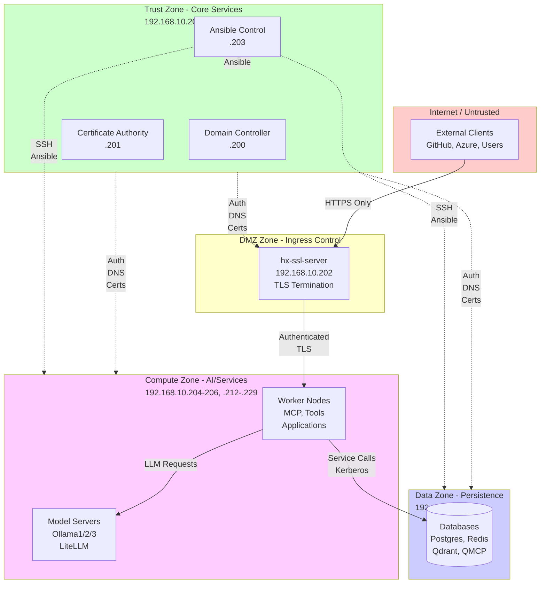
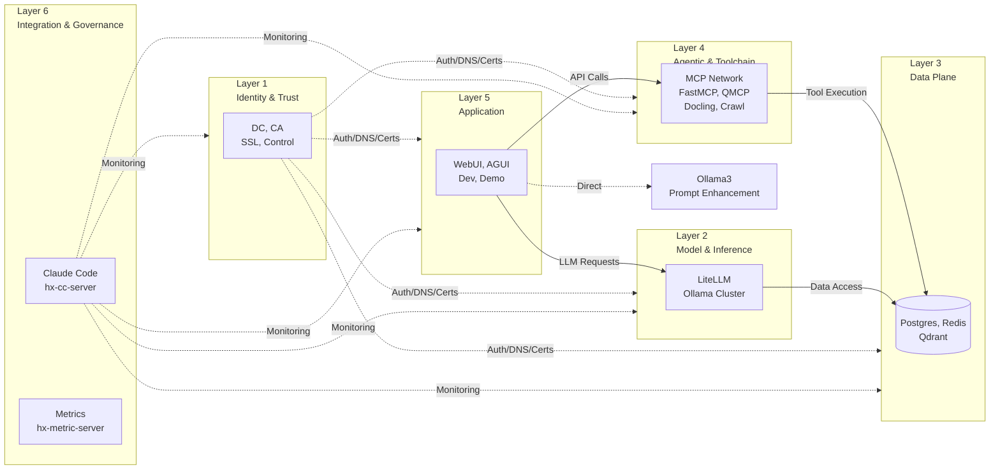
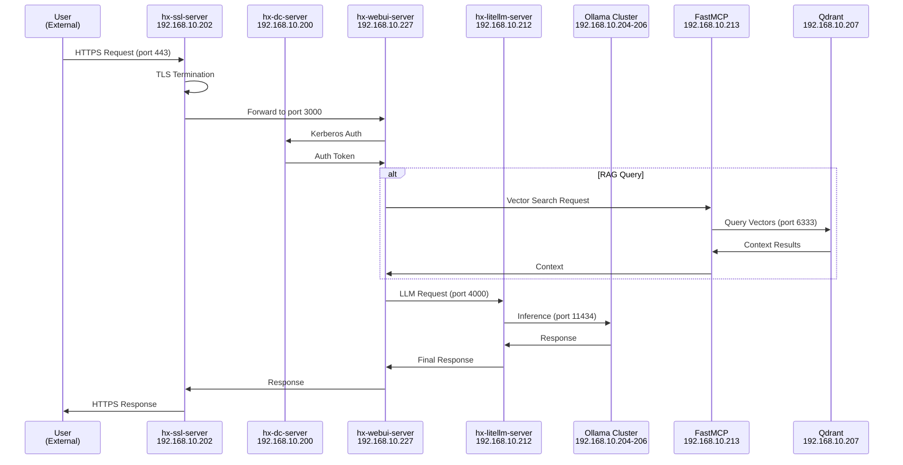
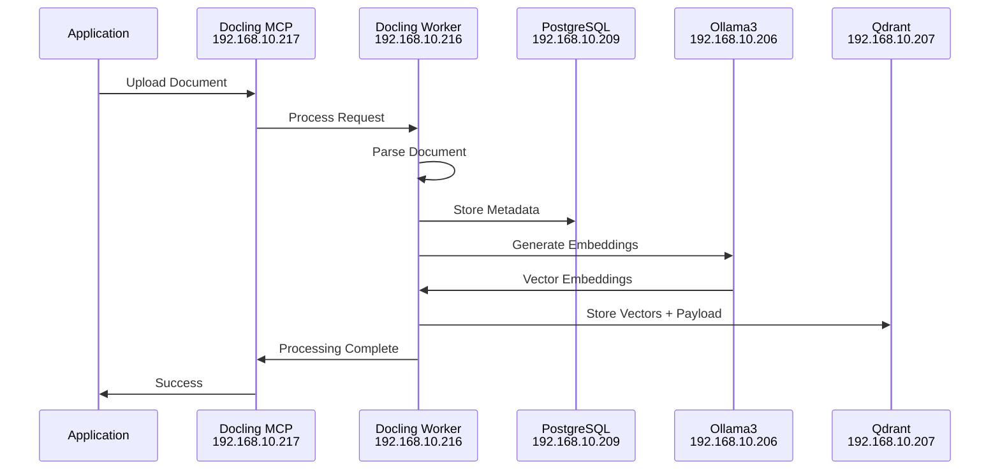
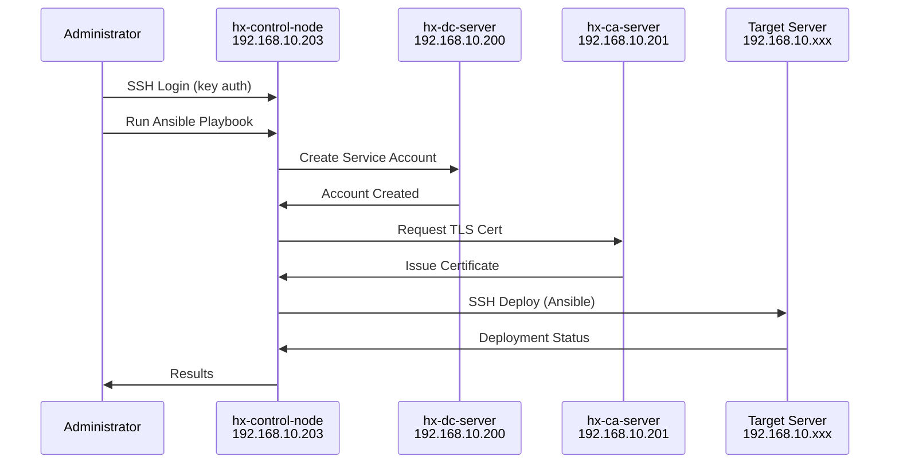
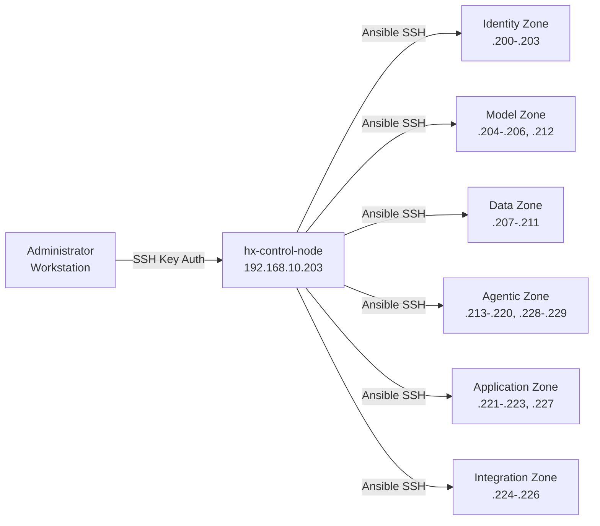
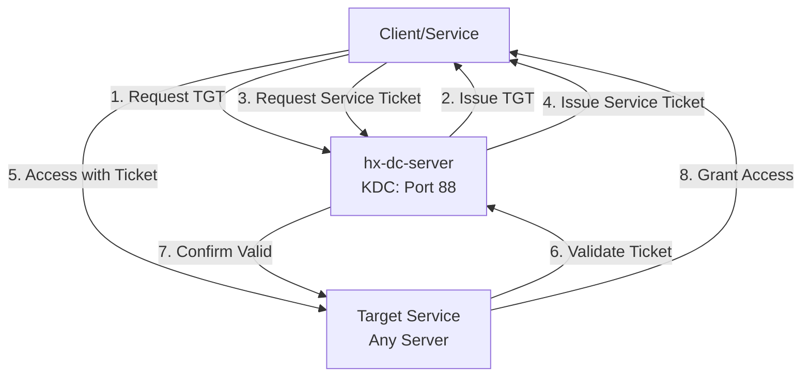

# Hana-X Network Topology Diagram

**Document Type**: Technical Reference - Network Architecture
**Version**: 1.0
**Date**: 2025-11-04
**Status**: FINAL
**Audience**: Infrastructure Team, AI Agents, Agent Zero
**Companion To**: 0.3-hana_x_ecosystem_architecture_final.md

---

## Document Purpose

This document provides comprehensive network topology diagrams for the Hana-X AI Ecosystem. It complements the Architecture document (0.3) by providing detailed visual representations of network structure, IP addressing, service connectivity, and security zones.

---

## 1. High-Level Network Overview

### 1.1 Network Summary

**Network Details**:
- **Network**: 192.168.10.0/24
- **Gateway**: 192.168.10.1
- **DNS Server**: 192.168.10.200 (hx-dc-server)
- **Domain**: hx.dev.local
- **Total Hosts**: 30 servers (192.168.10.200-229)

**Network Characteristics**:
- 100% isolated development network
- All nodes domain-joined to hx.dev.local
- Centralized authentication via Kerberos/LDAP
- Internal CA for TLS certificates
- Reverse proxy ingress via hx-ssl-server

---

## 2. Physical Network Topology

### 2.1 Network Layout Diagram

```mermaid
graph TB
    subgraph External["External Network / Internet"]
        User[User Workstations]
        GitHub[GitHub]
        ExtServices[External Services]
    end

    subgraph Gateway["Network Gateway"]
        Router[Router/Gateway<br/>192.168.10.1]
    end

    subgraph DMZ["Ingress Layer"]
        SSL[hx-ssl-server<br/>192.168.10.202<br/>TLS Termination<br/>Reverse Proxy]
    end

    subgraph InternalNetwork["Internal Network: 192.168.10.0/24<br/>Domain: hx.dev.local"]

        subgraph IdentityZone["Identity & Trust Zone (.200-.203)"]
            DC[hx-dc-server<br/>192.168.10.200<br/>Domain Controller<br/>DNS, Kerberos, LDAP]
            CA[hx-ca-server<br/>192.168.10.201<br/>Certificate Authority<br/>TLS Certs]
            Control[hx-control-node<br/>192.168.10.203<br/>Ansible Control<br/>Config Management]
        end

        subgraph ModelZone["Model & Inference Zone (.204-.206, .212)"]
            Ollama1[hx-ollama1-server<br/>192.168.10.204<br/>General Models]
            Ollama2[hx-ollama2-server<br/>192.168.10.205<br/>Code Models]
            Ollama3[hx-ollama3-server<br/>192.168.10.206<br/>Embeddings + Prompt]
            LiteLLM[hx-litellm-server<br/>192.168.10.212<br/>API Gateway]
        end

        subgraph DataZone["Data Plane Zone (.207-.211)"]
            Qdrant[hx-qdrant-server<br/>192.168.10.207<br/>Vector DB]
            QdrantUI[hx-qdrant-ui-server<br/>192.168.10.208<br/>Vector UI]
            Postgres[hx-postgres-server<br/>192.168.10.209<br/>SQL Database]
            Redis[hx-redis-server<br/>192.168.10.210<br/>Cache + Redis UI]
            QMCP[hx-qmcp-server<br/>192.168.10.211<br/>Qdrant MCP]
        end

        subgraph AgenticZone["Agentic & Toolchain Zone (.213-.220, .228-.229)"]
            FastMCP[hx-fastmcp-server<br/>192.168.10.213<br/>MCP Gateway]
            N8NMCP[hx-n8n-mcp-server<br/>192.168.10.214<br/>N8N MCP]
            N8N[hx-n8n-server<br/>192.168.10.215<br/>Workflows - TBD]
            Docling[hx-docling-server<br/>192.168.10.216<br/>Doc Worker]
            DoclingMCP[hx-docling-mcp-server<br/>192.168.10.217<br/>Docling MCP]
            CrawlMCP[hx-crawl4ai-mcp-server<br/>192.168.10.218<br/>Crawl4AI MCP]
            Crawl[hx-crawl4ai-server<br/>192.168.10.219<br/>Crawl Worker]
            LightRAG[hx-literag-server<br/>192.168.10.220<br/>RAG Framework]
            CodeRabbit[hx-coderabbit-server<br/>192.168.10.228<br/>Code Review MCP]
            Shadcn[hx-shadcn-server<br/>192.168.10.229<br/>Component MCP - TBD]
        end

        subgraph AppZone["Application Zone (.221-.223, .227)"]
            AGUI[hx-agui-server<br/>192.168.10.221<br/>Admin Dashboards]
            Dev[hx-dev-server<br/>192.168.10.222<br/>Development]
            Demo[hx-demo-server<br/>192.168.10.223<br/>Demo Environment]
            WebUI[hx-webui-server<br/>192.168.10.227<br/>Open WebUI]
        end

        subgraph IntegrationZone["Integration & Governance Zone (.224-.226)"]
            CC[hx-cc-server<br/>192.168.10.224<br/>Claude Code<br/>Systems Integrator]
            Metric[hx-metric-server<br/>192.168.10.225<br/>Metrics - TBD]
            Lang[hx-lang-server<br/>192.168.10.226<br/>LangChain]
        end
    end

    User -->|HTTPS| Router
    GitHub -.->|API| Router
    ExtServices -.->|API| Router

    Router --> SSL

    SSL --> WebUI
    SSL --> AGUI
    SSL --> Dev
    SSL --> Demo

    WebUI --> LiteLLM
    Dev --> LiteLLM
    Demo --> LiteLLM

    LiteLLM --> Ollama1
    LiteLLM --> Ollama2
    LiteLLM --> Ollama3

    WebUI -.Direct Bypass.-> Ollama3
    Dev -.Direct Bypass.-> Ollama3

    WebUI --> FastMCP
    Dev --> FastMCP

    FastMCP --> QMCP
    FastMCP --> DoclingMCP
    FastMCP --> CrawlMCP
    FastMCP --> N8NMCP
    FastMCP --> CodeRabbit

    QMCP --> Qdrant
    DoclingMCP --> Docling
    CrawlMCP --> Crawl

    Docling --> Postgres
    Crawl --> Postgres
    LightRAG --> Qdrant
    LightRAG --> Postgres

    Lang --> Postgres
    Lang --> Redis
    Lang --> Qdrant

    DC -.Auth/DNS.-> IdentityZone
    DC -.Auth/DNS.-> ModelZone
    DC -.Auth/DNS.-> DataZone
    DC -.Auth/DNS.-> AgenticZone
    DC -.Auth/DNS.-> AppZone
    DC -.Auth/DNS.-> IntegrationZone

    CA -.TLS Certs.-> SSL
    CA -.TLS Certs.-> AppZone
    CA -.TLS Certs.-> ModelZone

    Control -.Ansible.-> IdentityZone
    Control -.Ansible.-> ModelZone
    Control -.Ansible.-> DataZone
    Control -.Ansible.-> AgenticZone
    Control -.Ansible.-> AppZone
    Control -.Ansible.-> IntegrationZone

    CC -.Orchestration.-> IntegrationZone
    CC -.Orchestration.-> AppZone
    CC -.Orchestration.-> AgenticZone
```



---

## 3. IP Address Allocation Map

### 3.1 Complete IP Mapping

| IP Address | Hostname | FQDN | Zone | Status | Primary Role |
|------------|----------|------|------|--------|--------------|
| 192.168.10.1 | gateway | - | Gateway | ✅ | Network Gateway |
| 192.168.10.200 | hx-dc-server | hx-dc-server.hx.dev.local | Identity | ✅ | Domain Controller, DNS, Auth |
| 192.168.10.201 | hx-ca-server | hx-ca-server.hx.dev.local | Identity | ✅ | Certificate Authority |
| 192.168.10.202 | hx-ssl-server | hx-ssl-server.hx.dev.local | DMZ | ✅ | TLS Termination, Reverse Proxy |
| 192.168.10.203 | hx-control-node | hx-control-node.hx.dev.local | Identity | ✅ | Ansible Control |
| 192.168.10.204 | hx-ollama1-server | hx-ollama1-server.hx.dev.local | Model | ✅ | General LLM Models |
| 192.168.10.205 | hx-ollama2-server | hx-ollama2-server.hx.dev.local | Model | ✅ | Code-Focused Models |
| 192.168.10.206 | hx-ollama3-server | hx-ollama3-server.hx.dev.local | Model | ✅ | Embeddings + Prompt Enhancement |
| 192.168.10.207 | hx-qdrant-server | hx-qdrant-server.hx.dev.local | Data | ✅ | Vector Database |
| 192.168.10.208 | hx-qdrant-ui-server | hx-qdrant-ui-server.hx.dev.local | Data | ✅ | Qdrant Web UI |
| 192.168.10.209 | hx-postgres-server | hx-postgres-server.hx.dev.local | Data | ✅ | PostgreSQL Database |
| 192.168.10.210 | hx-redis-server | hx-redis-server.hx.dev.local | Data | ✅ | Redis Cache + UI |
| 192.168.10.211 | hx-qmcp-server | hx-qmcp-server.hx.dev.local | Data | ✅ | Qdrant MCP Server |
| 192.168.10.212 | hx-litellm-server | hx-litellm-server.hx.dev.local | Model | ✅ | LiteLLM API Gateway |
| 192.168.10.213 | hx-fastmcp-server | hx-fastmcp-server.hx.dev.local | Agentic | ✅ | FastMCP Gateway (w/ Brave) |
| 192.168.10.214 | hx-n8n-mcp-server | hx-n8n-mcp-server.hx.dev.local | Agentic | ✅ | N8N MCP Server |
| 192.168.10.215 | hx-n8n-server | hx-n8n-server.hx.dev.local | Agentic | ⬜ | N8N Workflows (TBD) |
| 192.168.10.216 | hx-docling-server | hx-docling-server.hx.dev.local | Agentic | ✅ | Docling Worker |
| 192.168.10.217 | hx-docling-mcp-server | hx-docling-mcp-server.hx.dev.local | Agentic | ✅ | Docling MCP Server |
| 192.168.10.218 | hx-crawl4ai-mcp-server | hx-crawl4ai-mcp-server.hx.dev.local | Agentic | ✅ | Crawl4AI MCP Server |
| 192.168.10.219 | hx-crawl4ai-server | hx-crawl4ai-server.hx.dev.local | Agentic | ✅ | Crawl4AI Worker |
| 192.168.10.220 | hx-literag-server | hx-literag-server.hx.dev.local | Agentic | ✅ | LightRAG Server |
| 192.168.10.221 | hx-agui-server | hx-agui-server.hx.dev.local | Application | 🛠️ | Admin Dashboards |
| 192.168.10.222 | hx-dev-server | hx-dev-server.hx.dev.local | Application | 🛠️ | Development Environment |
| 192.168.10.223 | hx-demo-server | hx-demo-server.hx.dev.local | Application | 🛠️ | Demo Environment |
| 192.168.10.224 | hx-cc-server | hx-cc-server.hx.dev.local | Integration | ✅ | Claude Code Integrator |
| 192.168.10.225 | hx-metric-server | hx-metric-server.hx.dev.local | Integration | ⬜ | Metrics/Observability (TBD) |
| 192.168.10.226 | hx-lang-server | hx-lang-server.hx.dev.local | Integration | 🛠️ | LangChain Server |
| 192.168.10.227 | hx-webui-server | hx-webui-server.hx.dev.local | Application | ✅ | Open WebUI |
| 192.168.10.228 | hx-coderabbit-server | hx-coderabbit-server.hx.dev.local | Agentic | ✅ | CodeRabbit MCP Server |
| 192.168.10.229 | hx-shadcn-server | hx-shadcn-server.hx.dev.local | Agentic | ⬜ | Shadcn MCP Server (TBD) |

**Total Servers**: 30
**Active (✅)**: 23
**In Progress (🛠️)**: 4
**To Be Decided (⬜)**: 3

---

## 4. Security Zone Architecture

### 4.1 Security Zones and Trust Boundaries



### 4.2 Security Zone Definitions

| Zone | Purpose | IP Range | Servers | Trust Level | Access Control |
|------|---------|----------|---------|-------------|----------------|
| **Internet** | External networks | N/A | External | Untrusted | Firewall blocked |
| **DMZ** | Ingress control | .202 | 1 | Semi-trusted | HTTPS only, TLS termination |
| **Trust Zone** | Identity & control | .200-.203 | 4 | Fully trusted | Domain auth, SSH keys |
| **Data Zone** | Persistent storage | .207-.211 | 5 | Trusted | Database auth + Kerberos |
| **Compute Zone** | AI/processing | .204-.206, .212-.229 | 20 | Trusted | Service principals, Kerberos |

---

## 5. Service Connectivity Matrix

### 5.1 Layer-to-Layer Communication



### 5.2 Port Mapping Reference

| Service | Server | Port(s) | Protocol | Purpose | Firewall |
|---------|--------|---------|----------|---------|----------|
| **Kerberos** | hx-dc-server | 88 | TCP/UDP | Authentication | Internal only |
| **LDAP** | hx-dc-server | 389, 636 | TCP | Directory services | Internal only |
| **DNS** | hx-dc-server | 53 | TCP/UDP | Name resolution | Internal only |
| **HTTPS** | hx-ssl-server | 443 | TCP | TLS termination | External + Internal |
| **HTTP** | hx-ssl-server | 80 | TCP | Redirect to HTTPS | External + Internal |
| **PostgreSQL** | hx-postgres-server | 5432 | TCP | Database access | Internal only |
| **Redis** | hx-redis-server | 6379 | TCP | Cache/queue | Internal only |
| **Qdrant** | hx-qdrant-server | 6333, 6334 | TCP | Vector API, gRPC | Internal only |
| **Ollama** | hx-ollama{1,2,3} | 11434 | TCP | Model inference | Internal only |
| **LiteLLM** | hx-litellm-server | 4000 | TCP | API gateway | Internal only |
| **FastMCP** | hx-fastmcp-server | 8000 | TCP | MCP gateway | Internal only |
| **Docling MCP** | hx-docling-mcp-server | 8001 | TCP | Document processing | Internal only |
| **Crawl4AI MCP** | hx-crawl4ai-mcp-server | 8002 | TCP | Web scraping | Internal only |
| **N8N MCP** | hx-n8n-mcp-server | 8003 | TCP | Workflow control | Internal only |
| **QMCP** | hx-qmcp-server | 8004 | TCP | Vector MCP | Internal only |
| **CodeRabbit MCP** | hx-coderabbit-server | 8005 | TCP | Code review | Internal only |
| **Open WebUI** | hx-webui-server | 3000 | TCP | Chat interface | Via SSL proxy |
| **SSH** | All servers | 22 | TCP | Remote admin | Internal only (from control) |

**Note**: Actual port numbers may vary; this is a reference based on typical configurations.

---

## 6. Data Flow Patterns

### 6.1 User Request Flow (Web-Based)



### 6.2 Document Processing Flow



### 6.3 Infrastructure Management Flow



---

## 7. Network Dependencies

### 7.1 Critical Path Dependencies

**Tier 0 - Foundation** (must be operational first):
1. Network Gateway (192.168.10.1)
2. hx-dc-server (192.168.10.200) - DNS, Auth
3. hx-ca-server (192.168.10.201) - TLS Certs

**Tier 1 - Core Infrastructure**:
4. hx-ssl-server (192.168.10.202) - Ingress
5. hx-control-node (192.168.10.203) - Management

**Tier 2 - Data & Model Services**:
6. hx-postgres-server (192.168.10.209) - System of record
7. hx-qdrant-server (192.168.10.207) - Vector storage
8. hx-redis-server (192.168.10.210) - Cache
9. hx-litellm-server (192.168.10.212) - API gateway
10. hx-ollama{1,2,3}-server (192.168.10.204-206) - Model inference

**Tier 3 - MCP & Workers**:
11. hx-fastmcp-server (192.168.10.213) - MCP gateway
12. Worker nodes (Docling, Crawl4AI, LightRAG, etc.)
13. MCP servers (QMCP, Docling MCP, Crawl MCP, etc.)

**Tier 4 - Applications**:
14. hx-webui-server (192.168.10.227) - User interface
15. hx-dev/demo-server (192.168.10.222-223) - Dev/demo environments

### 7.2 Dependency Matrix

| Service | Depends On | Optional Dependencies |
|---------|------------|----------------------|
| **hx-dc-server** | Network gateway | - |
| **hx-ca-server** | hx-dc-server | - |
| **hx-ssl-server** | hx-dc-server, hx-ca-server | - |
| **hx-control-node** | hx-dc-server, hx-ca-server | - |
| **hx-postgres-server** | hx-dc-server, hx-ca-server | - |
| **hx-redis-server** | hx-dc-server | - |
| **hx-qdrant-server** | hx-dc-server | - |
| **hx-ollama{1,2,3}** | hx-dc-server | - |
| **hx-litellm-server** | hx-dc-server, hx-ollama{1,2,3} | hx-fastmcp (for tools) |
| **hx-fastmcp-server** | hx-dc-server | MCP servers |
| **hx-webui-server** | hx-dc-server, hx-ssl-server, hx-litellm, hx-fastmcp | hx-qdrant, hx-postgres |
| **hx-dev/demo-server** | hx-dc-server, hx-ssl-server, hx-litellm | All services |

---

## 8. Disaster Recovery Network Considerations

### 8.1 Critical Services Backup Priority

| Priority | Service | Backup Requirement | RPO | RTO |
|----------|---------|-------------------|-----|-----|
| **P0** | hx-dc-server | Domain config, user DB | 1 hour | 2 hours |
| **P0** | hx-postgres-server | Full DB + WAL | 15 min | 1 hour |
| **P0** | hx-qdrant-server | Vector snapshots | 1 hour | 2 hours |
| **P1** | hx-ca-server | CA keys, cert DB | 24 hours | 4 hours |
| **P1** | hx-redis-server | RDB snapshots | 1 hour | 30 min |
| **P2** | hx-ollama{1,2,3} | Model files | 24 hours | 4 hours |
| **P2** | hx-control-node | Ansible configs | 24 hours | 2 hours |
| **P3** | Other services | Config files | 7 days | 8 hours |

**RPO**: Recovery Point Objective (max data loss)
**RTO**: Recovery Time Objective (max downtime)

---

## 9. Network Expansion Roadmap

### 9.1 Future Network Enhancements

**Phase 2 - High Availability** (Future):
- Add secondary domain controller (hx-dc-server-2)
- Implement Postgres streaming replication
- Add Redis sentinel cluster
- Deploy load balancer for web tier

**Phase 2 - Monitoring** (When hx-metric-server deployed):
- Prometheus metrics collection (port 9090)
- Grafana dashboards (port 3001)
- Alertmanager notifications (port 9093)

**Phase 3 - Container Orchestration** (Future):
- Kubernetes cluster (if deployed)
- Container registry
- Ingress controller

### 9.2 IP Address Reservation

**Reserved for Future Use**:
- 192.168.10.230-240: Reserved for HA replicas
- 192.168.10.241-250: Reserved for monitoring/logging expansion
- 192.168.10.251-254: Reserved for network infrastructure

---

## 10. Operational Network Diagrams

### 10.1 SSH Access Pattern (Admin)



**Security Note**: Direct SSH access to servers (other than control node) should be restricted. All management should flow through hx-control-node via Ansible.

### 10.2 Authentication Flow (Kerberos)



---

## 11. Network Troubleshooting Reference

### 11.1 Connectivity Verification Commands

**DNS Resolution Check**:
```bash
# Verify DNS resolution
nslookup hx-dc-server.hx.dev.local 192.168.10.200
dig @192.168.10.200 hx-webui-server.hx.dev.local

# Verify reverse DNS
dig -x 192.168.10.227 @192.168.10.200
```

**Network Connectivity Check**:
```bash
# Ping test
ping -c 3 192.168.10.200

# Port connectivity test
nc -zv hx-litellm-server.hx.dev.local 4000
telnet hx-postgres-server.hx.dev.local 5432

# Trace route
traceroute 192.168.10.227
```

**Kerberos Auth Check**:
```bash
# Test Kerberos ticket
kinit admin@HX.DEV.LOCAL
klist

# Verify service principals
kvno HTTP/hx-webui-server.hx.dev.local@HX.DEV.LOCAL
```

**Service Port Check**:
```bash
# Check listening ports on local server
ss -tlnp | grep <port>
netstat -tlnp | grep <port>

# Check open ports from remote
nmap -p 5432,6379,6333,11434 192.168.10.207-212
```

### 11.2 Common Network Issues

| Issue | Symptom | Check | Resolution |
|-------|---------|-------|------------|
| DNS Failure | Cannot resolve hostnames | `nslookup`, check `/etc/resolv.conf` | Point to 192.168.10.200 |
| Auth Failure | Kerberos errors | `klist`, check time sync | Run `ntpdate` or verify DC reachability |
| Port Blocked | Connection timeout | `nc -zv`, `ss -tlnp` | Check firewall, verify service running |
| TLS Error | Certificate invalid | Check cert with `openssl s_client` | Renew cert from hx-ca-server |
| Route Missing | Host unreachable | `ip route`, `traceroute` | Add route or check gateway |

---

## 12. Appendix: Network Configuration Files

### 12.1 Sample /etc/hosts Entry (All Servers)

```
# HX Infrastructure Project - Static hosts file
# Domain: hx.dev.local

127.0.0.1   localhost
::1         localhost ip6-localhost ip6-loopback

# HX Servers
192.168.10.200  hx-dc-server.hx.dev.local            hx-dc-server
192.168.10.201  hx-ca-server.hx.dev.local            hx-ca-server
192.168.10.202  hx-ssl-server.hx.dev.local           hx-ssl-server
192.168.10.203  hx-control-node.hx.dev.local         hx-control-node
[... continues for all 30 servers ...]
```

### 12.2 Sample /etc/resolv.conf (All Servers)

```
# DNS Configuration for hx.dev.local domain
search hx.dev.local
nameserver 192.168.10.200
nameserver 192.168.10.1
options timeout:2 attempts:3
```

### 12.3 Sample /etc/network/interfaces (Static IP Config)

```
# Static IP configuration for HX servers

auto lo
iface lo inet loopback

auto eth0
iface eth0 inet static
    address 192.168.10.XXX
    netmask 255.255.255.0
    gateway 192.168.10.1
    dns-nameservers 192.168.10.200 192.168.10.1
    dns-search hx.dev.local
```

---

## 13. Document Maintenance

### 13.1 Update Triggers

This document should be updated when:
- New servers added to the network
- IP address changes occur
- New security zones defined
- Network topology changes
- Service ports change
- Integration patterns evolve

### 13.2 Version History

| Version | Date | Changes | Author |
|---------|------|---------|--------|
| 1.0 | 2025-11-04 | Initial network topology documentation | Claude Code |

### 13.3 Cross-References

**Related Documents**:
- **0.1-hana_x_project_scope_final.md** - Project scope and agent definitions
- **0.2-hana_x_platform_nodes_final.md** - Server inventory and capabilities
- **0.3-hana_x_ecosystem_architecture_final.md** - System architecture and design patterns
- **0.4-hx-deployment-methodology_final.md** - Deployment procedures and coordination

**Knowledge Vault References**:
- `/srv/knowledge/vault/` - Additional network documentation
- `/srv/knowledge/vault/agentic-design-patterns-docs-main/` - Design patterns

---

**Document Status**: FINAL
**Version**: 1.0
**Date**: 2025-11-04
**Location**: `/srv/cc/Governance/0.0-governance/0.3.1-hx-network-topology-diagram.md`

---

*This network topology diagram provides the visual and technical foundation for understanding connectivity, security zones, and data flows within the Hana-X AI Ecosystem.*
