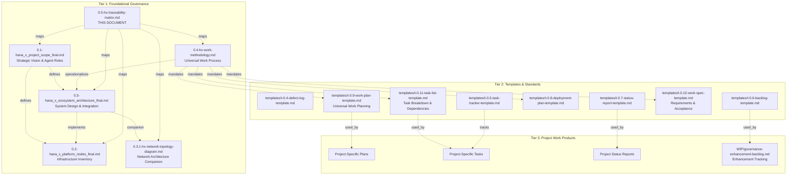
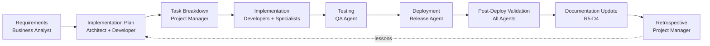

# Hana-X Traceability Matrix

**Document Type**: Governance - Traceability & Cross-Reference
**Version**: 1.1
**Date**: 2025-11-04
**Status**: LIVING DOCUMENT
**Audience**: All Agents, Agent Zero, Project Team

---

## Document Purpose

This traceability matrix establishes **complete bidirectional traceability** across all governance documents, templates, infrastructure components, and work products in the Hana-X AI Ecosystem. It serves as the master reference for understanding how requirements flow to implementation and how implementation artifacts trace back to governance.

**Key Questions This Document Answers**:
- Where is each governance principle implemented?
- Which agent owns which infrastructure component?
- What templates apply to which project phases?
- How do deployment tasks trace to architectural decisions?
- What evidence exists that requirements are met?

---

## 1. Document Hierarchy & Relationships

### 1.1 Governance Document Structure



### 1.2 Cross-Document Reference Table

| Source Document | References | Referenced By | Key Linkages |
|-----------------|-----------|---------------|--------------|
| **0.1 - Project Scope** | Constitution (pending), Platform Nodes, Architecture | All governance docs | Agent categories, Infrastructure mapping |
| **0.2 - Platform Nodes** | Project Scope, Architecture | Architecture, Network Topology, Work Methodology | Server inventory, IP mapping, Status tracking |
| **0.3 - Ecosystem Architecture** | Project Scope, Platform Nodes, Constitution (active) | Network Topology, Work Methodology, Traceability | 6-layer model, Integration patterns, Design decisions |
| **0.3.1 - Network Topology** | Platform Nodes, Architecture | Work Methodology, Traceability | Network zones, IP allocation, Port mapping, DR priorities |
| **0.4 - Work Methodology** | All Tier 1 docs, Constitution (active) | Project work products, Traceability | 6-phase process, Task sizing, Agent coordination |
| **0.5 - Traceability Matrix** | All Tier 1 docs | Future audits, Compliance reviews | Cross-reference hub, Gap tracking |
| **WIP - Enhancement Backlog** | All governance docs | Project planning | Short/medium-term improvements |

---

## 2. Governance Principle → Implementation Mapping

### 2.1 Constitution Principles (Active)

**Location**: `/srv/cc/Governance/0.1-agents/hx-agent-constitution.md` (v2.0 - Active)

| Constitution Principle | Implemented In | Evidence Location |
|--------------------------------------|----------------|-------------------|
| **Quality Over Speed** | Work Methodology Phase 4-5, Constitution §I | Validation checkpoints at every phase |
| **SOLID OOP** | Architecture §2 (Layered), §7.2, Constitution §II | 6-layer separation of concerns |
| **Infrastructure Supremacy (@agent-frank)** | Work Methodology Phase 2, Constitution §V | Infrastructure prerequisite phase |
| **Inter-Agent Coordination** | Work Methodology Phase 2-3, Constitution §X-XVIII | Multi-agent collaborative planning |
| **Escalation Protocol** | Work Methodology §5.5, Constitution §XV | Two-attempt rule, escalation format |
| **DEV Security Model** | Architecture §5.4, Constitution §VI | Documented simplifications |
| **Expertise & Authority** | Agent Catalog, Constitution §III | 30 specialized agents with domain expertise |
| **Iterative Development** | Work Methodology 6-phase process, Constitution §IV | Incremental validation at each phase |

**Status**: Constitution v2.0 active (2025-11-05). All principles mapped to Work Methodology and governance framework.

**Traceability Flow**:
```
Constitution Principle
  ↓
Architecture Design Decision (§7)
  ↓
Work Methodology Process (6 phases)
  ↓
Template Usage (work plan, spec, tasks)
  ↓
Work Product Evidence
```

---

## 3. Architecture → Infrastructure Mapping

### 3.1 Layer-to-Server Traceability

| Architecture Layer | Scope Agent Category | Server Nodes | Deployment Status | Owner Agent |
|-------------------|---------------------|--------------|-------------------|-------------|
| **Layer 1: Identity & Trust** | Platform & Infrastructure | hx-dc (200), hx-ca (201), hx-ssl (202), hx-control (203) | ✅✅✅✅ | Chewbacca |
| **Layer 2: Model & Inference** | Data & Model Infrastructure, API Gateway | hx-ollama1-3 (204-206), hx-litellm (212) | ✅✅✅✅ | Yoda (Ollama), C-3PO (LiteLLM) |
| **Layer 3: Data Plane** | Data & Model Infrastructure | hx-postgres (209), hx-redis (210), hx-qdrant (207), hx-qdrant-ui (208), hx-qmcp (211) | ✅✅✅✅✅ | Poe (Redis/Postgres), Leia (Qdrant/QMCP) |
| **Layer 4: Agentic & Toolchain** | Backend & Application Services | hx-fastmcp (213), hx-n8n-mcp (214), hx-docling* (216-217), hx-crawl4ai* (218-219), hx-literag (220), hx-coderabbit (228), hx-shadcn (229) | ✅✅✅✅✅✅⬜ | Various specialists |
| **Layer 5: Application Layer** | Frontend & User Interface | hx-webui (227), hx-agui (221), hx-dev (222), hx-demo (223) | ✅🛠️🛠️🛠️ | Han (WebUI), Luke (Dev/Demo) |
| **Layer 6: Integration & Governance** | DevOps, Governance & Delivery | hx-cc (224), hx-metric (225), hx-lang (226) | ✅⬜🛠️ | R5-D4 (CC Server), BB-8 (Metrics) |

**Total Nodes**: 30 servers across 6 layers

### 3.2 Integration Pattern Traceability

| Pattern Name | Defined In | Implemented By | Validation Method |
|--------------|-----------|----------------|-------------------|
| **Authentication & Authorization Flow** | Architecture §3.1, Network Topology §5.1-5.2 | hx-dc, hx-ssl, all apps | Post-deployment validation (Deployment §6.2) |
| **API Gateway Pattern** | Architecture §3.2, Network Topology §5.2 | hx-litellm | LLM traffic routing tests |
| **MCP Integration Backbone** | Architecture §3.3, Network Topology §5.1 | hx-fastmcp + 7 MCP servers | MCP protocol compliance tests |
| **Service-to-Service Communication** | Architecture §3.4, Network Topology §5.1 | All layers | Integration validation (Deployment §6.2) |
| **LiteLLM Bypass Patterns** | Architecture §3.5 | n8n, LangChain, direct Ollama3 | Documented exceptions validated |
| **Document Processing Pipeline** | Architecture §4.3, Network Topology §6.2 | Docling, Crawl4AI, Qdrant, LightRAG | End-to-end document ingestion test |
| **RAG Retrieval Pattern** | Architecture §4.4, Network Topology §6.1 | Qdrant, QMCP, LightRAG, LiteLLM | Query-to-response flow validation |
| **Network Security Zones** | Network Topology §4.1-4.2 | All servers (6 zones) | Zone isolation and trust boundary tests |
| **Infrastructure Management Flow** | Network Topology §6.3 | hx-control-node, Ansible | SSH access pattern validation |
| **Network Dependencies** | Network Topology §7.1-7.2 | All tiers (0-4) | Critical path availability tests |

---

## 4. Agent → Work Product Traceability

### 4.1 Agent Responsibility Matrix

| Agent Category | Primary Servers | Governance Docs Owned | Templates Used | Typical Work Products |
|----------------|----------------|----------------------|----------------|----------------------|
| **Project Management Agent** | hx-cc | Task tracker updates | t-0.5-task-tracker, t-0.7-status-report | Sprint plans, status reports |
| **Business Analyst Agent** | hx-cc | Requirements specs | t-0.2-spec-template | Feature specs, user stories |
| **Architect Agent** | hx-cc | Architecture updates | t-0.1-plan-template | Design docs, integration specs |
| **Senior App Developer** | hx-dev | Implementation docs | t-0.1-plan, t-0.3-tasks | Code, unit tests, refactoring logs |
| **QA/Test Agent** | hx-dev, hx-demo | Test plans, defect logs | t-0.4-defect-log | Test results, quality reports |
| **Release & Deployment Agent** | hx-demo | Deployment logs | Deployment Methodology | Release notes, deployment plans |
| **Chewbacca (Infrastructure)** | Layer 1 servers | Platform Nodes updates | Deployment Methodology §4.2.1 | Infrastructure configs, certificates |
| **BB-8 (OS/Service Mgmt)** | All servers | Platform Nodes status updates | Deployment Methodology §4.2.2 | Service configs, systemd units |
| **R5-D4 (Documentation)** | hx-cc | All governance docs | All templates | Documentation updates, organization |
| **Service Specialists** (Yoda, Poe, Leia, etc.) | Service-specific | Service runbooks | Deployment Methodology §5-7 | Service configs, deployment logs |

### 4.2 Work Product Lifecycle



---

## 5. Template → Project Phase Mapping

### 5.1 Template Usage Timeline

*Note: Templates t-0.1, t-0.2, t-0.3 archived on 2025-11-04 (BI-009), replaced by t-0.9, t-0.10, t-0.11 on 2025-11-05 - see `/templates/archive/README.md` for details*

| Project Phase | Templates Required | Created By | Input From | Output To |
|---------------|-------------------|------------|------------|-----------|
| **Initiation** | t-0.6-backlog-template | Project Manager / Business Analyst | Stakeholder requirements | Project Manager |
| **Discovery** | Work Methodology Phase 0 | Orchestrating Agent | Agent Catalog, Platform Nodes | Specification phase |
| **Specification** | t-0.10-work-spec-template | Orchestrating Agent | Requirements, acceptance criteria | Planning phase |
| **Planning** | t-0.9-work-plan-template, t-0.11-task-list-template | Orchestrating Agent + Team | Spec, agent inputs | Execution phase |
| **Deployment Planning** | t-0.8-deployment-plan-template | Service Specialist Agent | Platform Nodes, Architecture docs | Deployment team |
| **Execution** | t-0.5-task-tracker-template, t-0.11-task-list-template | All agents | Work plan, tasks | Validation phase |
| **Quality Assurance** | t-0.4-defect-log-template | QA Agent / Service Specialist | Test results, deployment issues | Developers / Specialists |
| **Reporting** | t-0.7-status-report-template | Project Manager | Task tracker, defect log | Agent Zero, stakeholders |
| **Deployment Execution** | Work Methodology (0.4) | Service Specialist | Work plan (t-0.9), task list (t-0.11) | Production environment |

**Template Focus**: Hana-X templates support **universal work methodology** - infrastructure deployment, service configuration, operational tasks, and complex multi-agent coordination.

### 5.2 Template Relationships

**Universal Work Flow** (NEW - 2025-11-05):
```
t-0.6-backlog (Requirements)
    ↓
Phase 0: Discovery (Work Methodology)
    ↓
t-0.10-work-spec (Requirements & Acceptance Criteria)
    ↓
Phase 2: Collaborative Planning (Work Methodology)
    ↓
t-0.9-work-plan (Multi-agent coordination) + t-0.11-task-list (Task breakdown)
    ↓
Phase 4: Execution (Work Methodology)
    ↓
t-0.5-task-tracker (Progress Tracking) ← t-0.4-defect-log (Issue Tracking)
    ↓
Phase 5: Validation (Work Methodology)
    ↓
t-0.7-status-report (Reporting)
```

**Infrastructure Deployment Flow** (uses Work Methodology + t-0.8):
```
t-0.6-backlog → Discovery → t-0.10-spec → t-0.9/t-0.11 planning → t-0.8-deployment-plan → Execution → Validation → t-0.7-status
```

**Archived Flow** (Application Development - see `/templates/archive/`):
```
[ARCHIVED 2025-11-04] t-0.6-backlog → t-0.2-spec → t-0.1-plan → t-0.3-tasks
[REPLACED BY] t-0.6-backlog → t-0.10-spec → t-0.9-plan → t-0.11-tasks
```

**Traceability Requirement**: Each work product must reference:
- **Upstream template**: What was the input? (e.g., "Based on t-0.9 work plan for model upgrade")
- **Downstream consumers**: What depends on this? (e.g., "Tasks tracked in t-0.11 task list")
- **Source template**: Path to template used (per §5.3 metadata requirements)

### 5.3 Template Metadata Requirements

**All templates must include**:
```markdown
---
source_template: [path to template in /0.0-governance/templates]
created_date: [YYYY-MM-DD]
created_by: [Agent name]
references:
  - [upstream doc 1]
  - [upstream doc 2]
depends_on:
  - [prerequisite 1]
  - [prerequisite 2]
---
```

---

## 6. Deployment → Validation Traceability

### 6.1 Deployment Phase → Evidence Mapping

| Deployment Phase | Methodology Section | Required Evidence | Validation Criteria | Status Tracking |
|------------------|--------------------|--------------------|---------------------|----------------|
| **Phase 1: Planning** | §3 | Deployment plan document | GO/NO-GO checklist passed | Plan approved by AZ |
| **Phase 2: Prerequisites** | §4 | Chewbacca confirmation, BB-8 confirmation | All prereq validations passed | Platform Nodes updated (⬜→🛠️) |
| **Phase 3: Deployment** | §5 | Task-by-task logs, validation outputs | All tasks validated, smoke tests passed | Service operational |
| **Phase 4: Post-Deployment** | §6 | Integration test results, performance metrics | End-to-end flows successful | Platform Nodes updated (🛠️→✅) |
| **Phase 5: Refinement** | §7 | Lessons learned document, methodology updates | Retrospective complete | Improvement backlog updated |

### 6.2 Server Status → Deployment Phase Correlation

| Platform Nodes Status | Deployment Phase | Required Artifacts | Responsible Agent |
|-----------------------|------------------|-------------------|-------------------|
| **⬜ TBD** | Pre-Planning | Server identified in architecture | Architect |
| **🛠️ In-Progress** | Phase 2-3 (Prerequisites → Deployment) | Deployment plan, in-progress logs | Service specialist |
| **✅ Active** | Phase 4-5 complete (Post-Deployment → Refinement) | Validation results, documentation | Service specialist + R5-D4 |

**Traceability Rule**: Status change from 🛠️ → ✅ requires:
1. Deployment log showing Phase 4 validation complete
2. Platform Nodes document updated with service details
3. Integration test results attached
4. R5-D4 confirmation of documentation complete

---

## 7. Decision → Implementation → Validation Chain

### 7.1 Architectural Decisions (from Architecture §7)

| Decision | Rationale (Arch §7) | Implementation Evidence | Validation Method | Status |
|----------|-------------------|------------------------|-------------------|--------|
| **100% Local Infrastructure** | §7.1 | Platform Nodes: All 30 servers in 192.168.10.0/24<br/>Network Topology: Complete IP mapping | Network isolation verified, security zones defined | ✅ |
| **Layered Architecture** | §7.2 | Architecture §2: 6 layers defined, all services mapped<br/>Network Topology §5.1: Layer connectivity matrix | Layer integration tests passed | ✅ |
| **MCP as Integration Backbone** | §7.3 | Platform Nodes: 8 MCP servers deployed<br/>Network Topology §5.1: MCP network documented | MCP protocol compliance tests | ✅ |
| **3-Node Ollama Cluster** | §7.4 | Platform Nodes: ollama1-3 active<br/>Network Topology §3.1: .204-.206 mapped | Load distribution tests, specialization validated | ✅ |
| **Hybrid Readiness Strategy** | §7.5 | Architecture §7.5: Containerization approach | Services containerized or containerization-ready | 🛠️ |
| **Security Zone Segmentation** | Architecture §5, Network Topology §4 | Network Topology: 6 security zones defined (Internet, DMZ, Trust, Data, Compute, Integration) | Zone isolation tests, firewall rules validated | ✅ |
| **Centralized Network Management** | Network Topology §6.3, §7 | hx-control-node (192.168.10.203) Ansible automation | SSH access pattern validation, tier dependency tests | ✅ |

**Traceability Chain Example** (3-Node Ollama):
```
Decision (Arch §7.4: Specialization + Load Distribution)
  ↓
Design (Arch §2.2 Layer 2: Ollama1=General, Ollama2=Code, Ollama3=Embeddings)
  ↓
Implementation (Platform Nodes: .204, .205, .206 - ✅ Active)
  ↓
Deployment (Methodology: Yoda agent, validated per §6.2)
  ↓
Validation Evidence (LiteLLM routing logs, model specialization tests)
```

---

## 8. Gap Analysis & Improvement Tracking

### 8.1 Current Traceability Gaps

*Note: This section is aligned with the WIP/governance-enhancement-backlog.md. Backlog items (BI-###) address identified gaps.*

| Gap ID | Description | Impact | Recommended Action | Backlog Item | Priority | Status |
|--------|-------------|--------|-------------------|--------------|----------|--------|
| **GAP-001** | Deployment Plan Template missing | Inconsistent deployment planning | Create standardized template per Methodology §3.3 | BI-002 | P1 | 📋 Ready |
| **GAP-002** | No interim logging/monitoring while hx-metric-server is TBD | Difficult to troubleshoot issues | Document interim logging strategy | BI-003 | P1 | 📋 Ready |
| **GAP-003** | Backup procedures not documented for critical data stores | Risk of data loss | Document backup/restore procedures for Postgres, Qdrant, Redis | BI-004 | P1 | 📋 Ready |
| **GAP-004** | Agent persona reference card missing | Inefficient agent coordination | Create quick reference for agent roles and responsibilities | BI-005 | P2 | ⚪ Not Ready |
| **GAP-005** | Troubleshooting runbooks missing for server categories | Extended MTTR for incidents | Create comprehensive runbooks for 6 server zones | BI-006 | P2 | ⚪ Not Ready |
| **GAP-006** | API specifications not documented | Integration challenges for developers/agents | Document API specs for key services | BI-007 | P2 | ⚪ Not Ready |
| **GAP-007** | Agent onboarding guide missing | Slow onboarding, repeated questions | Create structured onboarding process | BI-008 | P2 | ⚪ Not Ready |
| **GAP-008** | Template metadata (source, created_by, references) not enforced | Difficult to trace work product lineage | Add metadata validation to template usage | - | Medium | 🆕 Open |
| **GAP-009** | No automated status sync between Platform Nodes and deployment logs | Manual updates prone to drift | Create status update automation script | - | Medium | 🆕 Open |
| **GAP-010** | Constitution principles → implementation evidence link pending | Cannot fully audit governance compliance | Complete Constitution and extend traceability mapping | - | Medium | ⏸️ Blocked (Constitution pending) |

**Legend**:
- **P1**: High priority (short-term, from backlog)
- **P2**: Medium priority (medium-term, from backlog)
- **📋 Ready**: Backlog item ready to start
- **⚪ Not Ready**: Backlog item needs refinement
- **🆕 Open**: New gap, not yet in backlog
- **⏸️ Blocked**: Waiting on dependency

### 8.2 Continuous Improvement Process

**After Each Deployment**:
1. **Validate Traceability**: Can you trace the deployment back through all governance levels?
2. **Identify Gaps**: What links are missing or unclear?
3. **Update This Matrix**: Add new mappings, fill evidence gaps
4. **Propose Improvements**: Submit to Agent Zero for governance updates

**Quarterly Review**:
- Review Gap Analysis table (§8.1)
- Prioritize gap closure
- Update templates to enforce traceability
- Audit random sample of work products for compliance

---

## 9. Audit & Compliance

### 9.1 Traceability Audit Checklist

**For Any Infrastructure Component** (e.g., hx-qdrant-server):

- [ ] **Governance Traceability**:
  - [ ] Appears in Platform Nodes document with current status
  - [ ] Mapped to Architecture layer (§2.1)
  - [ ] Assigned to Scope agent category
  - [ ] Owner agent identified

- [ ] **Deployment Traceability**:
  - [ ] Deployment plan exists (if deployed)
  - [ ] Deployment log shows validated tasks
  - [ ] Prerequisites confirmed by Chewbacca/BB-8
  - [ ] Post-deployment validation results documented

- [ ] **Integration Traceability**:
  - [ ] Integration patterns documented (Architecture §3)
  - [ ] Upstream/downstream dependencies identified
  - [ ] Integration test results exist
  - [ ] Appears in relevant architecture diagrams

- [ ] **Operational Traceability**:
  - [ ] Service configuration documented
  - [ ] Operations guide exists (if active)
  - [ ] Troubleshooting procedures documented
  - [ ] Monitoring/metrics defined (future)

### 9.2 Work Product Audit Checklist

**For Any Project Artifact** (e.g., implementation plan):

- [ ] **Template Compliance**:
  - [ ] Based on appropriate template from /templates
  - [ ] Metadata section complete (source, created_by, references)
  - [ ] All required sections present

- [ ] **Upstream Traceability**:
  - [ ] References source requirements/specs
  - [ ] Links to relevant governance documents
  - [ ] Cites architectural decisions (if applicable)

- [ ] **Downstream Traceability**:
  - [ ] Identifies what artifacts it produces
  - [ ] Lists dependent work products
  - [ ] Clear handoff to next phase

- [ ] **Agent Accountability**:
  - [ ] Created by agent identified
  - [ ] Reviewed by (if applicable) documented
  - [ ] Approved by (if required) recorded

---

## 10. Quick Reference: Traceability Lookups

### 10.1 "I need to find..."

| I Need To Find... | Look Here | Section |
|-------------------|-----------|---------|
| **Which agent owns this server?** | This doc §3.1 Layer-to-Server table | Architecture Layer → Owner Agent column |
| **What template to use for this phase?** | This doc §5.1 Template Usage Timeline | Match project phase to template |
| **Where is this architecture decision implemented?** | This doc §7.1 Architectural Decisions table | Decision → Implementation Evidence |
| **What servers implement this integration pattern?** | This doc §3.2 Integration Pattern table | Pattern → Implemented By column |
| **What evidence proves this requirement is met?** | This doc §6.1 Deployment Phase → Evidence | Validation Criteria column |
| **Which governance doc defines this process?** | This doc §1.2 Cross-Document Reference table | Look up document, follow References column |
| **What's the status of this server deployment?** | Platform Nodes document | Server list with status icons |
| **What coordination pattern applies?** | Work Methodology Phase 2-3, Agent Catalog | Agent Coordination Patterns |
| **What's the IP address of this server?** | Network Topology §3.1 IP Mapping table | IP Address → Hostname mapping |
| **Which security zone is this server in?** | Network Topology §4.1-4.2 Security Zones | Server IP → Zone assignment |
| **What ports does this service use?** | Network Topology §5.2 Port Mapping | Service → Port(s) column |
| **What are the network dependencies?** | Network Topology §7.1-7.2 Dependencies | Tier-based critical path |
| **How do I troubleshoot network issues?** | Network Topology §11 Troubleshooting | Diagnostic commands reference |
| **What's the backup priority for this service?** | Network Topology §8.1 DR Priorities | Priority → RPO/RTO mapping |

### 10.2 "I need to trace..."

| Traceability Direction | Method | Example |
|------------------------|--------|---------|
| **Requirement → Implementation** | Follow: Scope → Architecture → Platform Nodes → Deployment logs | "MCP Integration" → Layer 4 → hx-fastmcp-server → Deployment plan |
| **Implementation → Requirement** | Follow: Deployment log → Platform Nodes → Architecture → Scope | hx-qdrant-server → Layer 3 Data Plane → "Data & Model Infrastructure" |
| **Decision → Validation** | Follow: Architecture §7 → This doc §7.1 → Evidence location | "Layered Architecture" → Layer integration tests |
| **Agent → Work Products** | This doc §4.1 Agent Responsibility Matrix | Architect Agent → Design docs, integration specs |
| **Template → Instances** | Template metadata → Project directories | t-0.1-plan-template → /specs/###-feature/plan.md |
| **Status Change → Approval** | Platform Nodes changelog → Deployment log Phase 4 | 🛠️ → ✅ requires validation results |

---

## 11. Living Document Maintenance

### 11.1 Update Triggers

**This matrix MUST be updated when**:

1. **New Governance Document Created**: Add to §1 hierarchy and §1.2 cross-reference table
2. **New Server Added/Removed**: Update §3.1 layer-to-server mapping AND Network Topology document
3. **New Integration Pattern Documented**: Add to §3.2 integration pattern table
4. **New Agent Role Created**: Update §4.1 agent responsibility matrix
5. **New Template Created**: Add to §5.1 template usage timeline
6. **Deployment Methodology Updated**: Sync §6 deployment phase mappings
7. **Traceability Gap Identified**: Add to §8.1 gap analysis table AND WIP backlog
8. **Architectural Decision Made**: Add to §7.1 decision table
9. **Network Topology Changed**: Update §3.2 network patterns and Architecture/Network Topology docs
10. **Backlog Item Completed**: Update §8.1 gap status and remove from WIP backlog
11. **Constitution Completed**: Update §2.1 with full principle mapping and evidence pointers

### 11.2 Ownership & Review

**Primary Owner**: R5-D4 (Documentation Agent)  
**Contributors**: All agents (submit updates via R5-D4)  
**Reviewer**: Agent Zero  
**Review Frequency**: After each major deployment, monthly audit

**Update Process**:
1. Agent identifies traceability update needed
2. Agent notifies R5-D4 with proposed change
3. R5-D4 validates change aligns with governance
4. R5-D4 updates this document
5. R5-D4 notifies Agent Zero for review
6. Version incremented

### 11.3 Version History

| Version | Date | Changes | Updated By |
|---------|------|---------|------------|
| 1.0 | 2025-11-04 | Initial traceability matrix creation | R5-D4 (Claude Code) |
| 1.1 | 2025-11-04 | Added Network Topology (0.3.1), aligned with WIP backlog, updated gap analysis, noted Constitution as pending | R5-D4 (Claude Code) |
| 1.2 | 2025-11-04 | Updated §5.1-5.2 template sections: archived t-0.1/t-0.2/t-0.3, added t-0.8 deployment plan template, updated flow for infrastructure deployment | R5-D4 (Claude Code) |
| 1.3 | 2025-11-05 | Major update: Replaced "Deployment Methodology" with "Work Methodology" throughout, added three new templates (t-0.9, t-0.10, t-0.11), updated Constitution status to active (v2.0), updated all cross-references and governance flows | R5-D4 (Claude Code) |

---

## 12. Conclusion

This traceability matrix establishes **complete bidirectional traceability** across the Hana-X AI Ecosystem governance framework. By maintaining this living document alongside the core governance documents, we ensure:

✅ **Accountability**: Every component has a clear owner  
✅ **Transparency**: Requirements flow to implementation is visible  
✅ **Auditability**: Evidence trails exist for all decisions  
✅ **Completeness**: Gaps are tracked and addressed  
✅ **Consistency**: Cross-document references are accurate  

**Key Principle**: *If it's not in the traceability matrix, it's not traceable. If it's not traceable, it's not governed.*

---

**Document Status**: LIVING DOCUMENT
**Version**: 1.3
**Date**: 2025-11-05
**Location**: `/srv/cc/Governance/0.0-governance/0.5-hx-traceability-matrix.md`

**Cross-References**:
- 0.1-hana_x_project_scope_final.md
- 0.2-hana_x_platform_nodes_final.md
- 0.3-hana_x_ecosystem_architecture_final.md
- 0.3.1-hx-network-topology-diagram.md
- 0.4-hx-work-methodology.md (UPDATED 2025-11-05)
- 0.6-hx-templates/ (t-0.9, t-0.10, t-0.11 added 2025-11-05)
- WIP/governance-enhancement-backlog.md
- /srv/cc/Governance/0.1-agents/hx-agent-constitution.md (v2.0 active)
- /srv/cc/Governance/0.1-agents/agent-catalog.md

**Next Actions**:
1. Address P1 gaps identified in §8.1 (BI-002, BI-003, BI-004 from backlog)
2. Validate traceability for all 30 servers (§9.1 checklist)
3. Enforce template metadata requirements (§5.3) for new templates (t-0.9, t-0.10, t-0.11)
4. Review and close backlog items as they are completed
5. Test new Work Methodology with real deployment scenario

---

*"Traceability is not overhead—it's the foundation of governance excellence."*
