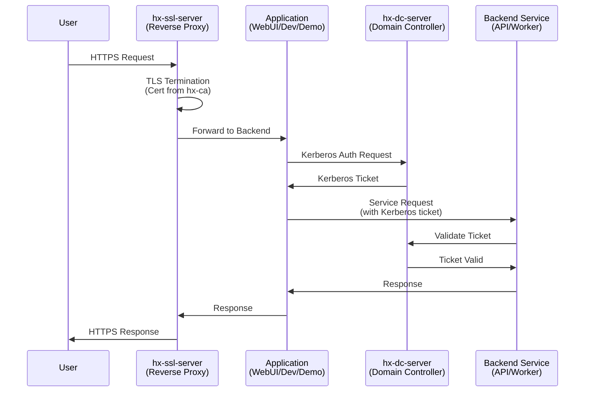
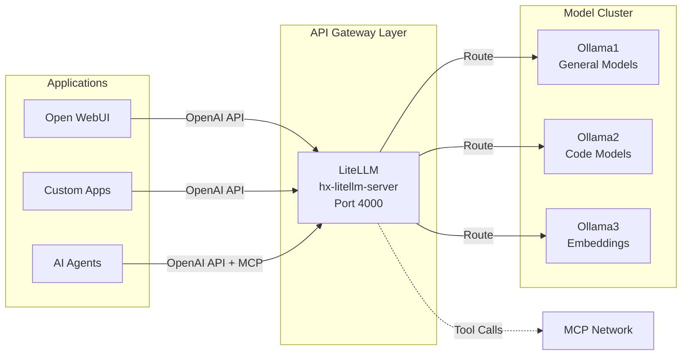
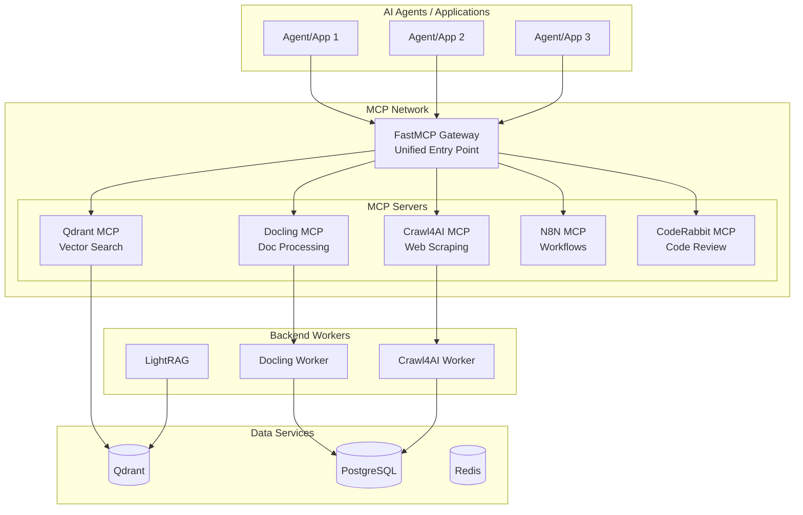
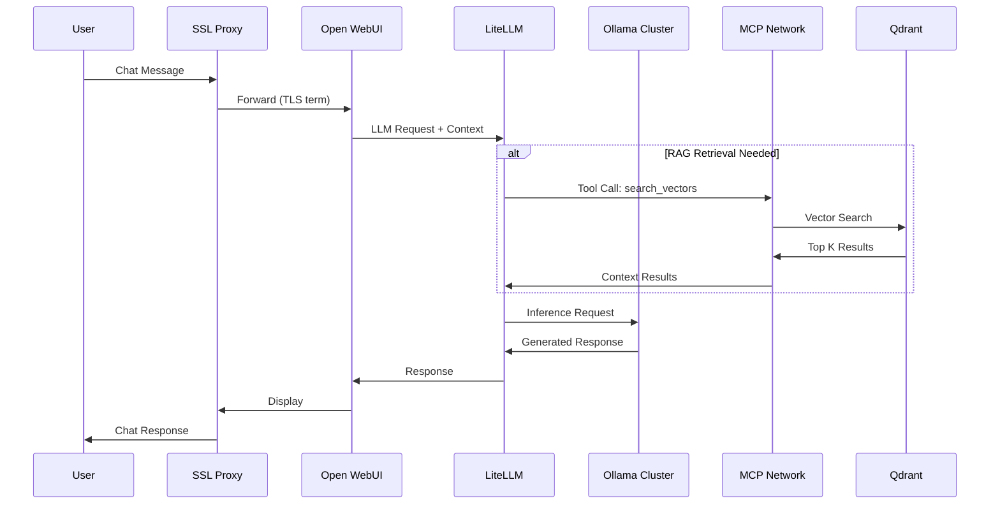
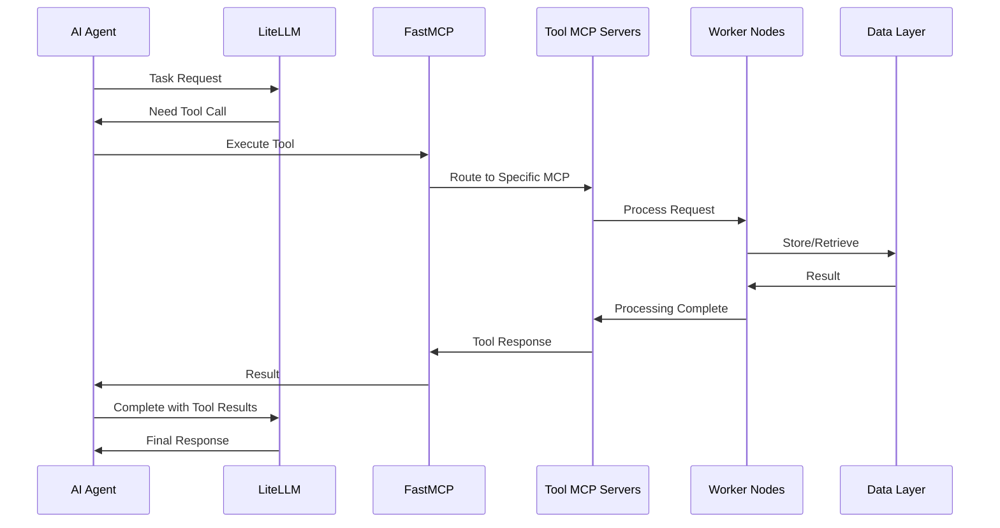
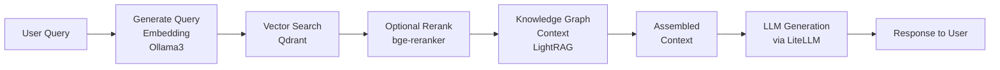
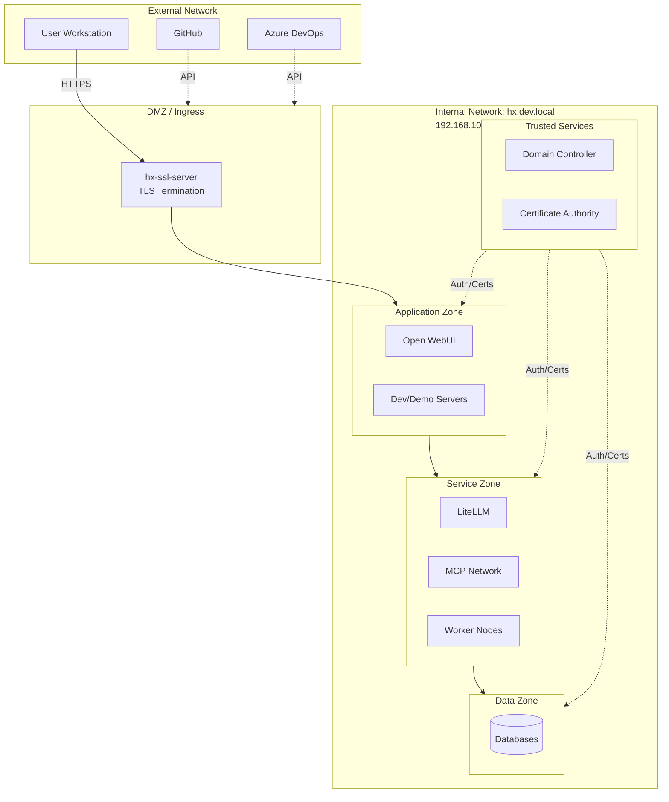

# Hana-X AI Ecosystem Architecture

**Document Type**: High-Level System Architecture  
**Version**: 1.1  
**Date**: 2025-11-02  
**Status**: FINAL  
**Audience**: Project Team, AI Agents, Agent Zero (AZ)

---

## Document Purpose

This architecture document provides a comprehensive high-level view of the Hana-X AI Development and Testing Ecosystem. It establishes the conceptual framework that all agents, developers, and stakeholders must understand to work effectively within the platform.

This is the **architectural blueprint** that connects the strategic vision (Project Scope) with the physical infrastructure (Platform Nodes) and the operational principles (Constitution). All detailed workflow diagrams, integration specifications, and implementation guides will extend from this foundation.

---

## 1. Architecture Overview

### 1.1 Vision Statement

The Hana-X AI Ecosystem is a **100% locally-hosted, enterprise-grade platform** designed to enable rapid development, testing, and validation of AI-driven solutions. It provides a complete stack—from identity management and model serving to vector storage and application hosting—that operates independently of cloud services while maintaining hybrid readiness for future deployment flexibility.

The platform serves as a **controlled sandbox** where AI applications can be developed with production-quality infrastructure patterns, governance frameworks, and security models, then transitioned to containerized deployments when ready.

### 1.2 Core Architectural Principles

**1. Separation of Concerns**  
Each infrastructure layer has a distinct responsibility. Identity management is isolated from model serving; data persistence is separated from application logic. This enables independent scaling, maintenance, and troubleshooting.

**2. 100% Local Independence**  
No external dependencies for core operations. All models, data, and processing remain within the `hx.dev.local` domain. External services (GitHub, Azure DevOps) are integration points, not requirements.

**3. Hybrid-Ready Design**  
All services are containerized or containerization-ready. The local architecture mirrors cloud deployment patterns, ensuring applications can migrate seamlessly when needed.

**4. Security by Design**  
Centralized authentication (Kerberos/LDAP), certificate-based trust (internal CA), and TLS-everywhere ensure secure communication. Development environment simplifications (standard passwords, plain-text docs) are conscious trade-offs documented in the Constitution.

**5. MCP as Integration Backbone**  
Model Context Protocol (MCP) provides standardized interfaces for AI agents to interact with tools, databases, and services. This creates a pluggable, extensible architecture where new capabilities can be added without rewriting integration code.

**6. Layered Architecture**  
Six distinct layers—from identity/trust at the foundation to applications at the top—create clear boundaries and dependencies. Each layer exposes well-defined interfaces to the layers above it.

### 1.3 Key Characteristics

- **30 Server Nodes**: Specialized infrastructure across 6 architectural layers
- **Domain Integrated**: All nodes joined to `hx.dev.local` for centralized auth
- **3-Node Ollama Cluster**: Distributed model serving (general, code, embeddings)
- **MCP Network**: 8+ MCP servers providing tool access to AI agents
- **Unified API Gateway**: LiteLLM routes all LLM traffic
- **Vector + Graph RAG**: Qdrant for vectors, LightRAG for knowledge graphs
- **Development → Demo Pipeline**: Containerized app progression path

---

## 2. Layered Architecture

The Hana-X ecosystem is organized into six logical layers, each with specific responsibilities and clear interfaces to adjacent layers.

```mermaid
graph TB
    subgraph Layer6["Layer 6: Integration & Governance"]
        CC[Claude Code<br/>hx-cc-server]
        METRIC[Metrics/Observability<br/>hx-metric-server]
    end
    
    subgraph Layer5["Layer 5: Application Layer"]
        WEBUI[Open WebUI<br/>hx-webui-server]
        AGUI[Admin Dashboards<br/>hx-agui-server]
        DEV[Dev Server<br/>hx-dev-server]
        DEMO[Demo Server<br/>hx-demo-server]
    end
    
    subgraph Layer4["Layer 4: Agentic & Toolchain"]
        FASTMCP[FastMCP Gateway<br/>hx-fastmcp-server]
        DOCLING_MCP[Docling MCP<br/>hx-docling-mcp-server]
        CRAWL_MCP[Crawl4AI MCP<br/>hx-crawl4ai-mcp-server]
        N8N_MCP[N8N MCP<br/>hx-n8n-mcp-server]
        QMCP[Qdrant MCP<br/>hx-qmcp-server]
        DOCLING[Docling Worker<br/>hx-docling-server]
        CRAWL[Crawl4AI Worker<br/>hx-crawl4ai-server]
        LITERAG[LightRAG<br/>hx-literag-server]
        CODERABBIT[CodeRabbit MCP<br/>hx-coderabbit-server]
    end
    
    subgraph Layer3["Layer 3: Data Plane"]
        POSTGRES[(PostgreSQL<br/>hx-postgres-server)]
        REDIS[(Redis Cache<br/>hx-redis-server)]
        QDRANT[(Qdrant Vectors<br/>hx-qdrant-server)]
        QDRANT_UI[Qdrant UI<br/>hx-qdrant-ui-server]
    end
    
    subgraph Layer2["Layer 2: Model & Inference"]
        LITELLM[LiteLLM Gateway<br/>hx-litellm-server]
        OLLAMA1[Ollama1 General<br/>hx-ollama1-server]
        OLLAMA2[Ollama2 Code<br/>hx-ollama2-server]
        OLLAMA3[Ollama3 Embeddings<br/>hx-ollama3-server]
    end
    
    subgraph Layer1["Layer 1: Identity & Trust"]
        DC[Domain Controller<br/>hx-dc-server]
        CA[Certificate Authority<br/>hx-ca-server]
        SSL[SSL Reverse Proxy<br/>hx-ssl-server]
        CONTROL[Ansible Control<br/>hx-control-node]
    end
    
    %% Layer connections
    Layer5 --> Layer4
    Layer5 --> Layer2
    Layer4 --> Layer3
    Layer4 --> Layer2
    Layer2 --> Layer3
    Layer6 -.monitors.-> Layer1
    Layer6 -.monitors.-> Layer2
    Layer6 -.monitors.-> Layer3
    Layer6 -.monitors.-> Layer4
    Layer6 -.monitors.-> Layer5
    
    %% All layers depend on Layer 1
    Layer2 -.auth.-> Layer1
    Layer3 -.auth.-> Layer1
    Layer4 -.auth.-> Layer1
    Layer5 -.auth.-> Layer1
    Layer6 -.auth.-> Layer1
```

### Layer Descriptions

#### **Layer 1: Identity & Trust**
**Purpose**: Foundation for authentication, authorization, and secure communication across the entire ecosystem.

**Components**:
- **hx-dc-server**: Active Directory domain controller providing Kerberos/LDAP authentication
- **hx-ca-server**: Internal Certificate Authority issuing TLS certificates for all services
- **hx-ssl-server**: Reverse proxy handling TLS termination and routing
- **hx-control-node**: Ansible automation for configuration management

**Key Functions**:
- Single sign-on (SSO) for all applications
- Centralized user/group management
- TLS certificate lifecycle management
- Infrastructure-as-code automation
- Network ingress/egress control

#### **Layer 2: Model & Inference**
**Purpose**: LLM serving, routing, and inference management.

**Components**:
- **hx-litellm-server**: Unified API gateway (OpenAI-compatible endpoints)
- **hx-ollama1-server**: General-purpose LLM inference (gemma3, gpt-oss, mistral)
- **hx-ollama2-server**: Code-focused models (qwen3-coder, qwen2.5, cogito)
- **hx-ollama3-server**: Embedding models (bge-m3) + prompt enhancement

**Key Functions**:
- Load balancing across Ollama nodes
- Model routing and fallback logic
- Token management and rate limiting
- MCP tool call brokering
- **Prompt enhancement preprocessing**: Ollama3 hosts a prompt enhancement model that **both Open WebUI and custom applications** use for low-latency query preprocessing. This bypasses LiteLLM for direct UI-to-model communication, optimizing user experience with immediate response to input refinement.

#### **Layer 3: Data Plane**
**Purpose**: Persistent storage for structured data, cache, and vector embeddings.

**Components**:
- **hx-postgres-server**: System-of-record database (app state, metadata, audit logs)
- **hx-redis-server**: In-memory cache, queues, rate limiting, session storage
- **hx-qdrant-server**: Vector database for RAG embeddings
- **hx-qdrant-ui-server**: Web-based management interface for Qdrant

**Key Functions**:
- Transactional data persistence
- High-performance caching layer
- Vector similarity search (RAG retrieval)
- Session state management
- WAL archiving and backup coordination

#### **Layer 4: Agentic & Toolchain**
**Purpose**: Expose specialized capabilities to AI agents through MCP interfaces and provide worker nodes for heavy processing.

**MCP Servers** (standardized agent interfaces):
- **hx-fastmcp-server**: Unified MCP gateway (includes Brave Search integration)
- **hx-qmcp-server**: Vector database access via MCP
- **hx-docling-mcp-server**: Document parsing/conversion via MCP
- **hx-crawl4ai-mcp-server**: Web scraping/extraction via MCP
- **hx-n8n-mcp-server**: Workflow automation control via MCP
- **hx-coderabbit-server**: AI code review via MCP
- **hx-shadcn-server**: Component registry access (planned)

**Worker Nodes** (backend processing):
- **hx-docling-server**: Document retrieval and conversion
- **hx-crawl4ai-server**: Web crawling and corpus gathering
- **hx-literag-server**: Knowledge graph RAG framework
- **hx-lang-server**: LangChain orchestration (in progress)
- **hx-n8n-server**: Workflow automation engine (planned)

**Key Functions**:
- Standardized tool access for AI agents
- Heavy document processing offload
- Web intelligence gathering
- Knowledge graph construction
- Low-code automation integration

#### **Layer 5: Application Layer**
**Purpose**: User-facing applications and development/testing environments.

**Components**:
- **hx-webui-server**: Open WebUI for conversational AI (production-like)
- **hx-agui-server**: Admin dashboards and operational consoles
- **hx-dev-server**: Development environment for custom Next.js apps
- **hx-demo-server**: Stakeholder demo environment (promoted containers)

**Key Functions**:
- End-user interaction (chat, agents, workflows)
- Administrative interfaces (monitoring, management)
- Development sandboxes (build, test, iterate)
- Demo/validation environments (stakeholder review)

**Agent-UI Communication Standard**:
The application layer uses **AG-UI (Agent User Interaction Protocol)**, an open-source, event-based protocol by CopilotKit that standardizes communication between AI agents and front-end applications. AG-UI enables:
- **Event-based communication**: 16 standard events (text message, tool call, state management)
- **Frontend tool calls**: Agents can trigger UI actions (render components, update canvas, change state)
- **Shared state**: Real-time state synchronization between agent backend and UI
- **Generative UI**: Dynamic component generation based on agent responses
- **Real-time streaming**: Streamed responses for immediate user feedback

CopilotKit provides the infrastructure (hooks like `useCoAgent`, `useCoAgentStateRender`) that bridges AG-UI events to React components in custom applications. Open WebUI and custom Next.js apps on hx-dev/hx-demo servers leverage this protocol for rich, interactive agent experiences.

#### **Layer 6: Integration & Governance**
**Purpose**: Cross-cutting concerns—orchestration, observability, and knowledge management.

**Components**:
- **hx-cc-server**: Claude Code systems integrator (agent coordination hub)
- **hx-metric-server**: Centralized metrics and telemetry (planned)

**Key Functions**:
- Agent orchestration and knowledge vault (`/srv/knowledge/vault`)
- Agentic design patterns repository
- Centralized logging and metrics aggregation (future)
- Platform health monitoring and alerting (future)

---

## 3. Integration Patterns

### 3.1 Authentication & Authorization Flow

All services authenticate through the centralized identity layer:

**Key Points**:
- All external traffic enters via `hx-ssl-server` (TLS termination)
- Applications authenticate users against `hx-dc-server` (Kerberos/LDAP)
- Service-to-service calls use Kerberos tickets for trust
- Internal CA (`hx-ca-server`) issues certificates for all services

### 3.2 API Gateway Pattern (LiteLLM)

All LLM traffic flows through the unified gateway:

**Benefits**:
- Single endpoint for all LLM interactions
- Load balancing and failover across Ollama nodes
- Consistent API (OpenAI-compatible)
- Tool call brokering to MCP servers
- Virtual key management for multi-tenant scenarios

**Architectural Note**: While LiteLLM is the **primary gateway for LLM inference**, certain operations (data ingestion, database queries, tool execution, caching) bypass LiteLLM for efficiency. See Section 3.5 (LiteLLM Bypass Patterns) for details. This is intentional architectural design, not a workaround.

**Exception**: Ollama3 prompt enhancement model bypasses LiteLLM for low-latency UI preprocessing in Open WebUI and custom applications.

### 3.3 MCP Integration Backbone

Model Context Protocol standardizes how AI agents access tools and services:

**Key Characteristics**:
- **FastMCP** acts as primary gateway (can proxy multiple MCP servers)
- Each MCP server provides standard interface to specialized capability
- Backend workers perform heavy lifting (document processing, crawling)
- Data services store results for retrieval
- Agents interact with tools through standardized MCP protocol

### 3.4 Service-to-Service Communication

Internal services communicate directly without gateway intermediation:

**Patterns**:
- **Synchronous**: HTTP/REST APIs for immediate responses
- **Asynchronous**: Redis pub/sub or queues for background jobs
- **Database**: Direct SQL/Redis/Qdrant connections where appropriate
- **Authentication**: Kerberos tickets for service identity

**Example Flow - Document Processing**:
1. User uploads document to application
2. Application calls Docling MCP endpoint
3. Docling MCP server enqueues job to Docling worker
4. Docling worker processes document, extracts text
5. Worker stores results in PostgreSQL (metadata) and Qdrant (embeddings)
6. Worker notifies MCP server of completion
7. MCP server returns status/results to application

### 3.5 LiteLLM Bypass Patterns (Edge Cases)

While LiteLLM serves as the primary gateway for LLM interactions, **certain operations bypass LiteLLM for efficiency**. These are valid architectural patterns where direct access provides better performance or is more appropriate.

**When Components Bypass LiteLLM**:

**1. Data Ingestion Workflows**
- **Pattern**: n8n workflows pull data from sources (MCP tools, PostgreSQL) and store embeddings in Qdrant
- **Why**: Data movement doesn't require LLM interaction; only embedding generation uses models (can call Ollama3 directly)
- **Components**: n8n, Docling/Crawl4AI workers, Qdrant

**2. Initial RAG Retrieval**
- **Pattern**: LangChain queries Qdrant (vector search) and PostgreSQL (metadata) directly using native connectors
- **Why**: Retrieval is a database operation, not an LLM operation
- **Components**: LangChain, Qdrant, PostgreSQL
- **Note**: LiteLLM is used AFTER retrieval to generate the final response

**3. Direct Tool Execution**
- **Pattern**: n8n workflows triggered by agent decisions make direct HTTP/API calls to MCP tools
- **Why**: Tool execution (web scraping, external APIs) doesn't require LLM gateway
- **Components**: n8n, MCP servers, external APIs

**4. Caching and State Management**
- **Pattern**: LangChain/n8n interact directly with Redis for caching responses or storing conversation history
- **Why**: State management is a data operation, not model inference
- **Components**: LangChain, n8n, Redis

**5. Model-Specific Advanced Features**
- **Pattern**: Direct Ollama API access for features not exposed through LiteLLM's unified interface
- **Why**: Access to model-specific parameters or experimental features
- **Components**: Custom applications, Ollama nodes
- **Example**: LightRAG framework may access Ollama directly for optimized retrieval patterns

**6. Prompt Enhancement Preprocessing**
- **Pattern**: Open WebUI and custom apps call Ollama3 prompt enhancer directly
- **Why**: Low-latency user input refinement before main inference
- **Components**: UI applications, Ollama3

**When LiteLLM IS Used**:
- ✅ Final response generation (augmented prompts → human-readable answers)
- ✅ Model routing (selecting appropriate model based on query type)
- ✅ Advanced LLM features (function calling, semantic caching for repeated prompts)
- ✅ Centralized monitoring and rate limiting for LLM usage

**Key Principle**: LiteLLM's value is as a **proxy for large language model operations**, not for data storage, retrieval, or non-LLM tool execution. The architecture allows components to communicate directly when appropriate, while maintaining LiteLLM as the standard gateway for actual model inference.

---

## 4. Data & Control Flows

### 4.1 User Interaction Flow (Web-Based)

### 4.2 Agent Workflow Pattern

### 4.3 Document Processing Pipeline

High-level flow for ingesting external documents:

1. **Acquisition**: User uploads or agent requests document via Crawl4AI/Docling MCP
2. **Retrieval**: Worker node fetches document (local file, URL, API)
3. **Parsing**: Docling extracts text, images, tables, metadata
4. **Chunking**: Text split into semantic chunks (512 tokens, 50 overlap)
5. **Embedding**: Ollama3 generates vector embeddings for each chunk
6. **Storage**: Qdrant stores vectors **with full payload** (text, metadata, source info), PostgreSQL stores metadata/source references
   - **Critical**: All Qdrant uploads must include the complete payload alongside vectors (not vectors alone) to enable rich retrieval and context assembly. Reference: [Contextual Document Embeddings](https://arxiv.org/abs/2410.05779)
7. **Indexing**: LightRAG builds knowledge graph of entities/relationships
8. **Retrieval**: Future queries search vectors + knowledge graph for relevant context

### 4.4 RAG Retrieval Pattern

**Dual-Level Retrieval**:
- **Low-Level**: Vector similarity (precise entity/fact retrieval)
- **High-Level**: Knowledge graph traversal (conceptual relationships)
- **Combined**: Synergistic retrieval for comprehensive answers

---

## 5. Security Architecture

### 5.1 Trust Boundaries

### 5.2 Authentication Zones

| Zone | Authentication Method | Trust Model |
|------|----------------------|-------------|
| **User → SSL** | HTTPS (client cert optional) | Certificate validation |
| **SSL → Apps** | Kerberos ticket | Domain trust |
| **App → Service** | Kerberos ticket | Service principals |
| **Service → Data** | Service account | Database auth + Kerberos |
| **Admin → Control** | SSH key + Kerberos | Multi-factor concept |

### 5.3 TLS Architecture

**Certificate Hierarchy**:
1. **Root CA** (hx-ca-server): Self-signed, offline root
2. **Issuing CA** (hx-ca-server): Issues server/client certificates
3. **Service Certificates**: TLS certs for each server/service
4. **Client Certificates** (optional): For workstation/service authentication

**TLS Termination**:
- **External**: hx-ssl-server terminates all external HTTPS
- **Internal**: Service-to-service can use direct TLS or trust domain
- **Encryption**: TLS 1.2+ required, modern cipher suites only

### 5.4 Development Environment Security Model

⚠️ **Critical Understanding**: This is a **DEVELOPMENT/TEST** environment with intentional security simplifications:

**Accepted Simplifications**:
- Standard passwords (`Major8859!` or `Major8859`)
- Secrets in plain text documentation
- No MFA enforcement
- No password rotation policies
- Simplified RBAC (basic groups)

**Security Still Enforced**:
- Domain authentication (Kerberos/LDAP)
- TLS encryption (internal CA)
- Service isolation (network boundaries)
- Audit logging (where configured)

**Production Requirements**:
- Complete security overhaul mandatory
- Secrets management (Vault, Key Management)
- MFA enforcement
- Password rotation policies
- Advanced RBAC and least privilege
- Enhanced monitoring and SIEM integration

---

## 6. Component Topology

### 6.1 Server Mapping to Layers

| Layer | IP Range | Server Count | Key Servers |
|-------|----------|--------------|-------------|
| **1: Identity & Trust** | .200-.203 | 4 | DC, CA, SSL, Control |
| **2: Model & Inference** | .204-.206, .212 | 4 | Ollama1/2/3, LiteLLM |
| **3: Data Plane** | .207-.211 | 5 | Postgres, Redis, Qdrant, QMCP, Qdrant-UI |
| **4: Agentic & Toolchain** | .213-.220, .228-.229 | 11 | FastMCP, Docling*, Crawl4AI*, N8N*, LightRAG, CodeRabbit, Shadcn |
| **5: Application** | .221-.223, .227 | 4 | WebUI, AGUI, Dev, Demo |
| **6: Integration & Governance** | .224-.226 | 3 | CC Server, Metrics, Lang |
| **Total** | .200-.229 | **30** | Full ecosystem |

### 6.2 Service Interdependencies (High-Level)

**Critical Dependencies** (must be operational for platform to function):
- **hx-dc-server**: Authentication for all services
- **hx-ca-server**: TLS certificates for all services
- **hx-litellm-server**: Gateway for all LLM traffic (except direct ollama3 bypass)
- **hx-postgres-server**: System-of-record for application state
- **hx-qdrant-server**: Vector storage for RAG

**Soft Dependencies** (enhance capability but not required for basic operations):
- **hx-redis-server**: Caching (performance optimization)
- **hx-fastmcp-server**: Unified MCP gateway (agents can call individual MCPs)
- **Worker nodes**: Background processing (can be queued if unavailable)

### 6.3 Network Topology

**Network**: `192.168.10.0/24` (isolated development network)  
**Gateway**: `192.168.10.1`  
**DNS**: `192.168.10.200` (hx-dc-server)  
**Domain**: `hx.dev.local`

**Firewall Concept** (logical, not strictly enforced in dev):
- External → SSL proxy only
- Internal → All-to-all within domain (Kerberos trust)
- Service → Data ports (Postgres: 5432, Redis: 6379, Qdrant: 6333)
- Admin → SSH (port 22) from control node

---

## 7. Design Decisions & Rationale

### 7.1 Why 100% Local Infrastructure?

**Benefits**:
- **Complete Control**: No cloud provider dependencies or rate limits
- **Data Privacy**: All data remains on-premises, no external transmission
- **Cost Predictability**: Fixed infrastructure costs, no per-token pricing
- **Performance**: Low-latency access to all services
- **Development Velocity**: No waiting for cloud provisioning or approvals

**Trade-offs**:
- Physical hardware management required
- Limited by on-prem compute/storage capacity
- Disaster recovery requires local backup infrastructure

**Mitigation**: Hybrid-ready design means workloads can move to cloud when needed without architecture changes.

### 7.2 Why Layered Architecture?

**Benefits**:
- **Clear Boundaries**: Each layer has well-defined responsibilities
- **Independent Scaling**: Scale layers based on demand
- **Easier Troubleshooting**: Issues isolated to specific layers
- **Technology Flexibility**: Swap implementations within a layer without affecting others
- **Team Alignment**: Teams can own specific layers

**Implementation**:
- Layers communicate through standardized interfaces
- Lower layers expose APIs to upper layers
- Cross-layer communication minimized (except auth/monitoring)

### 7.3 Why MCP as Integration Backbone?

**Benefits**:
- **Standardization**: Consistent protocol for tool access
- **Extensibility**: Add new tools without rewriting agent code
- **Composability**: Agents use multiple tools seamlessly
- **Abstraction**: Agents don't need to know backend implementation details
- **Community**: Growing ecosystem of MCP-compatible tools

**Implementation**:
- FastMCP provides unified gateway
- Individual MCP servers expose specialized capabilities
- Worker nodes do heavy processing behind MCP interfaces

### 7.4 Why 3-Node Ollama Cluster?

**Benefits**:
- **Specialization**: Dedicate nodes to workload types (general, code, embeddings)
- **Resource Optimization**: Match model size to node capacity
- **Load Distribution**: Spread inference across multiple GPUs/CPUs
- **Availability**: Continue operating if one node fails

**Configuration**:
- **Ollama1**: General conversational models (gemma3:27b, gpt-oss:20b, mistral:7b)
- **Ollama2**: Code-focused models (qwen3-coder:30b, qwen2.5:7b, cogito:3b)
- **Ollama3**: Embeddings (bge-m3:567m) + prompt enhancement

### 7.5 Hybrid Readiness Strategy

**Containerization**:
- All services are containerized or containerization-ready
- Docker/Podman used for deployment
- Container images stored in local registry (future) or built on-demand

**Migration Path**:
1. Develop and validate locally in hx.dev.local
2. Build production-ready containers with hardened security
3. Deploy to cloud Kubernetes cluster or on-prem OpenShift
4. Replicate architecture patterns (keep layered design)
5. Replace local DNS/auth with cloud equivalents (Azure AD, etc.)

**Key Principle**: Architecture patterns remain constant; only infrastructure provider changes.

---

## 8. Cross-Reference & Traceability

### 8.1 Alignment with Project Scope

This architecture document implements the vision defined in **Hana-X Project Scope (Final)**:

| Scope Category | Architecture Layer | Key Components |
|----------------|-------------------|----------------|
| **Frontend & User Interface** | Layer 5: Application | hx-webui, hx-agui, hx-dev, hx-demo |
| **Backend & Application Services** | Layer 4: Agentic | FastMCP, N8N*, Docling*, Crawl4AI*, CodeRabbit, Shadcn |
| **Data & Model Infrastructure** | Layer 2 & 3 | Ollama cluster, LiteLLM, Postgres, Redis, Qdrant, QMCP, LightRAG |
| **API Gateway** | Layer 2 | hx-litellm-server |
| **Platform & Infrastructure** | Layer 1 | hx-dc, hx-ca, hx-ssl, hx-control |
| **DevOps, Governance & Delivery** | Layer 6 | hx-cc, hx-metric |

### 8.2 Alignment with Platform Nodes

Every server documented in **Hana-X Platform Nodes (Final)** is represented in this architecture:

- **30 servers mapped to 6 architectural layers** ✅
- **Status tracking preserved** (✅ Active, 🛠️ In-Progress, ⬜ TBD)
- **Component relationships clarified** (which services depend on which)
- **Integration patterns defined** (how components communicate)

### 8.3 Alignment with Constitution

This architecture embodies principles from the **Hana-X Agent Constitution**:

- **Principle I (Quality Over Speed)**: Layered design prioritizes correctness over shortcuts
- **Principle II (SOLID OOP)**: Clear separation of concerns, single responsibilities per layer
- **Principle V (Infrastructure Supremacy)**: Layer 1 (Chewbacca) has foundational authority
- **Section VI (DEV Security Model)**: Security architecture acknowledges dev simplifications
- **Section X-XVIII (Inter-Agent Coordination)**: MCP backbone enables agent collaboration

---

## 9. Future Architecture Evolution

### 9.1 Phase 2 Enhancements (Planned)

**Observability & Monitoring**:
- Full deployment of hx-metric-server (Prometheus + Grafana)
- Centralized logging (ELK or Loki stack)
- Distributed tracing (OpenTelemetry)
- Service health dashboards

**High Availability**:
- Postgres streaming replication
- Redis sentinel for failover
- Load balancer for web tier
- Multi-node Qdrant clustering

**CI/CD Pipeline**:
- Automated testing on hx-dev-server
- Container image building and scanning
- Automated promotion to hx-demo-server
- GitOps deployment patterns

### 9.2 Advanced Features (Future)

**Multi-Tenancy**:
- Namespace isolation for different projects/teams
- Virtual keys with budget limits (LiteLLM)
- Separate Qdrant collections per tenant
- Role-based access control (RBAC) refinement

**Advanced RAG**:
- Hybrid search (vector + keyword + graph)
- Query rewriting and expansion
- Context caching and optimization
- Multi-hop reasoning over knowledge graphs

**Workflow Automation**:
- Full n8n deployment and integration
- Event-driven architectures
- Scheduled job orchestration
- Integration with external systems

---

## 10. Conclusion

The Hana-X AI Ecosystem Architecture provides a robust, scalable, and secure foundation for AI solution development and testing. By organizing 30 specialized servers into 6 logical layers, implementing standardized integration patterns (MCP, API gateway), and maintaining clear security boundaries, the platform enables:

- **Rapid Development**: Developers and agents have all necessary infrastructure immediately available
- **Production Patterns**: Applications developed locally can transition to production with minimal refactoring
- **Controlled Experimentation**: Isolated environment for testing AI capabilities without production risk
- **Governance Alignment**: Architecture enforces principles defined in Constitution
- **Future Flexibility**: Hybrid-ready design supports eventual cloud migration

This document serves as the **architectural reference point** for all agents, developers, and stakeholders. Detailed workflow diagrams, integration specifications, and implementation guides will extend from this foundation as the project progresses through Phase 1 and beyond.

---

**Document Status**: FINAL  
**Version**: 1.1  
**Date**: 2025-11-02  
**Location**: `/<project-name>/0.0-governance/hana_x_ecosystem_architecture_final.md`  
**Cross-References**:
- Hana-X Project Scope (Final)
- Hana-X Platform Nodes (Final)
- Hana-X Agent Constitution

---

*This architecture is the bridge between strategic vision and operational reality. Every component, every layer, every integration pattern exists to support the mission: enabling intelligent, adaptive, and scalable AI operations.*
