# n8n MCP Server Architecture

**Document Type**: Technical Architecture  
**Created**: November 10, 2025  
**Project Code**: HX-N8N-MCP-001  
**Classification**: Internal - Technical Documentation  
**Status**: DRAFT - In Development  

---

## Table of Contents

1. [Architecture Overview](#architecture-overview)
2. [System Context](#system-context)
3. [Network Architecture](#network-architecture)
4. [Integration Patterns](#integration-patterns)
5. [Data Flow Diagrams](#data-flow-diagrams)
6. [Sequence Diagrams](#sequence-diagrams)
7. [Component Architecture](#component-architecture)
8. [Security Architecture](#security-architecture)
9. [Future State Architecture](#future-state-architecture)

---

## 1. Architecture Overview

### 1.1 High-Level Architecture

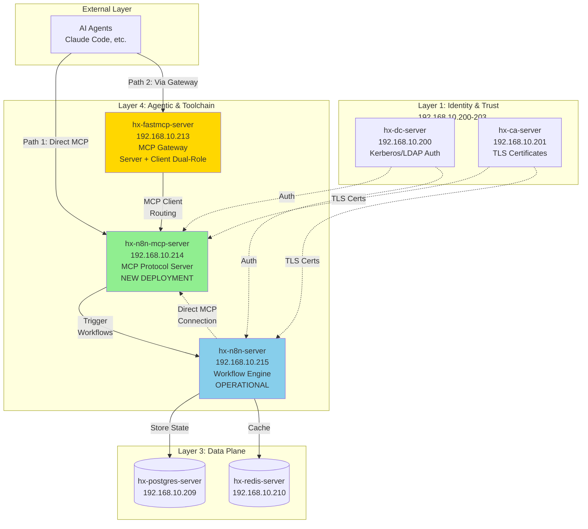
```mermaid
graph TB
    subgraph External["External Layer"]
        Agent[AI Agents<br/>Claude Code, etc.]
    end
    
    subgraph Layer1["Layer 1: Identity & Trust<br/>192.168.10.200-203"]
        DC[hx-dc-server<br/>192.168.10.200<br/>Kerberos/LDAP Auth]
        CA[hx-ca-server<br/>192.168.10.201<br/>TLS Certificates]
    end
    
    subgraph Layer4["Layer 4: Agentic & Toolchain<br/>192.168.10.213-215"]
        FastMCP[hx-fastmcp-server<br/>192.168.10.213<br/>MCP Gateway<br/>Server + Client Dual-Role]
        N8NMCP[hx-n8n-mcp-server<br/>192.168.10.214<br/>MCP Protocol Server<br/>NEW DEPLOYMENT]
        N8N[hx-n8n-server<br/>192.168.10.215<br/>Workflow Engine<br/>OPERATIONAL]
    end
    
    subgraph Layer3["Layer 3: Data Plane"]
        Postgres[(hx-postgres-server<br/>192.168.10.209)]
        Redis[(hx-redis-server<br/>192.168.10.210)]
    end
    
    Agent -->|Path 1: Direct MCP| N8NMCP
    Agent -->|Path 2: Via Gateway| FastMCP
    FastMCP -->|MCP Client<br/>Routing| N8NMCP
    
    N8N -.->|Direct MCP<br/>Connection| N8NMCP
    N8NMCP -->|Trigger<br/>Workflows| N8N
    
    N8N -->|Store State| Postgres
    N8N -->|Cache| Redis
    
    DC -.->|Auth| N8NMCP
    DC -.->|Auth| N8N
    CA -.->|TLS Certs| N8NMCP
    CA -.->|TLS Certs| N8N
    
    style N8NMCP fill:#90EE90
    style FastMCP fill:#FFD700
    style N8N fill:#87CEEB
```

### 1.2 Architecture Principles

**Separation of Concerns**:
- **n8n Server (192.168.10.215)**: Workflow execution engine
- **n8n MCP Server (192.168.10.214)**: MCP protocol translation layer
- **FastMCP (192.168.10.213)**: Unified gateway and routing

**Dual Integration Pattern**:
- **Direct Path**: Agents connect directly to n8n MCP server for workflow invocation
- **Gateway Path**: Agents discover tools via FastMCP, which routes to n8n MCP server

**Protocol Compliance**:
- All MCP communications follow Model Context Protocol specification
- Tool definitions use standard MCP metadata format
- Error handling follows MCP error response conventions

---

## 2. System Context

### 2.1 n8n MCP Server in HANA-X Ecosystem

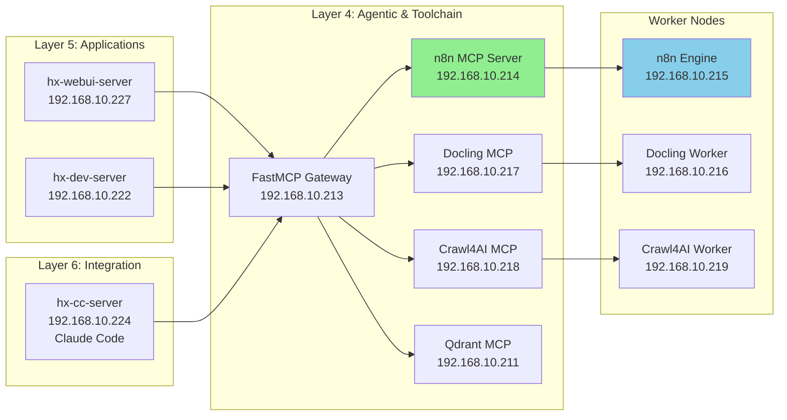
```mermaid
graph LR
    subgraph Applications["Layer 5: Applications"]
        WebUI[hx-webui-server<br/>192.168.10.227]
        DevServer[hx-dev-server<br/>192.168.10.222]
    end
    
    subgraph Integration["Layer 6: Integration"]
        CCServer[hx-cc-server<br/>192.168.10.224<br/>Claude Code]
    end
    
    subgraph AgenticTools["Layer 4: Agentic & Toolchain"]
        FastMCP[FastMCP Gateway<br/>192.168.10.213]
        N8NMCP[n8n MCP Server<br/>192.168.10.214]
        DoclingMCP[Docling MCP<br/>192.168.10.217]
        CrawlMCP[Crawl4AI MCP<br/>192.168.10.218]
        QMCP[Qdrant MCP<br/>192.168.10.211]
    end
    
    subgraph Workers["Worker Nodes"]
        N8NEngine[n8n Engine<br/>192.168.10.215]
        Docling[Docling Worker<br/>192.168.10.216]
        Crawl[Crawl4AI Worker<br/>192.168.10.219]
    end
    
    WebUI --> FastMCP
    DevServer --> FastMCP
    CCServer --> FastMCP
    
    FastMCP --> N8NMCP
    FastMCP --> DoclingMCP
    FastMCP --> CrawlMCP
    FastMCP --> QMCP
    
    N8NMCP --> N8NEngine
    DoclingMCP --> Docling
    CrawlMCP --> Crawl
    
    style N8NMCP fill:#90EE90
    style N8NEngine fill:#87CEEB
```

### 2.2 Component Responsibilities

| Component | IP Address | Primary Role | Secondary Role |
|-----------|------------|--------------|----------------|
| **hx-n8n-mcp-server** | 192.168.10.214 | MCP protocol server | Workflow discovery endpoint |
| **hx-n8n-server** | 192.168.10.215 | Workflow execution | Direct MCP client |
| **hx-fastmcp-server** | 192.168.10.213 | MCP gateway (server role) | MCP client (routing role) |

---

## 3. Network Architecture

### 3.1 Network Connectivity Map

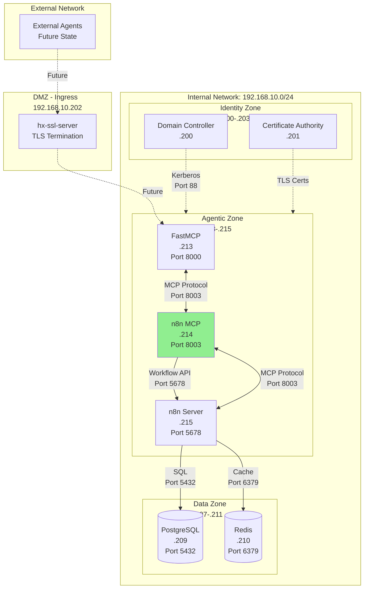
```mermaid
graph TB
    subgraph Internet["External Network"]
        ExtAgent[External Agents<br/>Future State]
    end
    
    subgraph DMZ["DMZ - Ingress<br/>192.168.10.202"]
        SSL[hx-ssl-server<br/>TLS Termination]
    end
    
    subgraph Internal["Internal Network: 192.168.10.0/24"]
        subgraph Identity["Identity Zone<br/>.200-.203"]
            DC[Domain Controller<br/>.200]
            CA[Certificate Authority<br/>.201]
        end
        
        subgraph Agentic["Agentic Zone<br/>.213-.215"]
            FastMCP[FastMCP<br/>.213<br/>Port 8000]
            N8NMCP[n8n MCP<br/>.214<br/>Port 8003]
            N8N[n8n Server<br/>.215<br/>Port 5678]
        end
        
        subgraph Data["Data Zone<br/>.207-.211"]
            DB[(PostgreSQL<br/>.209<br/>Port 5432)]
            Cache[(Redis<br/>.210<br/>Port 6379)]
        end
    end
    
    ExtAgent -.->|Future| SSL
    SSL -.->|Future| FastMCP
    
    FastMCP <-->|MCP Protocol<br/>Port 8003| N8NMCP
    N8N <-->|MCP Protocol<br/>Port 8003| N8NMCP
    N8NMCP -->|Workflow API<br/>Port 5678| N8N
    
    N8N -->|SQL<br/>Port 5432| DB
    N8N -->|Cache<br/>Port 6379| Cache
    
    DC -.->|Kerberos<br/>Port 88| Agentic
    CA -.->|TLS Certs| Agentic
    
    style N8NMCP fill:#90EE90
```

### 3.2 Port Mapping

| Service | Server | Port | Protocol | Purpose | Access |
|---------|--------|------|----------|---------|--------|
| **n8n MCP Server** | 192.168.10.214 | 8003 | TCP | MCP protocol | Internal only |
| **n8n Workflow Server** | 192.168.10.215 | 5678 | TCP | Workflow API | Internal only |
| **FastMCP Gateway** | 192.168.10.213 | 8000 | TCP | MCP gateway | Internal only |
| **PostgreSQL** | 192.168.10.209 | 5432 | TCP | Database | Internal only |
| **Redis** | 192.168.10.210 | 6379 | TCP | Cache | Internal only |

---

## 4. Integration Patterns

### 4.1 Dual-Path Integration Pattern

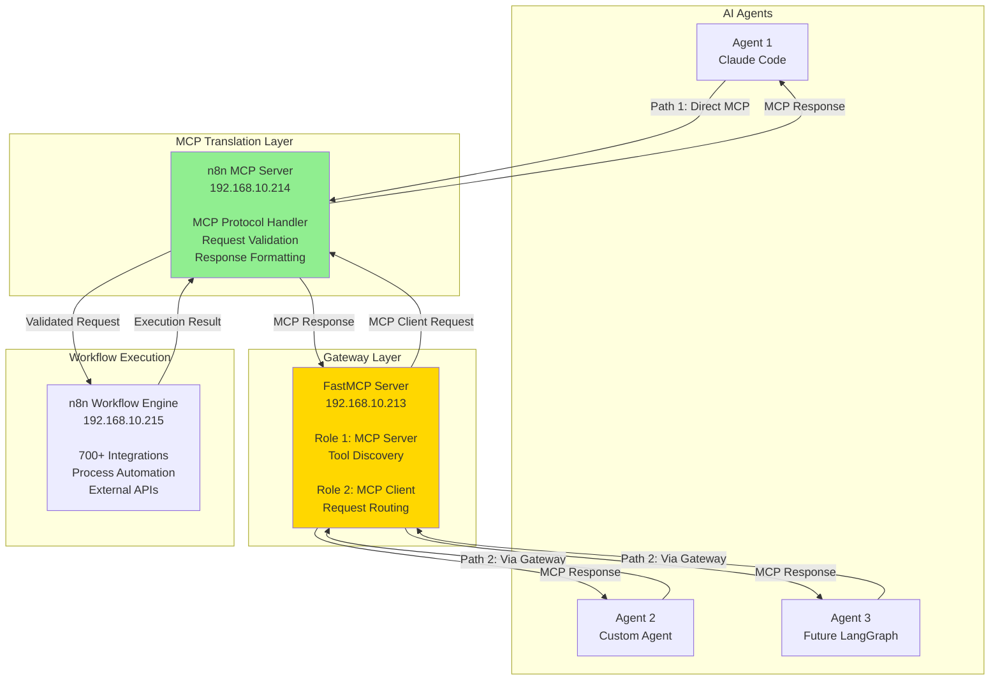
```mermaid
graph TB
    subgraph Agents["AI Agents"]
        A1[Agent 1<br/>Claude Code]
        A2[Agent 2<br/>Custom Agent]
        A3[Agent 3<br/>Future LangGraph]
    end
    
    subgraph Gateway["Gateway Layer"]
        FastMCP[FastMCP Server<br/>192.168.10.213<br/><br/>Role 1: MCP Server<br/>Tool Discovery<br/><br/>Role 2: MCP Client<br/>Request Routing]
    end
    
    subgraph MCP["MCP Translation Layer"]
        N8NMCP[n8n MCP Server<br/>192.168.10.214<br/><br/>MCP Protocol Handler<br/>Request Validation<br/>Response Formatting]
    end
    
    subgraph Execution["Workflow Execution"]
        N8N[n8n Workflow Engine<br/>192.168.10.215<br/><br/>700+ Integrations<br/>Process Automation<br/>External APIs]
    end
    
    A1 -->|Path 1: Direct MCP| N8NMCP
    A2 -->|Path 2: Via Gateway| FastMCP
    A3 -->|Path 2: Via Gateway| FastMCP
    
    FastMCP -->|MCP Client Request| N8NMCP
    
    N8NMCP -->|Validated Request| N8N
    N8N -->|Execution Result| N8NMCP
    N8NMCP -->|MCP Response| FastMCP
    N8NMCP -->|MCP Response| A1
    FastMCP -->|MCP Response| A2
    FastMCP -->|MCP Response| A3
    
    style N8NMCP fill:#90EE90
    style FastMCP fill:#FFD700
```

### 4.2 Path Selection Decision Tree

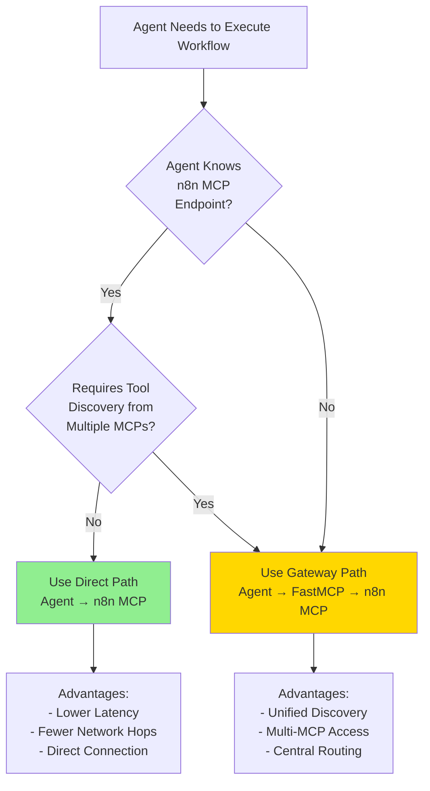
```mermaid
graph TD
    Start[Agent Needs to Execute Workflow] --> Question1{Agent Knows<br/>n8n MCP<br/>Endpoint?}
    
    Question1 -->|Yes| Question2{Requires Tool<br/>Discovery from<br/>Multiple MCPs?}
    Question2 -->|No| Direct[Use Direct Path<br/>Agent → n8n MCP]
    Question2 -->|Yes| Gateway[Use Gateway Path<br/>Agent → FastMCP → n8n MCP]
    
    Question1 -->|No| Gateway
    
    Direct --> Advantage1[Advantages:<br/>- Lower Latency<br/>- Fewer Network Hops<br/>- Direct Connection]
    Gateway --> Advantage2[Advantages:<br/>- Unified Discovery<br/>- Multi-MCP Access<br/>- Central Routing]
    
    style Direct fill:#90EE90
    style Gateway fill:#FFD700
```

---

## 5. Data Flow Diagrams

### 5.1 Direct Path Workflow Execution

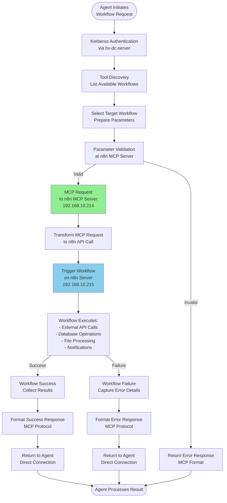
```mermaid
flowchart TB
    Start([Agent Initiates<br/>Workflow Request]) --> Auth[Kerberos Authentication<br/>via hx-dc-server]
    Auth --> Discover[Tool Discovery<br/>List Available Workflows]
    Discover --> Select[Select Target Workflow<br/>Prepare Parameters]
    Select --> Validate[Parameter Validation<br/>at n8n MCP Server]
    
    Validate -->|Valid| MCPReq[MCP Request<br/>to n8n MCP Server<br/>192.168.10.214]
    Validate -->|Invalid| Error1[Return Error Response<br/>MCP Format]
    
    MCPReq --> Transform[Transform MCP Request<br/>to n8n API Call]
    Transform --> Execute[Trigger Workflow<br/>on n8n Server<br/>192.168.10.215]
    
    Execute --> WorkflowSteps[Workflow Executes:<br/>- External API Calls<br/>- Database Operations<br/>- File Processing<br/>- Notifications]
    
    WorkflowSteps -->|Success| Success[Workflow Success<br/>Collect Results]
    WorkflowSteps -->|Failure| Error2[Workflow Failure<br/>Capture Error Details]
    
    Success --> Format1[Format Success Response<br/>MCP Protocol]
    Error2 --> Format2[Format Error Response<br/>MCP Protocol]
    
    Format1 --> Return1[Return to Agent<br/>Direct Connection]
    Format2 --> Return2[Return to Agent<br/>Direct Connection]
    
    Return1 --> End([Agent Processes Result])
    Return2 --> End
    Error1 --> End
    
    style MCPReq fill:#90EE90
    style Execute fill:#87CEEB
```

### 5.2 Gateway Path Workflow Execution

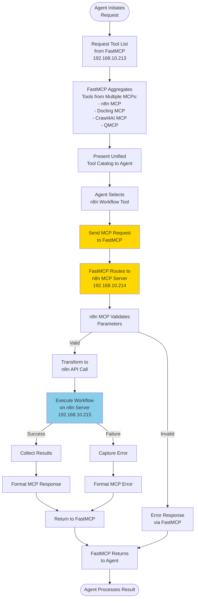
```mermaid
flowchart TB
    Start([Agent Initiates<br/>Request]) --> DiscoverGW[Request Tool List<br/>from FastMCP<br/>192.168.10.213]
    
    DiscoverGW --> Aggregate[FastMCP Aggregates<br/>Tools from Multiple MCPs:<br/>- n8n MCP<br/>- Docling MCP<br/>- Crawl4AI MCP<br/>- QMCP]
    
    Aggregate --> Present[Present Unified<br/>Tool Catalog to Agent]
    Present --> Select[Agent Selects<br/>n8n Workflow Tool]
    
    Select --> GWRequest[Send MCP Request<br/>to FastMCP]
    GWRequest --> Route[FastMCP Routes to<br/>n8n MCP Server<br/>192.168.10.214]
    
    Route --> Validate[n8n MCP Validates<br/>Parameters]
    
    Validate -->|Valid| Transform[Transform to<br/>n8n API Call]
    Validate -->|Invalid| Error1[Error Response<br/>via FastMCP]
    
    Transform --> Execute[Execute Workflow<br/>on n8n Server<br/>192.168.10.215]
    
    Execute -->|Success| Success[Collect Results]
    Execute -->|Failure| Error2[Capture Error]
    
    Success --> Format1[Format MCP Response]
    Error2 --> Format2[Format MCP Error]
    
    Format1 --> ReturnMCP[Return to FastMCP]
    Format2 --> ReturnMCP
    
    ReturnMCP --> ReturnAgent[FastMCP Returns<br/>to Agent]
    Error1 --> ReturnAgent
    
    ReturnAgent --> End([Agent Processes Result])
    
    style GWRequest fill:#FFD700
    style Route fill:#FFD700
    style Execute fill:#87CEEB
```

### 5.3 n8n Direct MCP Connection

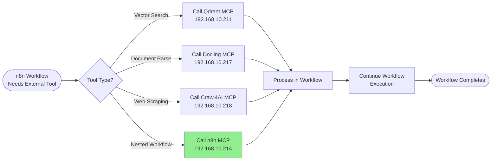
```mermaid
flowchart LR
    Start([n8n Workflow<br/>Needs External Tool]) --> Decision{Tool Type?}
    
    Decision -->|Vector Search| QMCP[Call Qdrant MCP<br/>192.168.10.211]
    Decision -->|Document Parse| DocMCP[Call Docling MCP<br/>192.168.10.217]
    Decision -->|Web Scraping| CrawlMCP[Call Crawl4AI MCP<br/>192.168.10.218]
    Decision -->|Nested Workflow| SelfMCP[Call n8n MCP<br/>192.168.10.214]
    
    QMCP --> Process[Process in Workflow]
    DocMCP --> Process
    CrawlMCP --> Process
    SelfMCP --> Process
    
    Process --> Continue[Continue Workflow<br/>Execution]
    Continue --> End([Workflow Completes])
    
    style SelfMCP fill:#90EE90
```

---

## 6. Sequence Diagrams

### 6.1 Direct MCP Workflow Invocation

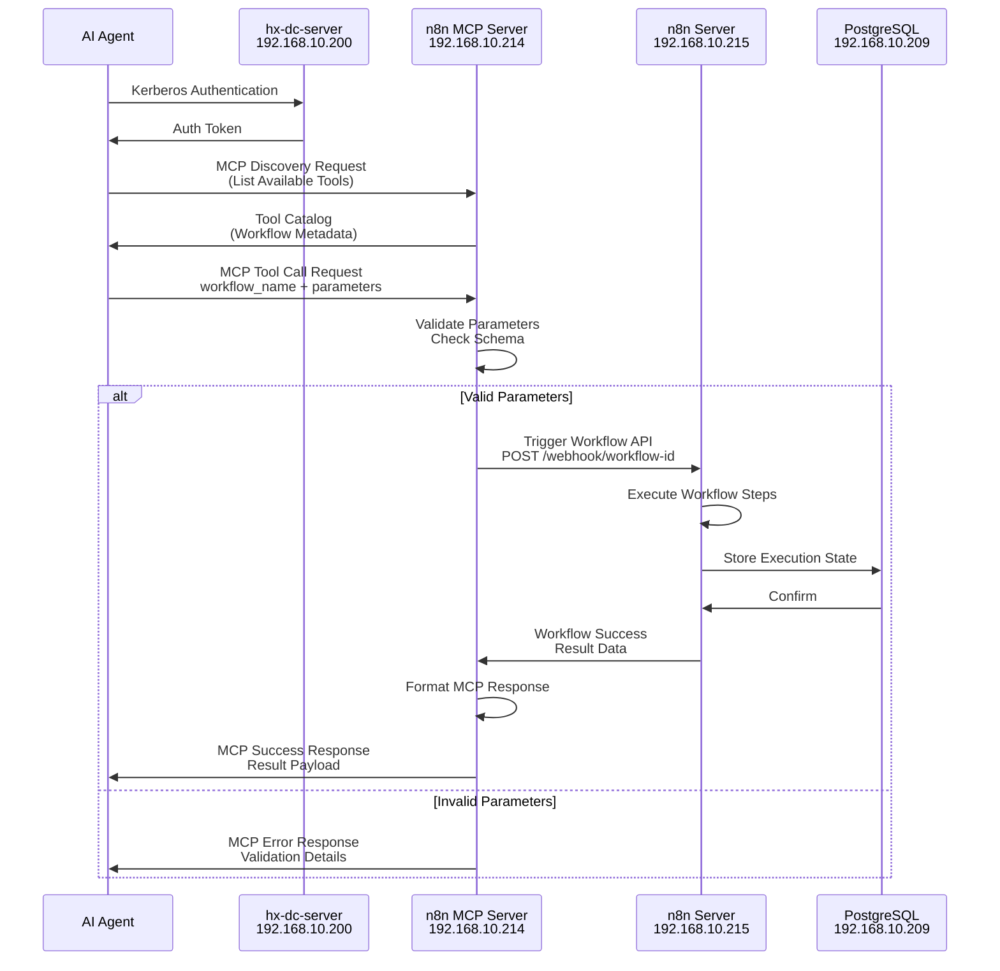
```mermaid
sequenceDiagram
    participant Agent as AI Agent
    participant DC as hx-dc-server<br/>192.168.10.200
    participant MCP as n8n MCP Server<br/>192.168.10.214
    participant N8N as n8n Server<br/>192.168.10.215
    participant DB as PostgreSQL<br/>192.168.10.209
    
    Agent->>DC: Kerberos Authentication
    DC->>Agent: Auth Token
    
    Agent->>MCP: MCP Discovery Request<br/>(List Available Tools)
    MCP->>Agent: Tool Catalog<br/>(Workflow Metadata)
    
    Agent->>MCP: MCP Tool Call Request<br/>workflow_name + parameters
    
    MCP->>MCP: Validate Parameters<br/>Check Schema
    
    alt Valid Parameters
        MCP->>N8N: Trigger Workflow API<br/>POST /webhook/workflow-id
        N8N->>N8N: Execute Workflow Steps
        N8N->>DB: Store Execution State
        DB->>N8N: Confirm
        N8N->>MCP: Workflow Success<br/>Result Data
        MCP->>MCP: Format MCP Response
        MCP->>Agent: MCP Success Response<br/>Result Payload
    else Invalid Parameters
        MCP->>Agent: MCP Error Response<br/>Validation Details
    end
```

### 6.2 Gateway-Routed Workflow Invocation

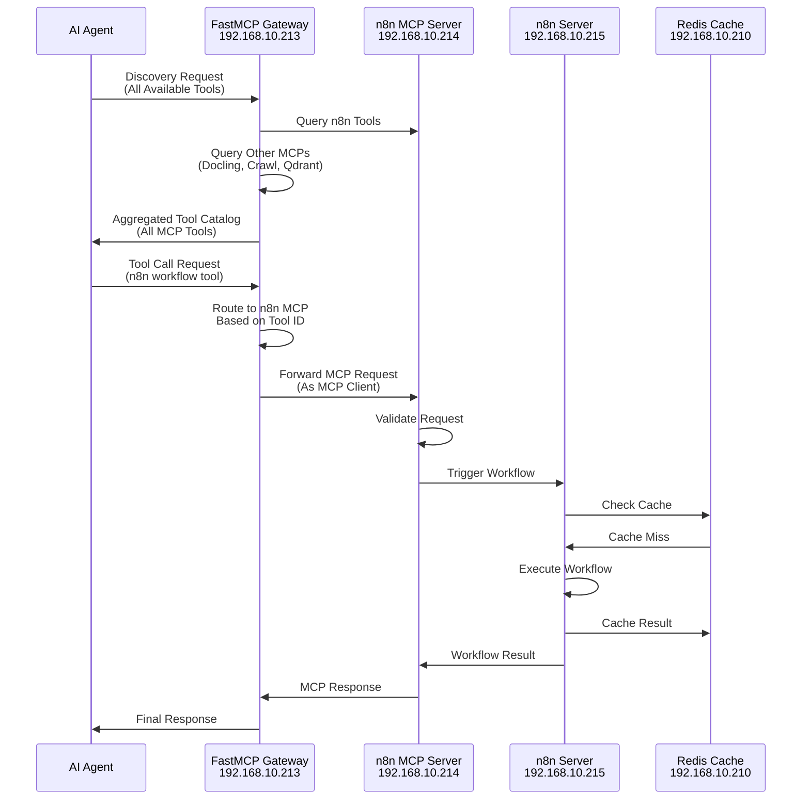
```mermaid
sequenceDiagram
    participant Agent as AI Agent
    participant FastMCP as FastMCP Gateway<br/>192.168.10.213
    participant MCP as n8n MCP Server<br/>192.168.10.214
    participant N8N as n8n Server<br/>192.168.10.215
    participant Redis as Redis Cache<br/>192.168.10.210
    
    Agent->>FastMCP: Discovery Request<br/>(All Available Tools)
    
    FastMCP->>MCP: Query n8n Tools
    FastMCP->>FastMCP: Query Other MCPs<br/>(Docling, Crawl, Qdrant)
    
    FastMCP->>Agent: Aggregated Tool Catalog<br/>(All MCP Tools)
    
    Agent->>FastMCP: Tool Call Request<br/>(n8n workflow tool)
    
    FastMCP->>FastMCP: Route to n8n MCP<br/>Based on Tool ID
    
    FastMCP->>MCP: Forward MCP Request<br/>(As MCP Client)
    
    MCP->>MCP: Validate Request
    MCP->>N8N: Trigger Workflow
    
    N8N->>Redis: Check Cache
    Redis->>N8N: Cache Miss
    
    N8N->>N8N: Execute Workflow
    N8N->>Redis: Cache Result
    
    N8N->>MCP: Workflow Result
    MCP->>FastMCP: MCP Response
    FastMCP->>Agent: Final Response
```

### 6.3 n8n-to-n8n MCP Self-Call

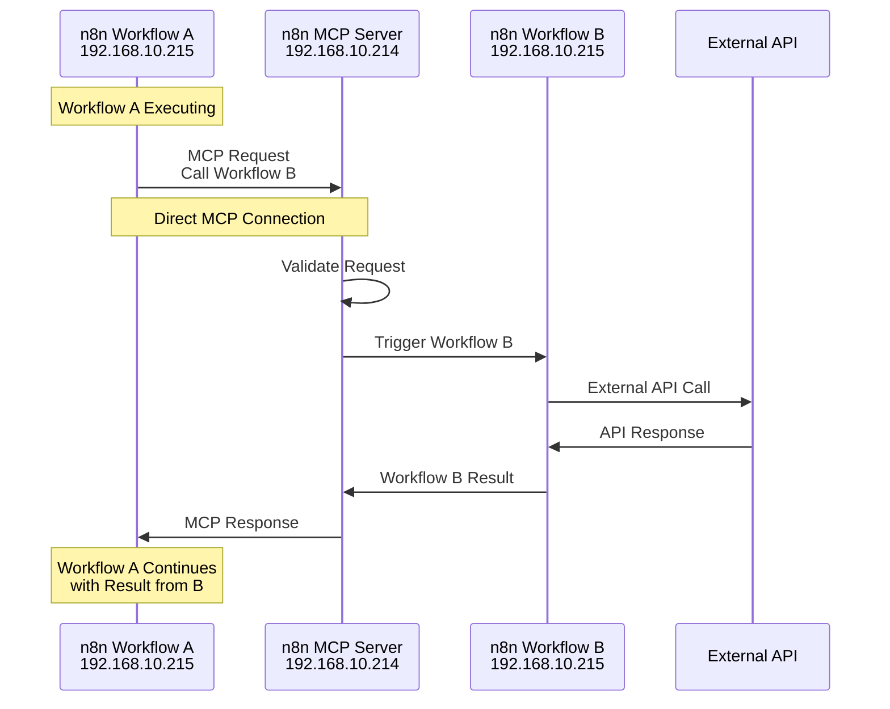
```mermaid
sequenceDiagram
    participant WF1 as n8n Workflow A<br/>192.168.10.215
    participant MCP as n8n MCP Server<br/>192.168.10.214
    participant WF2 as n8n Workflow B<br/>192.168.10.215
    participant API as External API
    
    Note over WF1: Workflow A Executing
    
    WF1->>MCP: MCP Request<br/>Call Workflow B
    Note over WF1,MCP: Direct MCP Connection
    
    MCP->>MCP: Validate Request
    MCP->>WF2: Trigger Workflow B
    
    WF2->>API: External API Call
    API->>WF2: API Response
    
    WF2->>MCP: Workflow B Result
    MCP->>WF1: MCP Response
    
    Note over WF1: Workflow A Continues<br/>with Result from B
```

### 6.4 Error Handling Flow

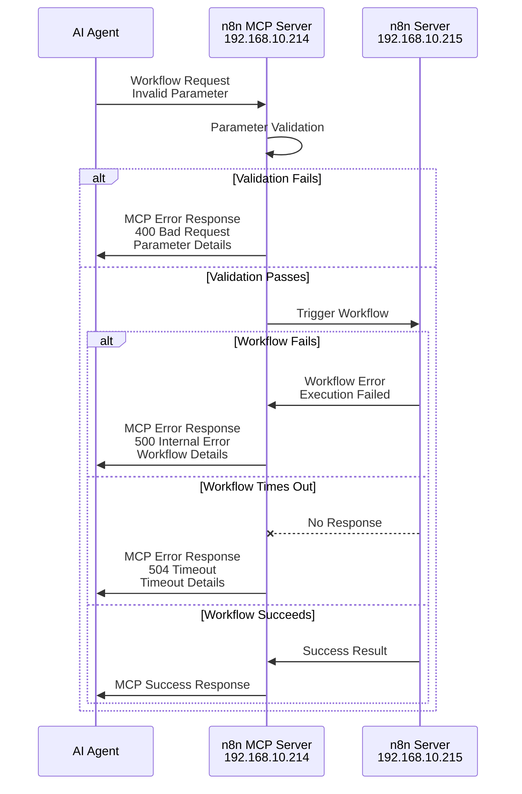
```mermaid
sequenceDiagram
    participant Agent as AI Agent
    participant MCP as n8n MCP Server<br/>192.168.10.214
    participant N8N as n8n Server<br/>192.168.10.215
    
    Agent->>MCP: Workflow Request<br/>Invalid Parameter
    
    MCP->>MCP: Parameter Validation
    
    alt Validation Fails
        MCP->>Agent: MCP Error Response<br/>400 Bad Request<br/>Parameter Details
    else Validation Passes
        MCP->>N8N: Trigger Workflow
        
        alt Workflow Fails
            N8N->>MCP: Workflow Error<br/>Execution Failed
            MCP->>Agent: MCP Error Response<br/>500 Internal Error<br/>Workflow Details
        else Workflow Times Out
            N8N--xMCP: No Response
            MCP->>Agent: MCP Error Response<br/>504 Timeout<br/>Timeout Details
        else Workflow Succeeds
            N8N->>MCP: Success Result
            MCP->>Agent: MCP Success Response
        end
    end
```

---

## 7. Component Architecture

### 7.1 n8n MCP Server Internal Architecture

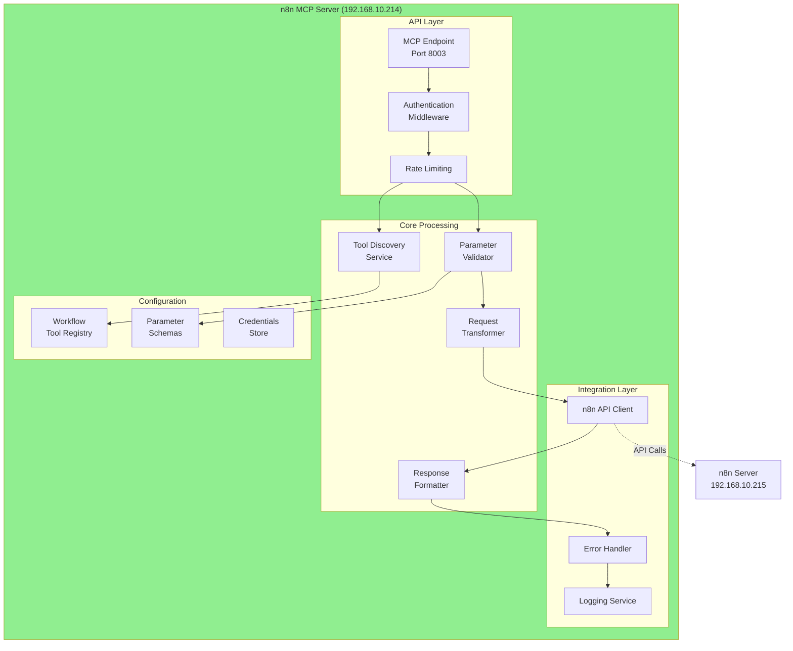
```mermaid
graph TB
    subgraph N8NMCP["n8n MCP Server (192.168.10.214)"]
        subgraph API["API Layer"]
            Endpoint[MCP Endpoint<br/>Port 8003]
            Auth[Authentication<br/>Middleware]
            RateLimit[Rate Limiting]
        end
        
        subgraph Core["Core Processing"]
            Discovery[Tool Discovery<br/>Service]
            Validator[Parameter<br/>Validator]
            Transformer[Request<br/>Transformer]
            Formatter[Response<br/>Formatter]
        end
        
        subgraph Integration["Integration Layer"]
            N8NClient[n8n API Client]
            ErrorHandler[Error Handler]
            Logger[Logging Service]
        end
        
        subgraph Config["Configuration"]
            ToolRegistry[Workflow<br/>Tool Registry]
            Schemas[Parameter<br/>Schemas]
            Creds[Credentials<br/>Store]
        end
    end
    
    Endpoint --> Auth
    Auth --> RateLimit
    RateLimit --> Discovery
    RateLimit --> Validator
    
    Discovery --> ToolRegistry
    Validator --> Schemas
    Validator --> Transformer
    
    Transformer --> N8NClient
    N8NClient --> Formatter
    
    Formatter --> ErrorHandler
    ErrorHandler --> Logger
    
    N8NClient -.->|API Calls| N8NServer[n8n Server<br/>192.168.10.215]
    
    style N8NMCP fill:#90EE90
```

### 7.2 Workflow Tool Registration

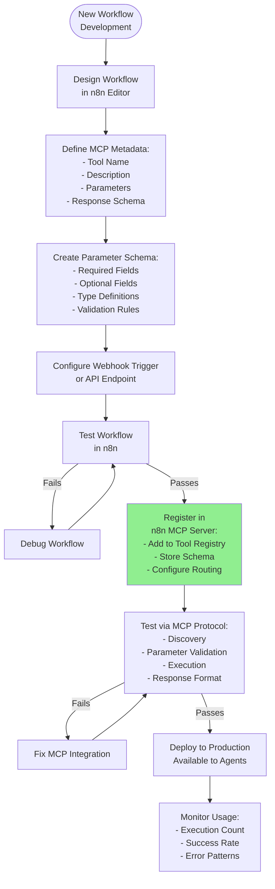
```mermaid
flowchart TB
    Start([New Workflow<br/>Development]) --> Design[Design Workflow<br/>in n8n Editor]
    
    Design --> Metadata[Define MCP Metadata:<br/>- Tool Name<br/>- Description<br/>- Parameters<br/>- Response Schema]
    
    Metadata --> Schema[Create Parameter Schema:<br/>- Required Fields<br/>- Optional Fields<br/>- Type Definitions<br/>- Validation Rules]
    
    Schema --> Webhook[Configure Webhook Trigger<br/>or API Endpoint]
    
    Webhook --> Test[Test Workflow<br/>in n8n]
    
    Test -->|Fails| Debug[Debug Workflow]
    Debug --> Test
    
    Test -->|Passes| Register[Register in<br/>n8n MCP Server:<br/>- Add to Tool Registry<br/>- Store Schema<br/>- Configure Routing]
    
    Register --> MCPTest[Test via MCP Protocol:<br/>- Discovery<br/>- Parameter Validation<br/>- Execution<br/>- Response Format]
    
    MCPTest -->|Fails| Fix[Fix MCP Integration]
    Fix --> MCPTest
    
    MCPTest -->|Passes| Production[Deploy to Production<br/>Available to Agents]
    
    Production --> Monitor[Monitor Usage:<br/>- Execution Count<br/>- Success Rate<br/>- Error Patterns]
    
    style Register fill:#90EE90
```

### 7.3 Package Installation Structure

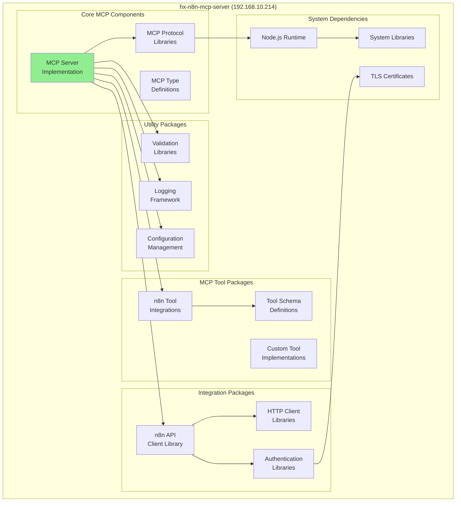
```mermaid
graph TB
    subgraph System["hx-n8n-mcp-server (192.168.10.214)"]
        subgraph Core["Core MCP Components"]
            MCPServer[MCP Server<br/>Implementation]
            MCPProtocol[MCP Protocol<br/>Libraries]
            MCPTypes[MCP Type<br/>Definitions]
        end
        
        subgraph Tools["MCP Tool Packages"]
            N8NTools[n8n Tool<br/>Integrations]
            CustomTools[Custom Tool<br/>Implementations]
            ToolSchemas[Tool Schema<br/>Definitions]
        end
        
        subgraph Integration["Integration Packages"]
            N8NAPI[n8n API<br/>Client Library]
            HTTPClient[HTTP Client<br/>Libraries]
            AuthLibs[Authentication<br/>Libraries]
        end
        
        subgraph Utils["Utility Packages"]
            Validation[Validation<br/>Libraries]
            Logging[Logging<br/>Framework]
            Config[Configuration<br/>Management]
        end
        
        subgraph Dependencies["System Dependencies"]
            Runtime[Node.js Runtime]
            SystemLibs[System Libraries]
            Certs[TLS Certificates]
        end
    end
    
    MCPServer --> MCPProtocol
    MCPServer --> N8NTools
    MCPServer --> N8NAPI
    
    N8NTools --> ToolSchemas
    N8NAPI --> HTTPClient
    N8NAPI --> AuthLibs
    
    MCPServer --> Validation
    MCPServer --> Logging
    MCPServer --> Config
    
    MCPProtocol --> Runtime
    Runtime --> SystemLibs
    AuthLibs --> Certs
    
    style MCPServer fill:#90EE90
```

---

## 8. Security Architecture

### 8.1 Authentication & Authorization Flow

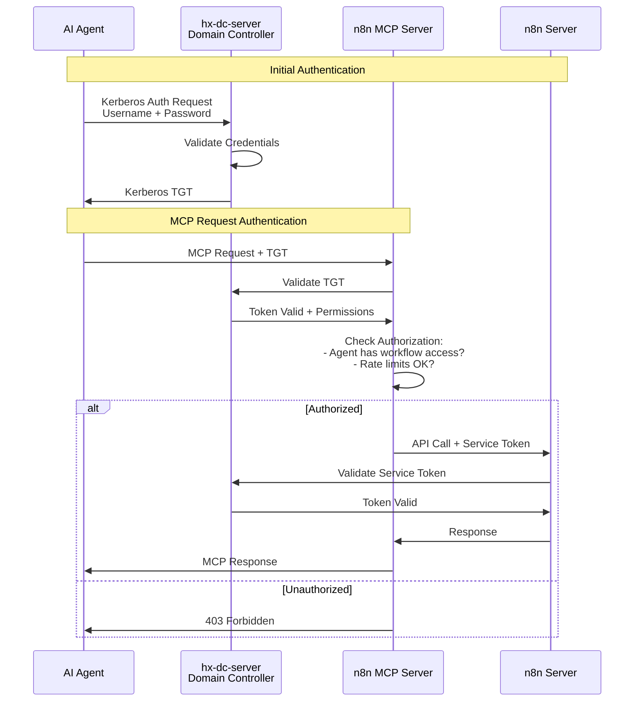
```mermaid
sequenceDiagram
    participant Agent as AI Agent
    participant DC as hx-dc-server<br/>Domain Controller
    participant MCP as n8n MCP Server
    participant N8N as n8n Server
    
    Note over Agent,N8N: Initial Authentication
    
    Agent->>DC: Kerberos Auth Request<br/>Username + Password
    DC->>DC: Validate Credentials
    DC->>Agent: Kerberos TGT
    
    Note over Agent,MCP: MCP Request Authentication
    
    Agent->>MCP: MCP Request + TGT
    MCP->>DC: Validate TGT
    DC->>MCP: Token Valid + Permissions
    
    MCP->>MCP: Check Authorization:<br/>- Agent has workflow access?<br/>- Rate limits OK?
    
    alt Authorized
        MCP->>N8N: API Call + Service Token
        N8N->>DC: Validate Service Token
        DC->>N8N: Token Valid
        N8N->>MCP: Response
        MCP->>Agent: MCP Response
    else Unauthorized
        MCP->>Agent: 403 Forbidden
    end
```

### 8.2 TLS Certificate Chain

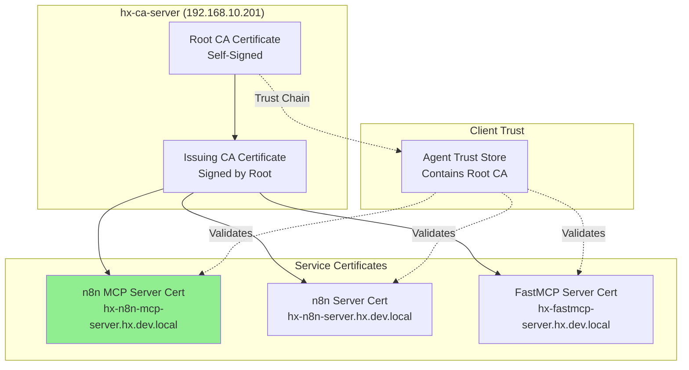
```mermaid
graph TB
    subgraph CA["hx-ca-server (192.168.10.201)"]
        RootCA[Root CA Certificate<br/>Self-Signed]
        IssuingCA[Issuing CA Certificate<br/>Signed by Root]
    end
    
    subgraph Certs["Service Certificates"]
        MCPCert[n8n MCP Server Cert<br/>hx-n8n-mcp-server.hx.dev.local]
        N8NCert[n8n Server Cert<br/>hx-n8n-server.hx.dev.local]
        FastCert[FastMCP Server Cert<br/>hx-fastmcp-server.hx.dev.local]
    end
    
    subgraph Clients["Client Trust"]
        AgentTrust[Agent Trust Store<br/>Contains Root CA]
    end
    
    RootCA --> IssuingCA
    IssuingCA --> MCPCert
    IssuingCA --> N8NCert
    IssuingCA --> FastCert
    
    RootCA -.Trust Chain.-> AgentTrust
    AgentTrust -.Validates.-> MCPCert
    AgentTrust -.Validates.-> N8NCert
    AgentTrust -.Validates.-> FastCert
    
    style MCPCert fill:#90EE90
```

### 8.3 Security Zones

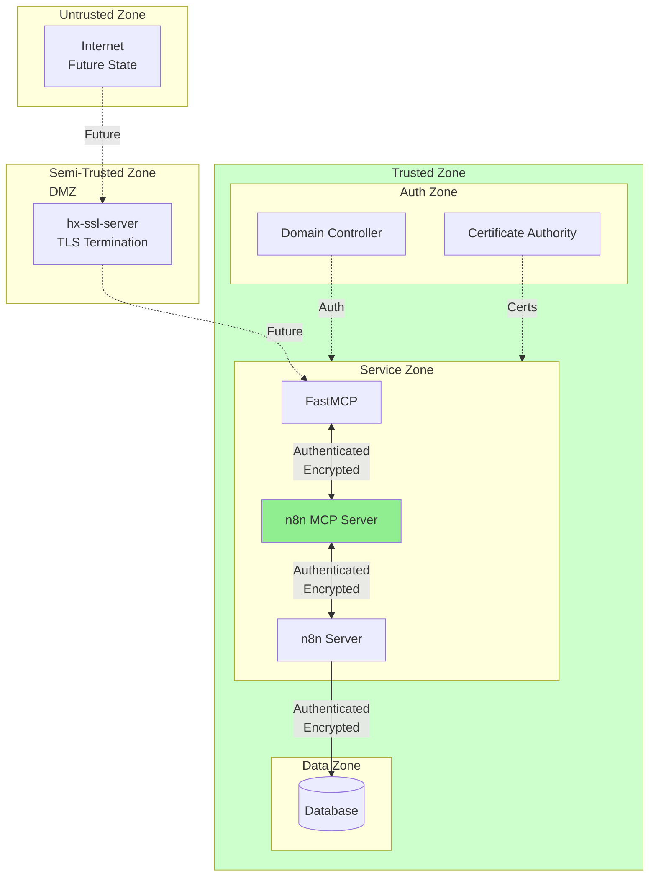
```mermaid
graph TB
    subgraph External["Untrusted Zone"]
        Internet[Internet<br/>Future State]
    end
    
    subgraph DMZ["Semi-Trusted Zone<br/>DMZ"]
        SSL[hx-ssl-server<br/>TLS Termination]
    end
    
    subgraph Trusted["Trusted Zone<br/>hx.dev.local"]
        subgraph Auth["Auth Zone"]
            DC[Domain Controller]
            CA[Certificate Authority]
        end
        
        subgraph Services["Service Zone"]
            FastMCP[FastMCP]
            MCP[n8n MCP Server]
            N8N[n8n Server]
        end
        
        subgraph Data["Data Zone"]
            DB[(Database)]
        end
    end
    
    Internet -.Future.-> SSL
    SSL -.Future.-> FastMCP
    
    FastMCP <-->|Authenticated<br/>Encrypted| MCP
    MCP <-->|Authenticated<br/>Encrypted| N8N
    N8N -->|Authenticated<br/>Encrypted| DB
    
    DC -.Auth.-> Services
    CA -.Certs.-> Services
    
    style MCP fill:#90EE90
    style Trusted fill:#ccffcc
```

---

## 9. Future State Architecture

### 9.1 LangGraph Integration (Future)

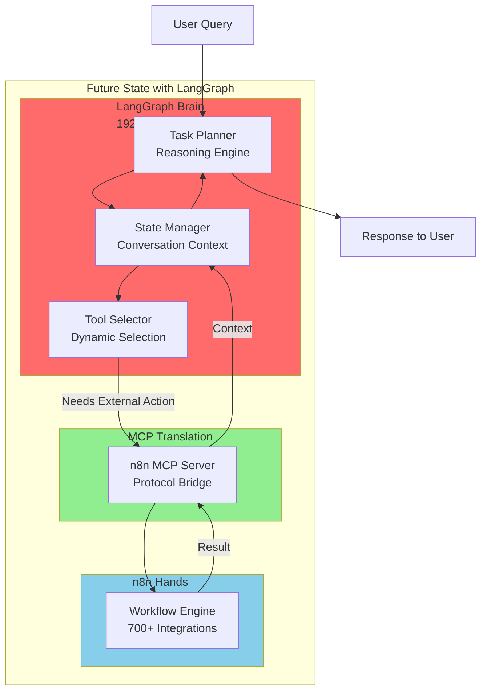
```mermaid
graph TB
    subgraph Future["Future State with LangGraph"]
        subgraph Brain["LangGraph Brain<br/>192.168.10.226"]
            Planner[Task Planner<br/>Reasoning Engine]
            StateManager[State Manager<br/>Conversation Context]
            ToolSelector[Tool Selector<br/>Dynamic Selection]
        end
        
        subgraph Hands["n8n Hands<br/>192.168.10.215"]
            N8N[Workflow Engine<br/>700+ Integrations]
        end
        
        subgraph Translation["MCP Translation<br/>192.168.10.214"]
            MCP[n8n MCP Server<br/>Protocol Bridge]
        end
    end
    
    User[User Query] --> Planner
    Planner --> StateManager
    StateManager --> ToolSelector
    
    ToolSelector -->|Needs External Action| MCP
    MCP --> N8N
    N8N -->|Result| MCP
    MCP -->|Context| StateManager
    
    StateManager --> Planner
    Planner --> Response[Response to User]
    
    style Brain fill:#FF6B6B
    style Hands fill:#87CEEB
    style Translation fill:#90EE90
```

### 9.2 Multi-Agent Coordination (Future)

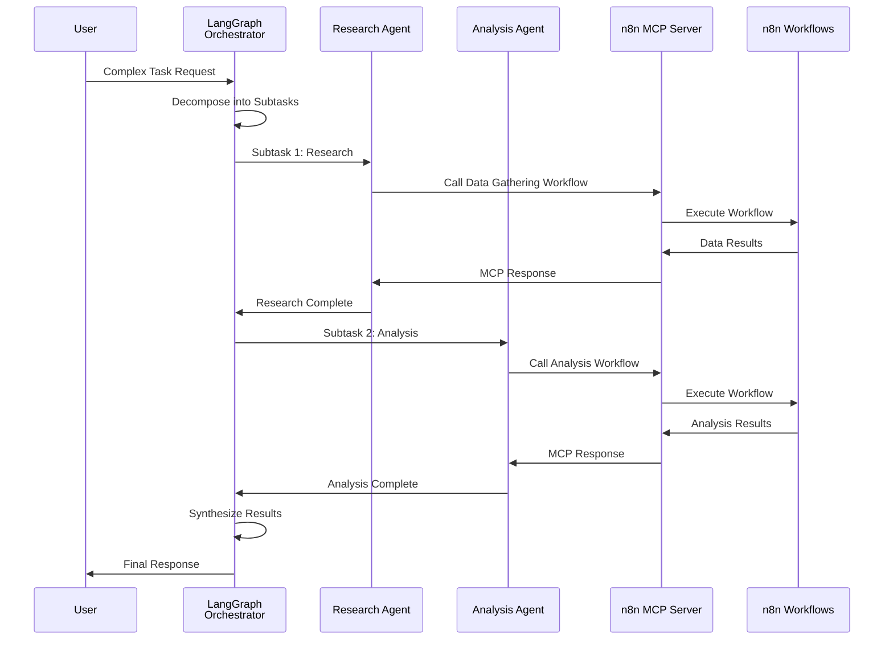
```mermaid
sequenceDiagram
    participant User
    participant LG as LangGraph<br/>Orchestrator
    participant A1 as Research Agent
    participant A2 as Analysis Agent
    participant MCP as n8n MCP Server
    participant N8N as n8n Workflows
    
    User->>LG: Complex Task Request
    LG->>LG: Decompose into Subtasks
    
    LG->>A1: Subtask 1: Research
    A1->>MCP: Call Data Gathering Workflow
    MCP->>N8N: Execute Workflow
    N8N->>MCP: Data Results
    MCP->>A1: MCP Response
    A1->>LG: Research Complete
    
    LG->>A2: Subtask 2: Analysis
    A2->>MCP: Call Analysis Workflow
    MCP->>N8N: Execute Workflow
    N8N->>MCP: Analysis Results
    MCP->>A2: MCP Response
    A2->>LG: Analysis Complete
    
    LG->>LG: Synthesize Results
    LG->>User: Final Response
```

### 9.3 Scaling Architecture (Future)

```mermaid
graph TB
    subgraph LoadBalancer["Load Balancer Layer"]
        LB[HAProxy/Nginx<br/>Load Balancer]
    end
    
    subgraph MCPCluster["n8n MCP Server Cluster"]
        MCP1[n8n MCP 1<br/>192.168.10.214]
        MCP2[n8n MCP 2<br/>192.168.10.XXX]
        MCP3[n8n MCP 3<br/>192.168.10.XXX]
    end
    
    subgraph N8NCluster["n8n Workflow Cluster"]
        N8N1[n8n Server 1<br/>192.168.10.215]
        N8N2[n8n Server 2<br/>192.168.10.XXX]
    end
    
    subgraph DataHA["High Availability Data"]
        PGPrimary[(PostgreSQL<br/>Primary)]
        PGReplica[(PostgreSQL<br/>Replica)]
        RedisCluster[(Redis Cluster)]
    end
    
    Agents[AI Agents] --> LB
    LB --> MCP1
    LB --> MCP2
    LB --> MCP3
    
    MCP1 --> N8N1
    MCP1 --> N8N2
    MCP2 --> N8N1
    MCP2 --> N8N2
    MCP3 --> N8N1
    MCP3 --> N8N2
    
    N8N1 --> PGPrimary
    N8N2 --> PGPrimary
    PGPrimary -.Replication.-> PGReplica
    
    N8N1 --> RedisCluster
    N8N2 --> RedisCluster
    
    style MCP1 fill:#90EE90
    style MCP2 fill:#90EE90
    style MCP3 fill:#90EE90
```

---

## 10. Deployment Architecture

### 10.1 Deployment Flow

```mermaid
flowchart TB
    Start([Deployment Initiation]) --> Prep[Infrastructure Preparation:<br/>- Server Provisioning<br/>- Network Configuration<br/>- DNS Registration]
    
    Prep --> Auth[Authentication Setup:<br/>- Domain Join<br/>- Service Accounts<br/>- Kerberos Config]
    
    Auth --> Certs[Certificate Installation:<br/>- Request from CA<br/>- Install on Server<br/>- Configure TLS]
    
    Certs --> Install[Package Installation:<br/>- Full MCP Stack<br/>- All Dependencies<br/>- Configuration Files]
    
    Install --> Config[Service Configuration:<br/>- MCP Endpoint Setup<br/>- n8n API Connection<br/>- Port Configuration]
    
    Config --> Test1[Unit Testing:<br/>- MCP Protocol<br/>- Parameter Validation<br/>- Error Handling]
    
    Test1 -->|Fail| Debug1[Debug Issues]
    Debug1 --> Test1
    
    Test1 -->|Pass| Test2[Integration Testing:<br/>- Direct Connection<br/>- Gateway Routing<br/>- Workflow Execution]
    
    Test2 -->|Fail| Debug2[Debug Integration]
    Debug2 --> Test2
    
    Test2 -->|Pass| Prod[Production Deployment:<br/>- Service Start<br/>- Monitoring Enable<br/>- Documentation]
    
    Prod --> Monitor[Continuous Monitoring]
    
    style Install fill:#90EE90
```

---

## Document Metadata

**Version**: 1.0  
**Created**: November 10, 2025  
**Last Updated**: November 10, 2025  
**Related Documents**:
- n8n MCP Server Project Charter
- HANA-X Ecosystem Architecture (0.0.2.2)
- HANA-X Network Topology (0.0.2.3)

**Approval Status**: DRAFT - In Review

---

## Revision History

| Version | Date | Changes | Author |
|---------|------|---------|--------|
| 1.0 | 2025-11-10 | Initial architecture document with comprehensive diagrams | Claude Code |

---

*This architecture document provides the technical blueprint for n8n MCP Server implementation, integration patterns, and future evolution within the HANA-X AI Ecosystem.*
