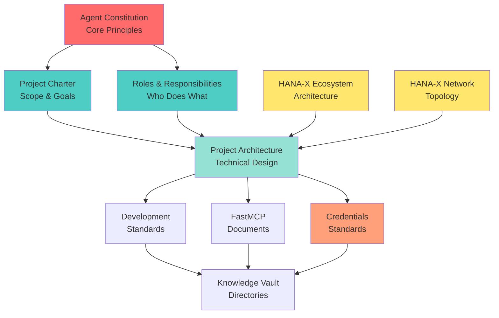

# n8n MCP Server Project: Knowledge Document

**Document Type**: Knowledge Management - Required Reading  
**Created**: November 10, 2025  
**Project Code**: HX-N8N-MCP-001  
**Classification**: Internal - Project Management  
**Status**: ACTIVE - Reference Document  

---

## Document Purpose

This knowledge document serves as the **comprehensive reference guide** for all team members working on the n8n MCP Server Installation & Configuration project. Every agent and stakeholder must review the documents and vault directories relevant to their role before beginning work.

**CRITICAL**: No agent should begin implementation work without first reviewing their assigned knowledge sources listed in this document.

---

## Table of Contents

1. [Required Reading for All Team Members](#required-reading-for-all-team-members)
2. [Role-Specific Knowledge Requirements](#role-specific-knowledge-requirements)
3. [Knowledge Vault Directory Reference](#knowledge-vault-directory-reference)
4. [Document Hierarchy and Dependencies](#document-hierarchy-and-dependencies)
5. [Knowledge Validation Checklist](#knowledge-validation-checklist)

---

## 1. Required Reading for All Team Members

### 1.1 Core Project Documents (MANDATORY)

Every team member must review these three foundational documents before starting work:

#### **Project Charter**
**Location**: `00-foundation/n8n-mcp-server-project-charter.md`
**Purpose**: Defines project scope, goals, objectives, deliverables, constraints, and success criteria  
**Key Sections**:
- Summary and Goals
- Objectives (1-7)
- Scope (In/Out of Scope)
- Deliverables and Success Criteria
- Assumptions, Constraints, and Risks
- Project Phases (7 phases, 18 days)

**Why Review**: Understand WHAT we're building, WHY we're building it, and HOW success is measured.

---

#### **Architecture Document**
**Location**: `00-foundation/n8n-mcp-server-architecture.md`
**Purpose**: Technical blueprint with Mermaid diagrams showing system flows, integrations, and component interactions  
**Key Sections**:
- High-Level Architecture
- System Context in HANA-X Ecosystem
- Network Architecture (ports, connectivity)
- Integration Patterns (direct vs. gateway)
- Data Flow Diagrams
- Sequence Diagrams
- Component Architecture
- Security Architecture
- Future State (LangGraph integration)

**Why Review**: Understand HOW the system works, WHERE components fit in HANA-X, and HOW they integrate.

---

#### **Roles and Responsibilities**
**Location**: `00-foundation/n8n-mcp-server-roles-responsibilities.md`
**Purpose**: Defines WHO does WHAT, decision authority, communication protocols, and escalation procedures  
**Key Sections**:
- Executive Leadership (CAIO Jarvis Richardson)
- Operational Leadership (Agent Zero / Claude Code)
- Decision Authority Matrix (Strategic, Operational, Technical, Quality)
- RACI Matrix by Phase
- Communication Protocols
- Escalation Procedures
- Agent Responsibilities Detail

**Why Review**: Understand WHO you report to, WHAT you're accountable for, and HOW to communicate/escalate.

---

### 1.2 HANA-X Governance Documents (MANDATORY)

All team members must understand the foundational governance that guides HANA-X infrastructure:

#### **HANA-X Ecosystem Architecture**
**Location**: `/srv/cc/Governance/0.0-governance/0.0.2-Architecture/0.0.2.2-ecosystem-architecture.md`  
**Purpose**: Complete HANA-X 6-layer architecture, 30-server topology, integration patterns  
**Key Sections**:
- Layered Architecture (Layers 0-6)
- Integration Patterns (Authentication, API Gateway, MCP Backbone)
- Data & Control Flows
- Security Architecture
- Component Topology

**Why Review**: Understand the HANA-X platform context where n8n MCP Server operates.

---

#### **HANA-X Network Topology**
**Location**: `/srv/cc/Governance/0.0-governance/0.0.2-Architecture/0.0.2.3-network-topology.md`  
**Purpose**: Network architecture, IP addressing (192.168.10.0/24), security zones, service connectivity  
**Key Sections**:
- IP Address Allocation Map (192.168.10.200-229)
- Security Zones and Trust Boundaries
- Port Mapping Reference
- Data Flow Patterns
- Network Dependencies

**Why Review**: Know the network layout, IP addresses, ports, and connectivity requirements.

---

#### **Agent Constitution**
**Location**: `/srv/cc/Governance/0.0-governance/0.0.5-Delivery/0.0.5.0-agent-constitution.md`  
**Purpose**: Core principles governing all HANA-X agent work  
**Key Principles**:
- Quality First (Accuracy > Speed)
- SOLID OOP Principles
- Layer 1 Foundation Supremacy
- Iterative Learning
- 100% Pass Rates Before Advancing

**Why Review**: Understand the cultural and operational principles that guide ALL work.

---

### 1.3 Technical Standards Documents (MANDATORY)

#### **Development and Coding Standards**
**Location**: `/srv/cc/Governance/0.0-governance/0.0.3-Development/development-and-coding-standards.md`  
**Purpose**: Code quality standards, testing requirements, documentation conventions  
**Key Sections**:
- Code Quality Standards
- Testing Requirements (unit, integration, load)
- Documentation Standards
- Git Workflow and Branching Strategy
- Security Standards

**Why Review**: Ensure all implementation work meets established quality and security standards.

---


#### **Credentials and Secrets Management Standards** ✅
**Location**: `/mnt/user-data/outputs/n8n-mcp-server-credentials-standards.md`  
**Status**: **AVAILABLE** - Created November 10, 2025  
**Purpose**: Standards for handling credentials, secrets, API keys, and sensitive configuration using Ansible Vault  
**Approach**: Ansible Vault for all secrets management (no external secrets managers in Phase 1)  
**Key Concepts**:
- Two standard passwords: `Major8859` (services) and `Major8859!` (users)
- Ansible Vault password: `Major8859!`
- Variable usage in playbooks
- .env file generation patterns
- Team workflow for each role

**This document is critical for Phase 2 (Infrastructure Setup) and Phase 3 (MCP Protocol Implementation). All team members must review this document.**

---

## 2. Role-Specific Knowledge Requirements

### 2.1 Executive Leadership

#### **CAIO: Jarvis Richardson**

**Required Reading** (in priority order):
1. ✅ Project Charter (Summary, Goals, Objectives, Success Criteria)
2. ✅ Roles and Responsibilities (Executive Leadership section, Decision Authority Matrix)
3. ✅ Architecture Document (High-Level Architecture, System Context)
4. ✅ Credentials Standards (AVAILABLE - Review Now - Ansible Vault approach)

**Optional Deep Dives**:
- HANA-X Ecosystem Architecture (strategic context)
- Agent Constitution (governance principles)
- FastMCP documents (if interested in integration details)

**Knowledge Validation**:
- [ ] Understand project scope and objectives
- [ ] Clear on decision authority and escalation triggers
- [ ] Familiar with high-level system design
- [ ] Know communication protocols and SLAs

---

### 2.2 Operational Leadership

#### **Agent Zero (Claude Code): Universal PM Orchestrator**

**Required Reading** (ALL documents):
1. ✅ Project Charter (complete document)
2. ✅ Architecture Document (complete document)
3. ✅ Roles and Responsibilities (complete document)
4. ✅ HANA-X Ecosystem Architecture
5. ✅ HANA-X Network Topology
6. ✅ Agent Constitution
7. ✅ Development and Coding Standards
8. ✅ FastMCP Capabilities Analysis (for George's work coordination)
9. ✅ FastMCP Client Implementation (for George's work coordination)
10. ✅ Credentials Standards (AVAILABLE - Review Now - Ansible Vault focus)

**Knowledge Vault Directories**:
- `/srv/knowledge/vault/n8n-mcp-main/` (complete review - implementation reference)
- `/srv/knowledge/vault/ottomator-agents-main/n8n-mcp-agent/` (example patterns)
- `/srv/knowledge/vault/ottomator-agents-main/mcp-agent-army/` (multi-MCP patterns)
- `/srv/knowledge/vault/ottomator-agents-main/simple-mcp-agent/` (basic patterns)

**Knowledge Validation**:
- [ ] Master understanding of all project documents
- [ ] Complete familiarity with HANA-X architecture
- [ ] Deep knowledge of MCP protocol and FastMCP integration
- [ ] Understanding of all 30 specialist agent capabilities
- [ ] Ability to orchestrate multi-agent workflows
- [ ] Knowledge of quality gates and validation procedures

---

### 2.3 Architecture Governance

#### **Alex Rivera (@agent-alex): Platform Architect**

**Required Reading**:
1. ✅ Project Charter (Scope, Objectives, Architecture-related sections)
2. ✅ Architecture Document (complete document - PRIMARY FOCUS)
3. ✅ Roles and Responsibilities (Architecture Governance section)
4. ✅ HANA-X Ecosystem Architecture (Layer 4 focus)
5. ✅ HANA-X Network Topology (Security Zones, Integration Patterns)
6. ✅ Agent Constitution (SOLID principles, Layer dependencies)
7. ✅ Credentials Standards (AVAILABLE - Review Now - Ansible Vault approach)

**Knowledge Vault Directories**:
- `/srv/knowledge/vault/n8n-mcp-main/docs/` (architecture reference)
- `/srv/knowledge/vault/n8n-mcp-main/architecture/` (if exists)
- `/srv/knowledge/vault/shield_mcp_complete/architecture/` (MCP architecture patterns)
- `/srv/knowledge/vault/agentic-design-patterns-docs-main/` (design patterns)

**Knowledge Validation**:
- [ ] Complete understanding of n8n MCP Server architecture
- [ ] Expertise in HANA-X Layer 4 (Agentic & Toolchain)
- [ ] Deep knowledge of MCP protocol and integration patterns
- [ ] Ability to create Architecture Decision Records (ADRs)
- [ ] Understanding of security zones and trust boundaries

---

### 2.4 Quality Assurance

#### **Julia Santos (@agent-julia): Testing & QA Lead**

**Required Reading**:
1. ✅ Project Charter (Success Criteria, Quality Gates, Testing sections)
2. ✅ Architecture Document (Component Architecture, Integration Patterns)
3. ✅ Roles and Responsibilities (Quality Assurance section, RACI Matrix)
4. ✅ Development and Coding Standards (Testing Requirements)
5. ✅ Agent Constitution (Quality First principle, 100% pass rates)
6. ✅ Credentials Standards (AVAILABLE - Review Now - Ansible Vault security testing)

**Knowledge Vault Directories**:
- `/srv/knowledge/vault/n8n-mcp-main/tests/` (test patterns)
- `/srv/knowledge/vault/pytest/` (Python testing framework)

**Knowledge Validation**:
- [ ] Understanding of project success criteria and quality gates
- [ ] Knowledge of testing requirements (unit, integration, load)
- [ ] Familiarity with n8n MCP Server architecture (what to test)
- [ ] Understanding of 100% pass rate requirement
- [ ] Ability to create comprehensive test plans

---

### 2.5 Layer 1: Identity & Trust Foundation

#### **William Taylor (@agent-william): Ubuntu Server Preparation**

**Required Reading**:
1. ✅ Project Charter (Infrastructure sections, Phase 2 objectives)
2. ✅ Architecture Document (Network Architecture, Security Architecture)
3. ✅ Roles and Responsibilities (William's section, Phase 2 RACI)
4. ✅ HANA-X Network Topology (IP allocation, network config)
5. ✅ Agent Constitution (Layer 1 Supremacy)
6. ✅ Development and Coding Standards (Infrastructure standards)
7. ✅ Credentials Standards (AVAILABLE - Review Now - Ansible Vault approach)

**Knowledge Vault Directories**:
- `/srv/knowledge/vault/ubuntu-noble-amd64/` (Ubuntu 24.04 reference - if exists)
- `/srv/knowledge/vault/ansible-main/` (automation patterns including Ansible Vault)

**Knowledge Validation**:
- [ ] Understanding of hx-n8n-mcp-server requirements (192.168.10.214)
- [ ] Knowledge of Ubuntu 24.04 configuration standards
- [ ] Familiarity with domain join preparation
- [ ] Understanding of Layer 1 foundation role

**Deliverables**:
- Ubuntu server provisioned and configured
- Network connectivity validated
- Domain join preparation complete
- System hardening and security baseline applied

---

#### **Frank Lucas (@agent-frank): Samba DC & Certificate Authority**

**Required Reading**:
1. ✅ Project Charter (Infrastructure sections, Phase 2 objectives)
2. ✅ Architecture Document (Security Architecture, TLS Certificate Chain)
3. ✅ Roles and Responsibilities (Frank's section, Phase 2 RACI)
4. ✅ HANA-X Network Topology (DNS configuration, security zones)
5. ✅ HANA-X Ecosystem Architecture (Layer 1 - Identity & Trust)
6. ✅ Agent Constitution (Layer 1 Supremacy)
7. ✅ Credentials Standards (AVAILABLE - Review Now - CRITICAL for Frank's work - Ansible Vault)

**Knowledge Vault Directories**:
- `/srv/knowledge/vault/samba-master/` (Samba DC reference - if exists)
- `/srv/knowledge/vault/kerberos/` (authentication reference - if exists)

**Knowledge Validation**:
- [ ] Understanding of Samba DC computer account creation
- [ ] Knowledge of service account creation and permissions
- [ ] Expertise in DNS A record configuration
- [ ] Understanding of TLS certificate issuance from hx-ca-server
- [ ] Familiarity with Kerberos authentication configuration

**Deliverables**:
- Computer account: hx-n8n-mcp-server
- Service account: n8n-mcp-service (with proper permissions)
- DNS A record: hx-n8n-mcp-server.hx.dev.local → 192.168.10.214
- TLS certificate issued and installed
- Kerberos authentication configured

---

### 2.6 Layer 4: Agentic & Toolchain Implementation

#### **Olivia Chang (@agent-olivia): N8N MCP Specialist**

**Required Reading**:
1. ✅ Project Charter (complete document - PRIMARY FOCUS)
2. ✅ Architecture Document (complete document - PRIMARY FOCUS)
3. ✅ Roles and Responsibilities (Olivia's section, Phase 3 & 5 RACI)
4. ✅ HANA-X Ecosystem Architecture (Layer 4 - Agentic & Toolchain)
5. ✅ HANA-X Network Topology (Port 8003, connectivity to .215)
6. ✅ Development and Coding Standards (complete)
7. ✅ Credentials Standards (AVAILABLE - Review Now - Ansible Vault approach)

**Knowledge Vault Directories** (CRITICAL - MUST REVIEW):
- **`/srv/knowledge/vault/n8n-mcp-main/`** (COMPLETE REVIEW - primary implementation reference)
  - `/docs/` - MCP Server documentation
  - `/src/` - Source code implementation patterns
  - `/examples/` - Example configurations
  - `/tests/` - Test patterns
  - `/types/` - TypeScript type definitions
  - `/deploy/` - Deployment configurations
  - `README.md` - Installation and setup instructions
- `/srv/knowledge/vault/ottomator-agents-main/n8n-mcp-agent/` (example implementation)
- `/srv/knowledge/vault/ottomator-agents-main/mcp-agent-army/` (multi-MCP patterns)
- `/srv/knowledge/vault/ottomator-agents-main/simple-mcp-agent/` (basic MCP patterns)
- `/srv/knowledge/vault/shield_mcp_complete/` (MCP protocol reference)
- `/srv/knowledge/vault/Skill_Seekers-development/mcp/` (MCP implementation patterns)

**Knowledge Validation**:
- [ ] Deep understanding of n8n MCP Server architecture
- [ ] Complete knowledge of MCP protocol specification
- [ ] Understanding of complete package installation requirements
- [ ] Knowledge of direct MCP connection to n8n server (.215)
- [ ] Expertise in MCP tool discovery endpoint configuration
- [ ] Understanding of parameter validation and error handling
- [ ] Familiarity with workflow tool registry patterns

**Deliverables**:
- Complete n8n MCP Server package installed (all tools, dependencies)
- MCP protocol server configured on port 8003
- Direct MCP connection established to hx-n8n-server (192.168.10.215)
- MCP tool discovery endpoint operational
- Parameter validation and error handling implemented
- Workflow tool registry created
- Complete package inventory documented

---

#### **Omar Rodriguez (@agent-omar): N8N Workflow Developer**

**Required Reading**:
1. ✅ Project Charter (Phase 4 objectives, workflow requirements)
2. ✅ Architecture Document (Workflow Tool Registration, Component Architecture)
3. ✅ Roles and Responsibilities (Omar's section, Phase 4 RACI)
4. ✅ Development and Coding Standards (complete)

**Knowledge Vault Directories** (CRITICAL - MUST REVIEW):
- **`/srv/knowledge/vault/n8n-mcp-main/`** (workflow patterns and MCP tool definitions)
  - `/examples/` - Example workflow configurations
  - `/docs/` - Workflow documentation
- `/srv/knowledge/vault/ottomator-agents-main/` - Multiple n8n workflow examples:
  - `/n8n-mcp-agent/` - MCP-integrated workflows
  - `/n8n-agentic-rag-agent/` - RAG workflow patterns
  - `/n8n-expert/` - Advanced n8n patterns
  - `/n8n-github-assistant/` - External API integration examples
  - `/n8n-youtube-agent/` - Data processing workflows
  - `/ultimate-n8n-rag-agent/` - Complex workflow orchestration
  - `/foundational-rag-agent/` - Basic workflow patterns
  - `/crawl4AI-agent/` and `/crawl4AI-agent-v2/` - Web scraping workflows
  - `/docling-rag-agent/` - Document processing workflows

**Knowledge Validation**:
- [ ] Understanding of n8n workflow development best practices
- [ ] Knowledge of MCP tool metadata requirements
- [ ] Expertise in parameter schema design and validation
- [ ] Understanding of error handling patterns in workflows
- [ ] Familiarity with workflow testing and debugging

**Deliverables**:
- 3-5 foundational workflows designed as MCP tools:
  1. Database query workflow
  2. External API call workflow
  3. File processing workflow
  4. Notification dispatch workflow
  5. [Optional 5th workflow]
- Complete MCP tool metadata for each workflow
- Parameter schemas with validation rules
- Error handling implementation
- Workflow documentation

---

#### **George Kim (@agent-george): FastMCP Gateway Integration**

**Required Reading**:
1. ✅ Project Charter (Phase 5 objectives, integration requirements)
2. ✅ Architecture Document (Dual-Path Integration Pattern, Gateway Layer)
3. ✅ Roles and Responsibilities (George's section, Phase 5 RACI)
4. ✅ FastMCP Capabilities Analysis (complete - PRIMARY FOCUS)
5. ✅ FastMCP Client Implementation (complete - PRIMARY FOCUS)
6. ✅ HANA-X Ecosystem Architecture (FastMCP position in Layer 4)

**Knowledge Vault Directories**:
- **`/srv/knowledge/vault/fastmcp-main/`** (if exists - primary reference)
- `/srv/knowledge/vault/n8n-mcp-main/` (understanding what to route to)
- `/srv/knowledge/vault/ottomator-agents-main/mcp-agent-army/` (multi-MCP routing patterns)
- `/srv/knowledge/vault/shield_mcp_complete/` (MCP protocol reference)

**Knowledge Validation**:
- [ ] Deep understanding of FastMCP dual-role operation (server + client)
- [ ] Knowledge of MCP routing configuration
- [ ] Expertise in FastMCP registration patterns
- [ ] Understanding of unified tool discovery
- [ ] Familiarity with gateway routing vs. direct connection patterns

**Deliverables**:
- n8n MCP server registered with FastMCP gateway (192.168.10.213)
- FastMCP dual-role configuration (server for agents, client for n8n MCP)
- Routing configuration for n8n workflow tools
- Unified tool discovery tested and validated
- Both direct and gateway routing paths operational

---

### 2.7 Support Roles

#### **Amanda Chen (@agent-amanda): Ansible Automation**

**Required Reading**:
1. ✅ Project Charter (Phase 6 objectives, optional automation)
2. ✅ Architecture Document (Deployment Architecture)
3. ✅ Roles and Responsibilities (Amanda's section, Phase 6 RACI)
4. ✅ Development and Coding Standards (Automation standards)

**Knowledge Vault Directories**:
- `/srv/knowledge/vault/ansible-main/` (Ansible reference - includes Ansible Vault for credentials)
- `/srv/knowledge/vault/n8n-mcp-main/deploy/` (deployment patterns)

**Deliverables** (Optional - Phase 6):
- Ansible playbook for n8n MCP Server deployment
- Ansible Vault configuration for credentials management
- Configuration management automation
- Repeatable deployment procedures

---

#### **Nathan Lewis (@agent-nathan): Monitoring & Observability**

**Required Reading**:
1. ✅ Project Charter (Phase 6 objectives, optional monitoring)
2. ✅ Architecture Document (monitoring sections)
3. ✅ Roles and Responsibilities (Nathan's section, Phase 6 RACI)
4. ✅ HANA-X Network Topology (hx-metric-server reference)

**Knowledge Vault Directories**:
- `/srv/knowledge/vault/prometheus/` (if exists - monitoring)
- `/srv/knowledge/vault/grafana/` (if exists - dashboards)

**Deliverables** (Optional - Phase 6):
- Service monitoring configuration
- Health checks implementation
- Alerting rules for n8n MCP Server
- Operational dashboards

---

## 3. Knowledge Vault Directory Reference

### 3.1 Primary Reference: n8n MCP Implementation

**Directory**: `/srv/knowledge/vault/n8n-mcp-main/`  
**Importance**: 🔴 CRITICAL - PRIMARY REFERENCE  
**Who Must Review**: Olivia (complete), Omar (examples + docs), George (understanding), Agent Zero (complete)

**Structure**:
```
n8n-mcp-main/
├── data/              # Data models and schemas
├── deploy/            # Deployment configurations
├── docker/            # Docker containerization
├── docs/              # Documentation (MUST READ)
├── examples/          # Example configurations (MUST REVIEW)
├── scripts/           # Utility scripts
├── src/               # Source code (MUST UNDERSTAND)
├── tests/             # Test patterns (MUST REVIEW)
├── types/             # TypeScript type definitions
└── README.md          # Installation guide (START HERE)
```

**Key Files to Review**:
- `README.md` - Installation and setup instructions
- `docs/` - Complete documentation
- `examples/` - Working example configurations
- `src/` - Implementation patterns
- `tests/` - Testing approaches

---

### 3.2 Supporting Reference: MCP Agent Examples

**Directory**: `/srv/knowledge/vault/ottomator-agents-main/`  
**Importance**: 🟡 HIGH - PATTERN REFERENCE  
**Who Must Review**: Olivia, Omar, George, Agent Zero

**Relevant Subdirectories**:

#### **MCP-Specific Agents**:
- `n8n-mcp-agent/` - n8n MCP integration example
- `mcp-agent-army/` - Multi-MCP coordination patterns
- `simple-mcp-agent/` - Basic MCP implementation
- `thirdbrain-mcp-openai-agent/` - MCP + OpenAI patterns
- `pydantic-ai-mcp-agent/` - Pydantic + MCP patterns

#### **n8n Workflow Examples**:
- `n8n-agentic-rag-agent/` - RAG workflows
- `n8n-expert/` - Advanced n8n patterns
- `n8n-github-assistant/` - External API integration
- `n8n-youtube-agent/` - Data processing
- `n8n-openwebui-agent/` - UI integration
- `ultimate-n8n-rag-agent/` - Complex orchestration

#### **General Agentic Patterns**:
- `agentic-rag-knowledge-graph/` - Knowledge graph integration
- `contextual-retrieval-n8n-agent/` - Contextual retrieval patterns
- `crawl4AI-agent/` and `crawl4AI-agent-v2/` - Web scraping
- `docling-rag-agent/` - Document processing

---

### 3.3 MCP Protocol Reference

**Directory**: `/srv/knowledge/vault/shield_mcp_complete/`  
**Importance**: 🟡 HIGH - PROTOCOL REFERENCE  
**Who Must Review**: Olivia, Alex, Agent Zero

**Structure**:
```
shield_mcp_complete/
├── architecture/      # MCP architecture patterns
├── implementation/    # Implementation guides
└── planning/          # Planning documents
```

**Key Focus**:
- MCP protocol specification details
- Architecture patterns for MCP servers
- Implementation best practices

---

### 3.4 Infrastructure References

#### **Redis** (for caching and state management)
**Directory**: `/srv/knowledge/vault/redis-unstable/`  
**Who Must Review**: Samuel (Redis agent), Olivia (caching patterns)

#### **PostgreSQL** (for metadata and state storage)
**Directory**: `/srv/knowledge/vault/postgres-master/`  
**Who Must Review**: Quinn (PostgreSQL agent), Olivia (data persistence)

#### **Ansible** (for automation and credentials management)
**Directory**: `/srv/knowledge/vault/ansible-main/`  
**Who Must Review**: Amanda (automation), William (server prep), Frank (credentials via Ansible Vault)  
**Key Focus**: Ansible Vault for secrets management

#### **Nginx** (for reverse proxy/load balancing - future)
**Directory**: `/srv/knowledge/vault/nginx/` or `/srv/knowledge/vault/nginx-master/`  
**Who Must Review**: Future load balancing implementation

---

### 3.5 Development Framework References

#### **FastAPI** (for API development)
**Directory**: `/srv/knowledge/vault/fastapi-main/`  
**Who Must Review**: Fatima (FastAPI agent), Olivia (API patterns)

#### **Pydantic** (for data validation)
**Directory**: `/srv/knowledge/vault/pydantic-main/`  
**Who Must Review**: Olivia (parameter validation), Omar (schema design)

#### **Pytest** (for testing)
**Directory**: `/srv/knowledge/vault/pytest/`  
**Who Must Review**: Julia (QA), all implementation agents

---

### 3.6 Design Pattern References

#### **SOLID Principles**
**Directory**: `/srv/knowledge/vault/solid-principles/`  
**Who Must Review**: Alex (architecture), Agent Zero (governance), all implementation agents

**Subdirectories**:
- `SingleResponsibilityPrinciple/`
- `OpenClosedPrinciple/`
- `LiskovSubstitutionPrinciple/`
- `InterfaceSegregationPrinciple/`
- `DependencyInversionPrinciple/`

#### **Agentic Design Patterns**
**Directory**: `/srv/knowledge/vault/agentic-design-patterns-docs-main/`  
**Who Must Review**: Alex (architecture), Agent Zero (orchestration), Laura (LangGraph)

---

## 4. Document Hierarchy and Dependencies

### 4.1 Document Reading Order

**Tier 1 - Foundation** (Read First):
1. Agent Constitution - Understand core principles
2. Project Charter - Understand project scope and goals
3. Roles and Responsibilities - Understand your role

**Tier 2 - Context** (Read Second):
1. HANA-X Ecosystem Architecture - Understand the platform
2. HANA-X Network Topology - Understand the infrastructure
3. Architecture Document - Understand the technical design

**Tier 3 - Implementation** (Read Third):
1. Development and Coding Standards - Understand quality requirements
2. FastMCP documents - Understand integration patterns
3. Credentials Standards - Understand security requirements (AVAILABLE - Review Now)

**Tier 4 - Reference** (Review as Needed):
1. Knowledge Vault directories relevant to your role
2. Example implementations and patterns
3. Technical framework documentation

---

### 4.2 Document Dependencies



---

## 5. Knowledge Validation Checklist

### 5.1 Pre-Work Validation

Before beginning ANY implementation work, complete this checklist:

**All Team Members**:
- [ ] Read Project Charter (appropriate sections for role)
- [ ] Read Architecture Document (appropriate sections for role)
- [ ] Read Roles and Responsibilities (understand your role)
- [ ] Reviewed relevant Knowledge Vault directories
- [ ] Understand quality gates and success criteria
- [ ] Know escalation procedures
- [ ] Credentials Standards reviewed (AVAILABLE NOW)

**Implementation Agents** (Olivia, Omar, George):
- [ ] Deep review of n8n-mcp-main vault directory
- [ ] Reviewed relevant example implementations
- [ ] Understand FastMCP integration patterns
- [ ] Familiar with MCP protocol specification
- [ ] Know testing requirements and procedures
- [ ] Understand Layer 1 dependencies (after William + Frank)

**Infrastructure Agents** (William, Frank):
- [ ] Understand HANA-X network topology
- [ ] Know IP addressing and DNS configuration
- [ ] Familiar with security zones and certificates
- [ ] Understand domain join procedures
- [ ] Know service account requirements

**Support Agents** (Amanda, Nathan, Julia):
- [ ] Understand deployment/monitoring/testing requirements
- [ ] Familiar with relevant tooling (Ansible, Prometheus, Pytest)
- [ ] Know quality gates and success criteria
- [ ] Understand integration with main implementation

---

### 5.2 Knowledge Gaps

If any team member identifies knowledge gaps or has questions about required reading:

**Escalation Path**:
1. **First**: Ask Agent Zero for clarification
2. **Second**: Agent Zero consults with specialist (Alex for architecture, Julia for testing, etc.)
3. **Third**: Agent Zero escalates to CAIO if gap affects project timeline or scope

**Knowledge Gap Template**:
```
TO: Agent Zero
FROM: [Your Name/Handle]
SUBJECT: Knowledge Gap - [Topic]

DOCUMENT/AREA: [Which document or vault directory]
QUESTION: [Specific question or unclear point]
IMPACT: [How this affects your work]
URGENCY: [When you need clarification]
```

---

### 5.3 Document Updates

As the project progresses, this knowledge document will be updated to reflect:
- All project documents created and available
- Additional vault directories discovered
- Lessons learned and updated patterns
- New reference materials

**Update Notification**: All team members will be notified when this document is updated with new required reading.

---

## 6. Summary: Quick Reference

### Phase 1: Research & Planning (Days 1-2)
**Focus**: Charter, Architecture, n8n-mcp-main vault review  
**Who**: Agent Zero, Alex, Olivia (research)

### Phase 2: Infrastructure Setup (Days 3-5)
**Focus**: Network topology, credentials standards  
**Who**: William, Frank

### Phase 3: MCP Protocol Implementation (Days 6-8)
**Focus**: n8n-mcp-main implementation, MCP protocol, FastMCP  
**Who**: Olivia (primary), George (consultation)

### Phase 4: Initial Workflow Development (Days 9-12)
**Focus**: n8n workflow examples, MCP tool patterns  
**Who**: Omar (primary), Olivia (consultation)

### Phase 5: Integration Testing (Days 13-15)
**Focus**: FastMCP integration, testing procedures  
**Who**: George (primary), Julia (testing), Olivia (support)

### Phase 6: Documentation & Handoff (Days 16-17)
**Focus**: Documentation standards, operational runbooks  
**Who**: Agent Zero (coordination), All agents (documentation)

### Phase 7: Production Deployment (Day 18)
**Focus**: Deployment procedures, validation  
**Who**: Agent Zero (orchestration), CAIO (approval)

---

## 7. Next Steps

### Immediate Actions Required

1. **CAIO (Jarvis Richardson)**: 
   - [ ] Review and approve Project Charter
   - [ ] Review and approve Roles and Responsibilities
   - [ ] Review high-level Architecture Document

2. **Agent Zero (Claude Code)**:
   - [ ] Complete review of ALL required documents
   - [ ] Complete review of n8n-mcp-main vault directory
   - [ ] Prepare Phase 1 (Research & Planning) initiation

3. **All Team Members**:
   - [ ] Review documents relevant to your role
   - [ ] Identify and report any knowledge gaps
   - [ ] Review Credentials Standards document (AVAILABLE NOW)
   - [ ] Stand by for Phase assignments from Agent Zero

---

## Document Metadata

**Version**: 1.0  
**Created**: November 10, 2025  
**Last Updated**: November 10, 2025  
**Next Review**: Document Complete - All Standards Available  

**Related Documents**:
- Project Charter: `/mnt/user-data/outputs/n8n-mcp-server-project-charter.md`
- Architecture Document: `/mnt/user-data/outputs/n8n-mcp-server-architecture.md`
- Roles and Responsibilities: `/mnt/user-data/outputs/n8n-mcp-server-roles-responsibilities.md`

**Maintained By**: Agent Zero (Claude Code)  
**Classification**: Internal - Project Management  
**Status**: ACTIVE - Reference Document  

---

## Approval

| Role | Name | Status | Date |
|------|------|--------|------|
| **CAIO** | Jarvis Richardson | Pending Review | _______ |
| **Agent Zero** | Claude Code | Active Use | 2025-11-10 |

---

*This knowledge document serves as the comprehensive reference for all n8n MCP Server project team members. Review your role-specific sections thoroughly before beginning work. Quality First - Accuracy is Job 1.*
