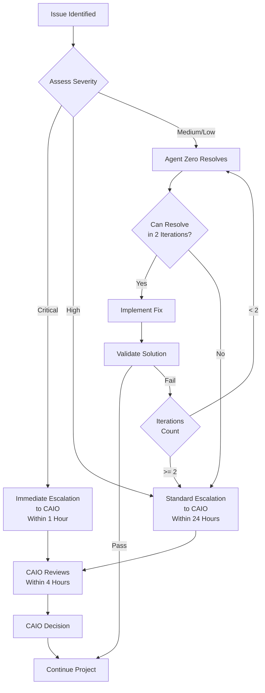

# n8n MCP Server Project: Roles and Responsibilities

**Document Type**: Project Management - RACI Matrix  
**Created**: November 10, 2025  
**Project Code**: HX-N8N-MCP-001  
**Classification**: Internal - Project Management  
**Status**: DRAFT - In Development  

---

## Table of Contents

1. [Executive Summary](#executive-summary)
2. [Project Roles](#project-roles)
3. [Decision Authority Matrix](#decision-authority-matrix)
4. [RACI Matrix by Phase](#raci-matrix-by-phase)
5. [Communication Protocols](#communication-protocols)
6. [Escalation Procedures](#escalation-procedures)
7. [Agent Responsibilities](#agent-responsibilities)

---

## 1. Executive Summary

This document defines roles, responsibilities, and decision-making authority for the n8n MCP Server Installation & Configuration project (HX-N8N-MCP-001). The project follows the HANA-X orchestration model with clear separation between strategic leadership (CAIO), operational orchestration (Agent Zero), and specialized implementation (Layer-specific agents).

### Key Principles

- **Quality First**: All decisions prioritize accuracy and reliability over speed
- **Systematic Approach**: Layered architecture dependencies must be respected
- **Clear Authority**: Decision rights clearly defined at each level
- **100% Pass Rates**: No phase advances without meeting all quality gates

---

## 2. Project Roles

### 2.1 Executive Leadership

#### **CAIO (Chief AI Officer): Jarvis Richardson**
**Level**: Executive Sponsor  
**Authority**: Final decision-making authority on all project aspects  

**Primary Responsibilities**:
- Strategic direction and project prioritization
- Resource allocation approval
- Final arbitration on scope, timeline, and quality trade-offs
- Go/No-Go decisions for major milestones
- Risk acceptance and mitigation strategy approval
- Production deployment authorization

**Decision Rights**:
- ✅ Approve/reject project charter and objectives
- ✅ Approve/reject major scope changes
- ✅ Approve/reject budget and resource requests
- ✅ Approve/reject production deployment
- ✅ Override any technical or operational decision
- ✅ Escalate external dependencies or blockers

**Communication Expectations**:
- Daily brief summaries of progress (async)
- Immediate notification of critical issues or blockers
- Weekly milestone reviews
- Approval requests for scope/timeline/resource changes
- Final sign-off at phase gates

**Time Commitment**: 2-4 hours/week (strategic oversight + approvals)

---

### 2.2 Operational Leadership

#### **Agent Zero (Claude Code): Universal PM Orchestrator**
**Level**: Project Manager & Technical Coordinator  
**Authority**: Day-to-day operational decisions within approved scope  

**Primary Responsibilities**:
- End-to-end project orchestration across all 30 specialist agents
- Multi-agent coordination and workflow management
- Quality assurance validation at every phase
- Risk identification and mitigation planning
- Technical decision-making within approved architecture
- Progress tracking and status reporting to CAIO
- Issue resolution and escalation management

**Decision Rights**:
- ✅ Assign work to specialist agents
- ✅ Approve/reject agent deliverables (quality validation)
- ✅ Determine agent invocation order and parallelization
- ✅ Make technical implementation decisions within approved architecture
- ✅ Invoke safety gates and DRY_RUN protections
- ✅ Escalate to CAIO when needed
- ❌ Change project scope without CAIO approval
- ❌ Approve production deployment without CAIO sign-off
- ❌ Violate architectural principles (Layer 1 first, quality gates)

**Communication Expectations**:
- Real-time updates to CAIO on progress and blockers
- Structured phase completion reports
- Immediate escalation of issues requiring CAIO decision
- Daily status summaries
- Quality gate validation reports

**Time Commitment**: Full-time project dedication (orchestration + validation)

---

### 2.3 Architecture Governance

#### **Alex Rivera (@agent-alex): Platform Architect**
**Level**: Technical Authority  
**Authority**: Architecture decisions and ADR creation  

**Primary Responsibilities**:
- Validate n8n MCP Server design against HANA-X architecture
- Create Architecture Decision Records (ADRs) for major decisions
- Ensure compliance with governance standards
- Review integration patterns (direct vs. gateway)
- Cross-layer dependency validation
- Technical risk assessment

**Decision Rights**:
- ✅ Approve/reject architectural patterns
- ✅ Create and approve ADRs
- ✅ Validate designs against governance standards
- ✅ Recommend architectural changes to Agent Zero/CAIO
- ❌ Override CAIO strategic decisions
- ❌ Directly manage implementation (delegates to Agent Zero)

**Invocation Triggers**:
- Architecture decisions affecting multiple layers
- ADR creation required
- Design conflicts with governance standards
- Major platform integration changes

**Communication Expectations**:
- Architecture review sessions with Agent Zero
- ADR documentation for all major decisions
- Risk assessments for architectural choices

---

### 2.4 Quality Assurance

#### **Julia Santos (@agent-julia): Testing & QA Lead**
**Level**: Quality Authority  
**Authority**: Quality gate approval  

**Primary Responsibilities**:
- Define test plans for each project phase
- Execute comprehensive testing (unit, integration, load)
- Validate 100% pass rates before phase advancement
- Document test results and quality metrics
- Identify quality risks and recommend mitigations

**Decision Rights**:
- ✅ Approve/reject quality gate passage
- ✅ Define test coverage requirements
- ✅ Recommend re-work for failed tests
- ✅ Escalate quality concerns to Agent Zero
- ❌ Override architectural decisions
- ❌ Approve scope changes

**Invocation Triggers**:
- Phase completion requiring quality gate validation
- Integration testing required
- Load/performance testing needed
- Quality metrics reporting

**Communication Expectations**:
- Test plans at phase start
- Test results with pass/fail status
- Quality metrics dashboards
- Immediate escalation of critical failures

---

### 2.5 Layer 1: Identity & Trust Foundation

#### **William Taylor (@agent-william): Ubuntu Server Preparation**
**Level**: Infrastructure Specialist  

**Responsibilities**:
- Provision hx-n8n-mcp-server (192.168.10.214)
- Configure Ubuntu 24.04 base OS
- Network connectivity validation
- System hardening and security baseline
- Domain join preparation

**Invocation**: Phase 2 (Infrastructure Setup) - First agent invoked

---

#### **Frank Lucas (@agent-frank): Samba DC & Certificate Authority**
**Level**: Infrastructure Specialist  

**Responsibilities**:
- Create computer account for hx-n8n-mcp-server
- Create service account for n8n MCP Server
- Configure DNS A record (hx-n8n-mcp-server.hx.dev.local → 192.168.10.214)
- Issue TLS certificate from hx-ca-server
- Configure Kerberos authentication

**Invocation**: Phase 2 (Infrastructure Setup) - After William completes

---

### 2.6 Layer 4: Agentic & Toolchain Implementation

#### **Olivia Chang (@agent-olivia): N8N MCP Specialist**
**Level**: Service Specialist  

**Responsibilities**:
- Install complete n8n MCP Server package (all tools, dependencies)
- Configure MCP protocol server on port 8003
- Establish direct MCP connection to hx-n8n-server (192.168.10.215)
- Implement MCP tool discovery endpoint
- Configure parameter validation and error handling
- Create workflow tool registry
- Document complete package inventory

**Invocation**: Phase 3 (MCP Protocol Implementation) - After Layer 1 complete

---

#### **Omar Rodriguez (@agent-omar): N8N Workflow Developer**
**Level**: Service Specialist  

**Responsibilities**:
- Design 3-5 foundational workflows as MCP tools
- Implement workflow parameter schemas
- Configure workflow error handling
- Test workflows independently in n8n
- Document workflow-to-tool patterns

**Invocation**: Phase 4 (Initial Workflow Development) - After Olivia completes

---

#### **George Kim (@agent-george): FastMCP Gateway Integration**
**Level**: Service Specialist  

**Responsibilities**:
- Register n8n MCP server with FastMCP gateway (192.168.10.213)
- Configure FastMCP dual-role operation (server + client)
- Implement routing to n8n MCP server
- Test unified tool discovery
- Validate gateway routing patterns

**Invocation**: Phase 5 (Integration Testing) - After workflows deployed

---

### 2.7 Support Roles

#### **Amanda Chen (@agent-amanda): Ansible Automation**
**Level**: Automation Specialist  
**Invocation**: Phase 6 (Documentation & Handoff) - Optional  

**Responsibilities**:
- Create Ansible playbook for n8n MCP Server deployment
- Automate configuration management
- Enable repeatable deployments

---

#### **Nathan Lewis (@agent-nathan): Monitoring & Observability**
**Level**: Operations Specialist  
**Invocation**: Phase 6 (Documentation & Handoff) - Optional  

**Responsibilities**:
- Configure service monitoring
- Set up health checks
- Implement alerting for n8n MCP Server
- Create operational dashboards

---

## 3. Decision Authority Matrix

### 3.1 Strategic Decisions (CAIO Authority)

| Decision Type | CAIO | Agent Zero | Architect | Notes |
|---------------|------|------------|-----------|-------|
| Project Charter Approval | **Approve** | Recommend | Consult | CAIO final authority |
| Scope Changes | **Approve** | Recommend | Consult | Any scope modification requires CAIO approval |
| Timeline Extensions | **Approve** | Recommend | Inform | CAIO approves any phase extension |
| Resource Allocation | **Approve** | Recommend | Consult | Additional resources or budget |
| Production Deployment Go/No-Go | **Approve** | Recommend | Consult | CAIO must explicitly approve |
| Risk Acceptance (High/Critical) | **Approve** | Recommend | Consult | CAIO accepts or mitigates high risks |
| Architecture Principle Exceptions | **Approve** | Recommend | **Recommend** | Both Agent Zero and Architect must recommend |

**Escalation**: All strategic decisions require CAIO review and explicit approval.

---

### 3.2 Operational Decisions (Agent Zero Authority)

| Decision Type | CAIO | Agent Zero | Architect | Notes |
|---------------|------|------------|-----------|-------|
| Agent Assignment | Inform | **Approve** | Consult | Agent Zero assigns work to specialists |
| Implementation Details | Inform | **Approve** | Consult | Within approved architecture |
| Agent Deliverable Acceptance | Inform | **Approve** | Inform | Agent Zero validates quality |
| Workflow Execution Order | Inform | **Approve** | Consult | Parallel vs. sequential decisions |
| Quality Gate Pass/Fail | Inform | **Approve** | Inform | Based on Julia's validation |
| Minor Issue Resolution | Inform | **Approve** | Inform | Issues not requiring scope/timeline change |
| Safety Gate Invocation | Inform | **Approve** | Inform | DRY_RUN and confirmation gates |

**Escalation**: Operational decisions escalate to CAIO if they impact scope, timeline, or risk profile.

---

### 3.3 Technical Decisions (Architect + Agent Zero)

| Decision Type | CAIO | Agent Zero | Architect | Notes |
|---------------|------|------------|-----------|-------|
| Architecture Patterns | Consult | **Approve** | **Recommend** | Alex recommends, Agent Zero approves |
| ADR Creation | Inform | Consult | **Approve** | Alex creates and owns ADRs |
| Integration Patterns | Consult | **Approve** | **Recommend** | Direct vs. gateway routing decisions |
| Package Selection | Inform | **Approve** | Consult | Within complete package installation scope |
| Configuration Standards | Inform | **Approve** | **Recommend** | Port numbers, naming conventions, etc. |
| Cross-Layer Dependencies | Consult | **Approve** | **Recommend** | Layer 1 first principle enforcement |

**Escalation**: Technical decisions escalate to CAIO if they require scope/timeline changes or introduce high risks.

---

### 3.4 Quality Decisions (Julia + Agent Zero)

| Decision Type | CAIO | Agent Zero | QA Lead | Notes |
|---------------|------|------------|---------|-------|
| Test Plan Definition | Inform | Consult | **Approve** | Julia defines test requirements |
| Quality Gate Criteria | Consult | Consult | **Recommend** | Julia recommends, Agent Zero approves |
| Pass/Fail Determination | Inform | **Approve** | **Recommend** | Julia validates, Agent Zero approves |
| Re-work Requirements | Inform | **Approve** | **Recommend** | Based on test failures |
| Test Coverage Gaps | Consult | **Approve** | **Recommend** | Julia identifies, Agent Zero approves fixes |

**Escalation**: Quality issues that cannot be resolved within 2 iterations escalate to CAIO.

---

## 4. RACI Matrix by Phase

**Legend**:
- **R** = Responsible (does the work)
- **A** = Accountable (final approval authority)
- **C** = Consulted (provides input)
- **I** = Informed (kept updated)

### Phase 1: Research & Planning (Days 1-2)

| Activity | CAIO | Agent Zero | Alex | Julia | Olivia | Omar | George | William | Frank |
|----------|------|------------|------|-------|--------|------|--------|---------|-------|
| Charter Review | **A** | R | C | C | I | I | I | I | I |
| Technical Feasibility Research | I | **A** | C | I | R | C | C | I | I |
| Package Inventory Documentation | I | **A** | C | I | R | I | I | I | I |
| Architecture Validation | C | C | **A** | I | C | I | C | I | I |
| Go/No-Go Decision | **A** | R | C | C | I | I | I | I | I |

---

### Phase 2: Infrastructure Setup (Days 3-5)

| Activity | CAIO | Agent Zero | Alex | Julia | Olivia | Omar | George | William | Frank |
|----------|------|------------|------|-------|--------|------|--------|---------|-------|
| Ubuntu Server Preparation | I | **A** | I | I | I | I | I | R | I |
| Domain Join & Auth Config | I | **A** | I | I | I | I | I | C | R |
| TLS Certificate Installation | I | **A** | I | I | C | I | I | I | R |
| Network Connectivity Validation | I | **A** | I | C | C | I | I | R | R |
| Quality Gate Validation | I | **A** | I | R | I | I | I | I | I |

---

### Phase 3: MCP Protocol Implementation (Days 6-8)

| Activity | CAIO | Agent Zero | Alex | Julia | Olivia | Omar | George | William | Frank |
|----------|------|------------|------|-------|--------|------|--------|---------|-------|
| Complete Package Installation | I | **A** | C | I | R | I | I | I | I |
| MCP Server Configuration | I | **A** | C | I | R | I | I | I | I |
| Direct Connection Setup | I | **A** | C | I | R | C | I | I | I |
| Tool Discovery Implementation | I | **A** | C | I | R | I | I | I | I |
| Parameter Validation Implementation | I | **A** | C | C | R | I | I | I | I |
| Quality Gate Validation | I | **A** | I | R | C | I | I | I | I |

---

### Phase 4: Initial Workflow Development (Days 9-12)

| Activity | CAIO | Agent Zero | Alex | Julia | Olivia | Omar | George | William | Frank |
|----------|------|------------|------|-------|--------|------|--------|---------|-------|
| Workflow Design (3-5 workflows) | I | **A** | C | I | C | R | I | I | I |
| MCP Tool Metadata Creation | I | **A** | C | I | C | R | I | I | I |
| Parameter Schema Implementation | I | **A** | I | C | C | R | I | I | I |
| Error Handling Implementation | I | **A** | I | C | C | R | I | I | I |
| Workflow Testing (n8n) | I | **A** | I | C | C | R | I | I | I |
| Quality Gate Validation | I | **A** | I | R | I | C | I | I | I |

---

### Phase 5: Integration Testing (Days 13-15)

| Activity | CAIO | Agent Zero | Alex | Julia | Olivia | Omar | George | William | Frank |
|----------|------|------------|------|-------|--------|------|--------|---------|-------|
| Direct Connection Testing | I | **A** | I | C | C | C | I | I | I |
| FastMCP Gateway Integration | I | **A** | C | I | C | I | R | I | I |
| Gateway Routing Testing | I | **A** | I | C | C | I | C | I | I |
| End-to-End Agent Integration | I | **A** | C | C | C | C | C | I | I |
| Load Testing | I | **A** | I | R | I | I | I | I | I |
| Quality Gate Validation | I | **A** | I | R | I | I | I | I | I |

---

### Phase 6: Documentation & Handoff (Days 16-17)

| Activity | CAIO | Agent Zero | Alex | Julia | Olivia | Omar | George | William | Frank |
|----------|------|------------|------|-------|--------|------|--------|---------|-------|
| Architecture Document | C | C | **A** | I | C | C | C | I | I |
| Package Inventory | I | **A** | I | I | R | I | I | I | I |
| Operational Runbook | I | **A** | C | I | R | C | C | I | I |
| Workflow Design Guide | I | **A** | I | I | C | R | I | I | I |
| Integration Patterns Guide | I | **A** | C | I | C | C | R | I | I |
| Team Training | C | **A** | I | I | R | R | R | I | I |
| Quality Gate Validation | C | **A** | I | R | I | I | I | I | I |

---

### Phase 7: Production Deployment (Day 18)

| Activity | CAIO | Agent Zero | Alex | Julia | Olivia | Omar | George | William | Frank |
|----------|------|------------|------|-------|--------|------|--------|---------|-------|
| Final Validation Checks | C | **A** | I | R | C | C | C | I | I |
| Production Cutover Plan | **A** | R | C | C | C | I | I | I | I |
| Production Deployment | **A** | R | I | C | C | I | I | I | I |
| Post-Deployment Validation | C | **A** | I | R | C | C | C | I | I |
| Monitoring Validation | I | **A** | I | C | I | I | I | I | I |
| Production Sign-Off | **A** | R | C | C | I | I | I | I | I |

---

## 5. Communication Protocols

### 5.1 CAIO ↔ Agent Zero

**Frequency**: Daily + on-demand  
**Format**: Structured status updates + escalations  

**Daily Status Update** (Agent Zero → CAIO):
```
Subject: n8n MCP Server Daily Status - [Date]

Current Phase: [Phase X - Description]
Progress: [X]% complete
Status: [On Track / At Risk / Blocked]

Completed Today:
- [Key accomplishment 1]
- [Key accomplishment 2]

In Progress:
- [Active work 1]
- [Active work 2]

Blockers / Risks:
- [Issue 1 - Impact and ETA]
- [Issue 2 - Impact and ETA]

Next 24 Hours:
- [Planned work 1]
- [Planned work 2]

Decisions Needed: [None / List items requiring CAIO approval]
```

**Escalation** (Agent Zero → CAIO):
```
Subject: [URGENT] n8n MCP Server - Escalation Required

Category: [Scope / Timeline / Risk / Technical]
Severity: [High / Critical]

Issue:
[Clear description of the problem]

Impact:
- Timeline: [Impact on schedule]
- Scope: [Impact on deliverables]
- Risk: [Potential consequences]

Options Considered:
1. [Option 1 - Pros/Cons]
2. [Option 2 - Pros/Cons]

Recommendation: [Agent Zero's recommendation]

Decision Required: [Specific decision needed from CAIO]
Timeline: [When decision needed by]
```

**CAIO Response Expected**: Within 4 business hours for high-severity, within 24 hours for standard updates.

---

### 5.2 Agent Zero ↔ Specialist Agents

**Frequency**: On-demand per task  
**Format**: Structured agent invocation  

**Agent Invocation Template**:
```
@agent-[name]

**Task:** [One clear sentence stating what to accomplish]

**Context:**
- Current Phase: [Phase X - Description]
- Work Orchestration: [What Agent Zero is coordinating]
- Layer Status: [What's complete, what's ready]
- Your Expertise Needed: [Why this specific agent]

**Requirements:**
1. [Specific requirement 1]
2. [Specific requirement 2]
3. [Specific requirement 3]

**Infrastructure Details:**
- Server: hx-n8n-mcp-server.hx.dev.local (192.168.10.214)
- Dependencies: [Other services/agents this depends on]
- Configuration: [Specific settings required]

**Expected Output:**
- [Deliverable 1]
- [Deliverable 2]
- [Evidence of success]

**Quality Gates:**
- [Test/validation 1 must pass]
- [Test/validation 2 must pass]

**Integration Points:**
- [What other agents/services depend on this]

**Timeline:** [Expected completion timeframe]
```

**Agent Response Expected**: 
- Acknowledgment within 1 hour
- Status updates every 4 hours for multi-day tasks
- Completion notification with deliverables

---

### 5.3 Agent Zero ↔ Quality Assurance

**Frequency**: At each quality gate  
**Format**: Quality gate validation request  

**Quality Gate Request** (Agent Zero → Julia):
```
@agent-julia

**Phase:** [Phase X - Description]
**Status:** Ready for Quality Gate Validation

**Deliverables:**
- [Deliverable 1 - Location/Description]
- [Deliverable 2 - Location/Description]

**Quality Criteria:**
- [ ] [Criteria 1]
- [ ] [Criteria 2]
- [ ] [Criteria 3]

**Tests Required:**
- [Test type 1 - Description]
- [Test type 2 - Description]

**Success Threshold:** 100% pass rate on all tests

**Request:** Please validate and provide pass/fail determination.
```

**Quality Gate Response** (Julia → Agent Zero):
```
**Phase:** [Phase X]
**Status:** [PASS / FAIL]

**Test Results:**
✅ [Test 1]: PASS - [Details]
✅ [Test 2]: PASS - [Details]
❌ [Test 3]: FAIL - [Details]

**Quality Metrics:**
- Test Coverage: [X]%
- Pass Rate: [X]%
- Critical Defects: [Count]

**Recommendation:** [Approve to Proceed / Require Re-work]

**Re-work Required** (if applicable):
- [Fix 1 - Description and priority]
- [Fix 2 - Description and priority]
```

---

### 5.4 Agent Zero ↔ Architecture

**Frequency**: On-demand for architectural decisions  
**Format**: Architecture review request  

**Architecture Review Request** (Agent Zero → Alex):
```
@agent-alex

**Decision Required:** [Architectural decision description]

**Context:**
- Current Phase: [Phase]
- Issue: [What needs architectural guidance]

**Options:**
1. [Option 1 - Description, pros, cons]
2. [Option 2 - Description, pros, cons]

**Governance Considerations:**
- [Relevant principle/standard 1]
- [Relevant principle/standard 2]

**Impact:**
- Layers Affected: [List]
- Integration Points: [List]
- Risk: [Assessment]

**Request:** Architecture validation and ADR creation if needed.
```

---

### 5.5 Communication Schedule

| Interaction | Frequency | Format | Owner | Response SLA |
|-------------|-----------|--------|-------|--------------|
| CAIO Daily Update | Daily | Async summary | Agent Zero | Info only |
| CAIO Escalation | On-demand | Structured escalation | Agent Zero | 4 hrs (high), 24 hrs (standard) |
| CAIO Phase Gate Review | Per phase | Structured report + approval request | Agent Zero | 24 hrs |
| Agent Invocation | On-demand | Structured task | Agent Zero | 1 hr ack, ongoing updates |
| Quality Gate Validation | Per phase | Structured request | Agent Zero → Julia | 24 hrs |
| Architecture Review | On-demand | Structured review | Agent Zero → Alex | 24-48 hrs |
| Team Meetings | Weekly | Sync discussion | CAIO | N/A |

---

## 6. Escalation Procedures

### 6.1 Escalation Triggers

**Immediate Escalation to CAIO** (within 1 hour):
- Critical blocker halting all progress
- Security vulnerability discovered
- Data loss or corruption risk
- Scope change required to meet objectives
- Timeline extension needed (>1 day)
- Cost overrun or resource shortage
- Layer 1 failure (foundation compromise)
- Production system impact

**Standard Escalation to CAIO** (within 24 hours):
- Quality gate failure after 2 iterations
- Technical risk identified (high severity)
- Architecture principle exception needed
- Agent resource unavailable
- Integration issue requiring cross-team coordination
- User-facing issue or complaint

**No Escalation Required** (Agent Zero resolves):
- Routine implementation issues
- Agent coordination within normal workflow
- Minor configuration adjustments
- Standard troubleshooting within 2 iterations
- Documentation clarifications

---

### 6.2 Escalation Process



---

### 6.3 Escalation Communication Template

```
TO: Jarvis Richardson (CAIO)
FROM: Agent Zero (Claude Code)
SUBJECT: [ESCALATION - SEVERITY] n8n MCP Server - [Brief Description]

ESCALATION LEVEL: [Immediate / Standard]
SEVERITY: [Critical / High / Medium]
PHASE: [Current Phase]
DATE: [Date/Time]

ISSUE SUMMARY:
[2-3 sentence description of the problem]

IMPACT:
- Timeline: [Specific impact on schedule with dates]
- Scope: [Specific impact on deliverables]
- Quality: [Impact on quality metrics]
- Risk: [Potential consequences if not addressed]

ROOT CAUSE:
[What caused this issue]

ATTEMPTED RESOLUTIONS:
1. [What was tried] - Result: [Outcome]
2. [What was tried] - Result: [Outcome]

CURRENT STATUS:
[Current state - what's blocked, what can continue]

OPTIONS FOR RESOLUTION:
1. **[Option 1]**
   - Description: [Details]
   - Timeline Impact: [Impact]
   - Scope Impact: [Impact]
   - Pros: [Benefits]
   - Cons: [Drawbacks]
   - Cost: [Resource/time cost]

2. **[Option 2]**
   - Description: [Details]
   - Timeline Impact: [Impact]
   - Scope Impact: [Impact]
   - Pros: [Benefits]
   - Cons: [Drawbacks]
   - Cost: [Resource/time cost]

AGENT ZERO RECOMMENDATION:
[Recommended option with rationale]

DECISION REQUIRED:
[Specific decision needed from CAIO]

REQUIRED BY:
[Date/time decision needed to avoid further impact]

NEXT STEPS PENDING DECISION:
- [Action 1]
- [Action 2]
```

---

## 7. Agent Responsibilities Detail

### 7.1 Agent Zero: Core Orchestration Responsibilities

**Pre-Project:**
- Charter validation and approval preparation
- Agent availability verification
- Resource planning and allocation
- Risk assessment and mitigation planning

**During Project:**
- Phase planning and agent invocation sequencing
- Multi-agent coordination (parallel vs. sequential)
- Quality validation at each deliverable
- Progress tracking and status reporting
- Issue identification and resolution
- Safety gate enforcement (DRY_RUN, confirmations)
- Documentation aggregation
- Stakeholder communication (CAIO updates)

**Post-Project:**
- Lessons learned documentation
- Process improvement recommendations
- Knowledge transfer
- Post-deployment support coordination

**Quality Responsibilities:**
- Validate ALL agent deliverables before acceptance
- Ensure 100% pass rates at quality gates
- Never advance phases with failed validation
- Enforce Layer 1 completion before dependent layers
- Maintain quality-over-speed prioritization

**Communication Responsibilities:**
- Daily status updates to CAIO
- Real-time escalations for critical issues
- Phase completion reports
- Agent coordination communications
- Documentation consolidation

---

### 7.2 CAIO: Strategic Leadership Responsibilities

**Pre-Project:**
- Charter review and approval
- Strategic objectives definition
- Budget and resource approval
- Risk tolerance definition

**During Project:**
- Phase gate approvals
- Escalation response and decision-making
- Scope change approvals
- Risk acceptance decisions
- Cross-functional coordination (if needed)
- Strategic guidance on trade-offs

**Post-Project:**
- Production deployment authorization
- Project success evaluation
- Strategic lessons learned
- Future roadmap input

**Quality Responsibilities:**
- Set quality standards and expectations
- Approve quality gate criteria
- Review quality metrics at phase gates
- Enforce quality-first culture

**Communication Responsibilities:**
- Timely responses to Agent Zero escalations (4 hrs for critical)
- Phase gate review and approval (24 hrs)
- Strategic guidance when requested
- Stakeholder updates (external, if applicable)

---

### 7.3 Cross-Functional Collaboration

**Agent Zero + Alex (Architecture):**
- Architecture validation sessions at design decisions
- ADR review and approval coordination
- Governance compliance verification
- Technical risk assessment collaboration

**Agent Zero + Julia (Quality):**
- Test plan review at phase start
- Quality gate validation coordination
- Re-work prioritization and scheduling
- Quality metrics tracking and reporting

**Agent Zero + Layer-Specific Agents:**
- Clear task assignment with context and requirements
- Real-time status updates and progress tracking
- Issue resolution and troubleshooting support
- Deliverable validation and acceptance

**CAIO + Agent Zero + Alex:**
- Major architectural decisions requiring strategic input
- Trade-off decisions (scope vs. timeline vs. quality)
- Risk acceptance for high-severity issues
- Production deployment readiness review

---

## Document Approval

| Role | Name | Signature | Date |
|------|------|-----------|------|
| **CAIO (Chief AI Officer)** | Jarvis Richardson | _______________ | _______ |
| **Agent Zero (Project Orchestrator)** | Claude Code | _______________ | _______ |
| **Platform Architect** | Alex Rivera (@agent-alex) | _______________ | _______ |
| **Quality Assurance Lead** | Julia Santos (@agent-julia) | _______________ | _______ |

---

## Document Revision History

| Version | Date | Changes | Author |
|---------|------|---------|--------|
| 1.0 | 2025-11-10 | Initial draft with CAIO and Agent Zero roles defined | Claude Code (Agent Zero) |

---

**Document Version**: 1.0  
**Created**: November 10, 2025  
**Last Updated**: November 10, 2025  
**Related Documents**:
- n8n MCP Server Project Charter
- n8n MCP Server Architecture
- HANA-X Agent Constitution (0.0.5.0)
- Agent Catalog (0.0.5.1.0)

**Classification**: Internal - Project Management  
**Status**: DRAFT - Awaiting CAIO Approval  

---

*This Roles and Responsibilities document establishes clear authority, accountability, and communication patterns for successful n8n MCP Server project delivery following HANA-X quality-first principles.*
