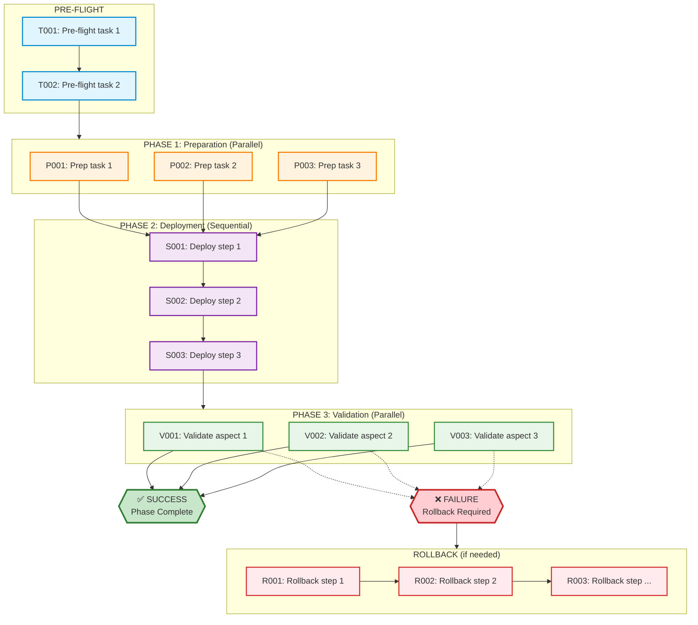

**Document Type**: Template - Summary Task  
**Created**: 2025-11-06  
**Topic**: Summary Task Template  
**Purpose**: Template for high-level summary tasks in project planning  
**Classification**: Internal

---

# Task List: [WORK ITEM NAME]

**Date**: [YYYY-MM-DD]
**Orchestrating Agent**: [@agent-name]
**Task Size**: [Simple/Medium/Complex]
**Work Plan**: [Link to work plan if exists, or N/A]
**Specification**: [Link to spec if exists, or N/A]
**Total Tasks**: [#]
**Estimated Duration**: [X hours/days]

---

## Template Purpose

**Summary-Level Focus**:
- ✅ Coordinate multiple tasks across agents
- ✅ Visualize dependencies and parallel execution
- ✅ Track overall work item progress
- ✅ Manage sequencing and checkpoints

**NOT for detailed step-by-step execution** → Use 0.0.6.13 (Individual Task Template) for that

---

## Quick Guidelines

✅ **Mark parallel tasks with [P]** - Can run simultaneously (different systems, no dependencies)
✅ **Mark sequential tasks with [S]** - Must run in order (blocked by previous tasks)
✅ **Note dependencies** - Use `[Blocked by: T###]` for tasks that wait on others
✅ **Assign agents** - Every task has a clear owner
✅ **Keep it high-level** - Expected outcome + simple validation (details go in individual task docs)

---

## Task Format

**Simple Format**: `[ID] [P/S] @agent-name - Description`

- **[P]**: Parallel - Can run with other [P] tasks
- **[S]**: Sequential - Must wait for previous tasks
- **[Blocked by: T###]**: Explicit dependencies

**What to Include**:
- Task ID and agent assignment
- Brief description (1 line)
- Expected outcome (what "done" looks like)
- Simple validation (how to check it worked)

**What NOT to Include**:
- Detailed step-by-step commands → Use 0.0.6.13 (Individual Task Template)
- Troubleshooting procedures → Use 0.0.6.13
- Long explanations → Keep summary-level

---

## Task List Template

### PRE-FLIGHT: Setup & Baseline

```
□ T001 [S] @agent-name - [Brief description]
  Outcome: [What success looks like]
  Check: [Quick validation]

□ T002 [S] @agent-name - [Brief description]
  [Blocked by: T001]
  Outcome: [What success looks like]
  Check: [Quick validation]
```

---

### PHASE 1: PREPARATION

**Parallel execution available** - These can run simultaneously

```
□ P001 [P] @agent-name - [Brief description]
  Outcome: [What success looks like]
  Check: [Quick validation]

□ P002 [P] @agent-name - [Brief description]
  Outcome: [What success looks like]
  Check: [Quick validation]

□ P003 [P] @agent-name - [Brief description]
  Outcome: [What success looks like]
  Check: [Quick validation]
```

**Checkpoint**: All Phase 1 tasks complete? → Proceed to Phase 2

---

### PHASE 2: DEPLOYMENT

**Sequential execution** - Must run in order

```
□ S001 [S] @agent-name - [Brief description]
  [Blocked by: P001, P002, P003]
  Outcome: [What success looks like]
  Check: [Quick validation]

□ S002 [S] @agent-name - [Brief description]
  [Blocked by: S001]
  Outcome: [What success looks like]
  Check: [Quick validation]

□ S003 [S] @agent-name - [Brief description]
  [Blocked by: S002]
  Outcome: [What success looks like]
  Check: [Quick validation]
```

**Checkpoint**: All deployment tasks complete? → Proceed to validation

---

### PHASE 3: VALIDATION

**Parallel testing** - Tests can run simultaneously

```
□ V001 [P] @agent-name - [Test description]
  Outcome: [Test passes with X result]
  Check: [How to verify]

□ V002 [P] @agent-name - [Test description]
  Outcome: [Test passes with X result]
  Check: [How to verify]

□ V003 [P] @agent-name - [Test description]
  Outcome: [Test passes with X result]
  Check: [How to verify]
```

**Checkpoint**: All tests passed? ✅ Success | ❌ → Proceed to rollback

---

### ROLLBACK: Restore Previous State

**Execute if validation fails**

```
□ R001 [S] @agent-name - [Rollback step]
  Outcome: [System restored to previous state]
  Check: [How to verify rollback worked]

□ R002 [S] @agent-name - [Rollback step]
  [Blocked by: R001]
  Outcome: [Component restored]
  Check: [How to verify]
```

---

## Summary

### Task Count
- Pre-Flight: [#] tasks
- Phase 1 Prep: [#] tasks (parallel)
- Phase 2 Deploy: [#] tasks (sequential)
- Phase 3 Validate: [#] tasks (parallel)
- Rollback: [#] tasks (if needed)
- **Total**: [#] tasks

### Time Estimate
- Sequential (worst case): [X] hours
- Optimized (parallel): [Y] hours
- Time savings: [Z] hours ([%]% faster)

---

## Dependency Visualization

### Mermaid Diagram



> **Note**: Mermaid diagram rendering requires a Mermaid-compatible viewer (VS Code with Mermaid extension, GitHub, GitLab, or Mermaid Live Editor). If the diagram doesn't render, use the ASCII fallback below.

### ASCII Diagram (Fallback)

<!--
ASCII diagram provided as fallback for environments without Mermaid support.
This represents the same dependency structure as the Mermaid diagram above.
-->

```
PRE-FLIGHT
T001 → T002

PHASE 1 (Parallel)
P001 ─┐
P002 ─┼─→ S001 (Phase 2 starts)
P003 ─┘

PHASE 2 (Sequential)
S001 → S002 → S003

PHASE 3 (Parallel)
V001 ─┐
V002 ─┼─→ SUCCESS ✅ (if all pass)
V003 ─┘  └─→ ROLLBACK ❌ (if any fail)

ROLLBACK (if needed)
R001 → R002 → ...
```

---

## Agent Coordination

| Agent | Role | Availability | Tasks |
|-------|------|--------------|-------|
| [@agent-name] | [Role] | [Status] | [Task IDs] |
| [@agent-name] | [Role] | [Status] | [Task IDs] |

**Communication**:
- Status updates: [Frequency and channel]
- Blocked tasks: [Escalation process]
- Completion: [Who to notify]

---

## Risk Summary

| Risk | Impact | Mitigation |
|------|--------|------------|
| [Risk] | [H/M/L] | [Which tasks address this] |

---

## Progress Tracking

**Status Legend**: □ Not started | ⏳ In progress | ✅ Complete | ❌ Failed | ⏭️ Skipped

**Phase Completion**:
- [ ] Pre-Flight
- [ ] Phase 1: Preparation
- [ ] Phase 2: Deployment
- [ ] Phase 3: Validation
- [ ] Documentation
- [ ] Work Item Complete

---

## Template Usage Instructions

### When to Use This Template

**Use 0.0.6.11 (Summary Task List) for**:
- ✅ Coordinating 5+ related tasks
- ✅ Managing work across multiple agents
- ✅ Visualizing dependencies and parallel execution
- ✅ High-level progress tracking

**Use 0.0.6.13 (Individual Task) for**:
- ✅ Detailed step-by-step execution
- ✅ Complex tasks requiring troubleshooting
- ✅ Audit trails and command logs
- ✅ Tasks that will be repeated

### How to Use

1. **Copy template** to your project directory
2. **Fill in header** with work item details
3. **List tasks** in appropriate phases
4. **Mark [P] or [S]** for each task
5. **Assign agents** to each task
6. **Note dependencies** with [Blocked by: T###]
7. **Keep descriptions brief** (1 line per task)
8. **Track progress** with checkboxes
9. **Update checkpoints** as phases complete
10. **Link to 0.0.6.13 docs** for detailed task execution

### Best Practices

✅ **Keep it summary-level** - This is for coordination, not detailed execution
✅ **One line per task** - If you need more, create a 0.0.6.13 individual task doc
✅ **Focus on dependencies** - Make blocking relationships clear
✅ **Use phases wisely** - Not all work needs all phases
✅ **Update in real-time** - Keep status current for coordination
✅ **Link related docs** - Reference work plans, specs, and individual task docs

---

## Document Metadata

```yaml
work_item: [Name]
orchestrating_agent: [@agent-name]
created_date: [YYYY-MM-DD]
task_size: [Simple/Medium/Complex]
total_tasks: [#]
parallel_tasks: [#]
sequential_tasks: [#]
estimated_duration: [X hours]
actual_duration: [X hours]
template: /srv/cc/Governance/0.0-governance/0.0.6-Templates/0.0.6.11-summary-task-template.md
related_docs:
  - individual_tasks: [Links to 0.0.6.13 documents]
  - work_plan: [Link if exists]
  - specification: [Link if exists]
```

---

**Template Version**: 1.0  
**Maintained By**: Hana-X AI Governance  
**Template ID**: 0.0.6.11  
**Classification**: Summary Task List Template  
**Related Templates**:
- 0.0.6.13: Individual Task Template (for detailed execution)
- 0.0.6.9: Work Plan Template
- 0.0.6.10: Work Specification Template

---

**Version**: 1.0  
**Maintained By**: Agent Zero / Project Managers  
**Related Documents**:
- `0.0.6.10-individual-task-template.md` - Template
- `0.0.6.6-work-plan-template.md` - Template  
**Classification**: Internal  
**Status**: Template - Ready for Use  
**Last Review**: 2025-11-06
