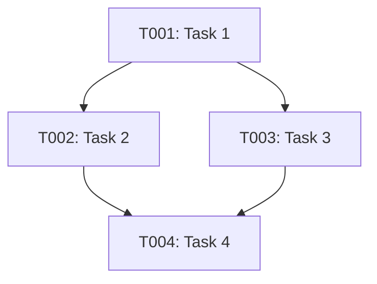

# n8n MCP Server Deployment: Project Plan

**Document Type**: Project Plan - Master Coordination  
**Created**: November 10, 2025  
**Project Code**: HX-N8N-MCP-001 (POC5)  
**Classification**: Internal - Project Management  
**Status**: ACTIVE - Execution Ready  

---

## Table of Contents

1. [Project Overview](#project-overview)
2. [Directory Structure](#directory-structure)
3. [Execution Methodology](#execution-methodology)
4. [Phase-by-Phase Approach](#phase-by-phase-approach)
5. [Specification Strategy](#specification-strategy)
6. [Task Management Strategy](#task-management-strategy)
7. [Test Planning Strategy](#test-planning-strategy)
8. [Document Review Process](#document-review-process)
9. [Team Coordination](#team-coordination)
10. [Quality Gates](#quality-gates)

---

## 1. Project Overview

### 1.1 Executive Summary

This project plan orchestrates the deployment of the n8n MCP Server (hx-n8n-mcp-server at 192.168.10.214), following the HANA-X quality-first, systematic approach. The plan follows a **7-phase methodology** spanning **18-21 days** (18 days baseline + 3 days contingency reserve), with each phase having dedicated specifications, task lists, and quality gates.

**Key Principles**:
- **Quality First**: 100% pass rates before phase advancement
- **Systematic Approach**: Layer 1 foundation before dependent services
- **Phase-Based Specs**: One specification per phase to manage complexity
- **Task Dependencies**: Clear blocking relationships documented
- **Comprehensive Testing**: Test plan drives validation at every phase

---

### 1.2 Success Criteria

**Project success requires**:
- ✅ All 7 phases completed with 100% quality gate passage
- ✅ All 5 project documents reviewed and approved by team
- ✅ All phase specifications written, reviewed, and approved
- ✅ All tasks completed with validation evidence
- ✅ Test plan executed with 100% pass rate
- ✅ Production deployment authorized by CAIO

---

## 2. Directory Structure

### 2.1 Project Root

**Location**: `/srv/cc/Governance/x-poc5-n8n-mcp-deployment/`

**Purpose**: Centralized location for all project artifacts, following HANA-X POC naming convention (POC5 = n8n MCP Server deployment).

---

### 2.2 Complete Directory Structure

```
/srv/cc/Governance/x-poc5-n8n-mcp-deployment/
│
├── README.md                                    # Project overview and navigation
├── project-plan.md                             # This document
│
├── 00-foundation/                               # Foundation documents (created first)
│   ├── project-charter.md                       # From /mnt/user-data/outputs/
│   ├── architecture.md                          # From /mnt/user-data/outputs/
│   ├── roles-responsibilities.md                # From /mnt/user-data/outputs/
│   ├── knowledge-document.md                    # From /mnt/user-data/outputs/
│   ├── credentials-standards.md                 # From /mnt/user-data/outputs/
│   └── reviews/                                 # Foundation doc reviews
│       ├── charter-review.md
│       ├── architecture-review.md
│       ├── roles-review.md
│       ├── knowledge-review.md
│       └── credentials-review.md
│
├── 01-phase1-research-planning/                # Phase 1: Research & Planning (Days 1-2)
│   ├── spec-phase1.md                          # Phase 1 specification
│   ├── tasks/                                   # Phase 1 task list
│   │   ├── task-list-phase1.md                 # Summary task list
│   │   ├── T001-research-n8n-mcp.md           # Individual detailed tasks
│   │   ├── T002-validate-fastmcp-dual.md
│   │   ├── T003-document-packages.md
│   │   └── T004-go-no-go-decision.md
│   ├── deliverables/                           # Phase 1 outputs
│   │   ├── technical-feasibility-report.md
│   │   ├── package-inventory.md
│   │   └── go-no-go-recommendation.md
│   └── reviews/                                 # Phase 1 reviews
│       └── spec-phase1-review.md
│
├── 02-phase2-infrastructure/                    # Phase 2: Infrastructure Setup (Days 3-5)
│   ├── spec-phase2.md                          # Phase 2 specification
│   ├── tasks/
│   │   ├── task-list-phase2.md
│   │   ├── T005-william-ubuntu-prep.md        # William's tasks
│   │   ├── T006-william-network-config.md
│   │   ├── T007-frank-domain-join.md          # Frank's tasks
│   │   ├── T008-frank-service-account.md
│   │   ├── T009-frank-dns-record.md
│   │   ├── T010-frank-ssl-certificate.md
│   │   └── T011-validate-layer1.md
│   ├── deliverables/
│   │   ├── server-configuration-report.md
│   │   ├── domain-integration-report.md
│   │   └── layer1-validation-report.md
│   └── reviews/
│       └── spec-phase2-review.md
│
├── 03-phase3-mcp-protocol/                      # Phase 3: MCP Protocol Implementation (Days 6-8)
│   ├── spec-phase3.md                          # Phase 3 specification
│   ├── tasks/
│   │   ├── task-list-phase3.md
│   │   ├── T012-olivia-package-install.md     # Olivia's tasks
│   │   ├── T013-olivia-mcp-server-config.md
│   │   ├── T014-olivia-direct-connection.md
│   │   ├── T015-olivia-tool-discovery.md
│   │   ├── T016-olivia-param-validation.md
│   │   └── T017-validate-mcp-protocol.md
│   ├── deliverables/
│   │   ├── mcp-server-installation-report.md
│   │   ├── package-inventory-complete.md
│   │   └── mcp-protocol-validation-report.md
│   └── reviews/
│       └── spec-phase3-review.md
│
├── 04-phase4-workflow-dev/                      # Phase 4: Initial Workflow Development (Days 9-12)
│   ├── spec-phase4.md                          # Phase 4 specification
│   ├── tasks/
│   │   ├── task-list-phase4.md
│   │   ├── T018-omar-workflow1-design.md      # Omar's tasks (3-5 workflows)
│   │   ├── T019-omar-workflow2-design.md
│   │   ├── T020-omar-workflow3-design.md
│   │   ├── T021-omar-mcp-metadata.md
│   │   ├── T022-omar-param-schemas.md
│   │   ├── T023-omar-error-handling.md
│   │   └── T024-validate-workflows.md
│   ├── deliverables/
│   │   ├── workflow-designs/
│   │   │   ├── workflow1-database-query.md
│   │   │   ├── workflow2-api-call.md
│   │   │   ├── workflow3-file-processing.md
│   │   │   ├── workflow4-notification.md
│   │   │   └── workflow5-optional.md
│   │   ├── mcp-tool-metadata.md
│   │   └── workflow-validation-report.md
│   └── reviews/
│       └── spec-phase4-review.md
│
├── 05-phase5-integration-testing/               # Phase 5: Integration Testing (Days 13-15)
│   ├── spec-phase5.md                          # Phase 5 specification
│   ├── tasks/
│   │   ├── task-list-phase5.md
│   │   ├── T025-george-fastmcp-register.md    # George's tasks
│   │   ├── T026-george-routing-config.md
│   │   ├── T027-george-dual-path-test.md
│   │   ├── T028-julia-integration-tests.md     # Julia's tasks
│   │   ├── T029-julia-load-tests.md
│   │   └── T030-validate-integration.md
│   ├── deliverables/
│   │   ├── fastmcp-integration-report.md
│   │   ├── integration-test-results.md
│   │   ├── load-test-results.md
│   │   └── dual-path-validation-report.md
│   └── reviews/
│       └── spec-phase5-review.md
│
├── 06-phase6-documentation/                     # Phase 6: Documentation & Handoff (Days 16-17)
│   ├── spec-phase6.md                          # Phase 6 specification
│   ├── tasks/
│   │   ├── task-list-phase6.md
│   │   ├── T031-amanda-ansible-playbook.md    # Amanda's tasks (optional)
│   │   ├── T032-nathan-monitoring-setup.md     # Nathan's tasks (optional)
│   │   ├── T033-agent-zero-docs-consolidate.md
│   │   ├── T034-agent-zero-runbook.md
│   │   ├── T035-agent-zero-team-training.md
│   │   └── T036-validate-documentation.md
│   ├── deliverables/
│   │   ├── ansible-playbook/                   # If Amanda creates
│   │   ├── monitoring-config/                  # If Nathan creates
│   │   ├── operational-runbook.md
│   │   ├── workflow-design-guide.md
│   │   ├── integration-patterns-guide.md
│   │   ├── troubleshooting-guide.md
│   │   └── team-training-materials/
│   └── reviews/
│       └── spec-phase6-review.md
│
├── 07-phase7-production/                        # Phase 7: Production Deployment (Day 18)
│   ├── spec-phase7.md                          # Phase 7 specification
│   ├── tasks/
│   │   ├── task-list-phase7.md
│   │   ├── T037-julia-final-validation.md     # Julia's tasks
│   │   ├── T038-agent-zero-cutover-plan.md    # Agent Zero's tasks
│   │   ├── T039-agent-zero-production-deploy.md
│   │   ├── T040-agent-zero-post-deploy-validation.md
│   │   └── T041-agent-zero-monitoring-validation.md
│   ├── deliverables/
│   │   ├── final-validation-report.md
│   │   ├── cutover-plan.md
│   │   ├── production-deployment-report.md
│   │   ├── post-deployment-validation-report.md
│   │   └── project-completion-summary.md
│   └── reviews/
│       └── spec-phase7-review.md
│
├── 10-testing/                                  # Testing artifacts (all phases)
│   ├── test-plan.md                            # Master test plan (Julia)
│   ├── test-suites/
│   │   ├── phase1-tests.md                     # Research validation tests
│   │   ├── phase2-tests.md                     # Infrastructure tests
│   │   ├── phase3-tests.md                     # MCP protocol tests
│   │   ├── phase4-tests.md                     # Workflow tests
│   │   ├── phase5-tests.md                     # Integration tests
│   │   ├── phase6-tests.md                     # Documentation tests
│   │   └── phase7-tests.md                     # Production tests
│   ├── test-results/
│   │   ├── phase1-results.md
│   │   ├── phase2-results.md
│   │   ├── phase3-results.md
│   │   ├── phase4-results.md
│   │   ├── phase5-results.md
│   │   ├── phase6-results.md
│   │   └── phase7-results.md
│   └── test-evidence/                           # Screenshots, logs, etc.
│       ├── phase1/
│       ├── phase2/
│       ├── phase3/
│       ├── phase4/
│       ├── phase5/
│       ├── phase6/
│       └── phase7/
│
├── 20-risks-issues/                             # Risk and issue tracking
│   ├── risk-register.md                        # All identified risks
│   ├── issue-log.md                            # Issues encountered
│   └── decisions-log.md                        # Key decisions made
│
├── 30-reviews/                                  # Cross-phase reviews
│   ├── foundation-docs-review-summary.md       # Consolidated foundation review
│   ├── phase-specs-review-summary.md           # Consolidated specs review
│   └── final-project-review.md                 # Post-deployment review
│
├── 40-meetings-notes/                           # Meeting documentation
│   ├── kickoff-meeting.md
│   ├── phase-reviews/
│   │   ├── phase1-review-meeting.md
│   │   ├── phase2-review-meeting.md
│   │   ├── phase3-review-meeting.md
│   │   ├── phase4-review-meeting.md
│   │   ├── phase5-review-meeting.md
│   │   ├── phase6-review-meeting.md
│   │   └── phase7-review-meeting.md
│   └── weekly-status-meetings/
│       ├── week1-status.md
│       ├── week2-status.md
│       └── week3-status.md
│
├── 50-knowledge-transfer/                       # Knowledge artifacts
│   ├── lessons-learned.md                      # What we learned
│   ├── best-practices.md                       # What worked well
│   ├── anti-patterns.md                        # What to avoid
│   └── future-recommendations.md               # Ideas for future work
│
└── 99-archive/                                  # Archived/superseded docs
    ├── old-versions/
    └── drafts/
```

---

## 3. Execution Methodology

### 3.1 The Four-Document Pattern

**For each phase, we create FOUR key documents**:

1. **Phase Specification** (`spec-phaseX.md`)
   - WHAT needs to be done in this phase
   - WHY we're doing it
   - WHAT success looks like
   - Created using Work Spec Template (0.0.6.10)

2. **Task List** (`task-list-phaseX.md`)
   - Summary of all tasks for the phase
   - Task dependencies and sequencing
   - Agent assignments
   - Timeline estimates

3. **Individual Tasks** (`TXXX-description.md`)
   - Detailed execution steps for each task
   - Commands, validation, troubleshooting
   - Created using Individual Task Template (0.0.6.13)

4. **Test Suite** (`phaseX-tests.md`)
   - How to validate the phase succeeded
   - Specific test cases
   - Expected results
   - Created by Julia

---

### 3.2 Workflow for Each Phase

```
┌─────────────────────────────────────────────────────────────────────┐
│ Phase Execution Workflow                                            │
└─────────────────────────────────────────────────────────────────────┘

┌──────────────┐
│ STEP 1       │ Write Phase Specification
│ (1-2 days)   │ - Agent Zero coordinates
└──────┬───────┘ - All relevant agents contribute
       │         - Review and approval by team
       ▼
┌──────────────┐
│ STEP 2       │ Break Down into Tasks
│ (0.5 days)   │ - Agent Zero creates task list
└──────┬───────┘ - Identify dependencies
       │         - Assign to agents
       ▼
┌──────────────┐
│ STEP 3       │ Create Individual Task Documents
│ (0.5 days)   │ - Assigned agents detail their tasks
└──────┬───────┘ - Include commands, validation, rollback
       │         - Agent Zero reviews
       ▼
┌──────────────┐
│ STEP 4       │ Julia Creates Test Suite
│ (0.5 days)   │ - Based on spec acceptance criteria
└──────┬───────┘ - Covers all phase requirements
       │         - Includes validation methods
       ▼
┌──────────────┐
│ STEP 5       │ Execute Tasks
│ (varies)     │ - Agents execute their tasks
└──────┬───────┘ - Document as they go
       │         - Agent Zero coordinates
       ▼
┌──────────────┐
│ STEP 6       │ Run Test Suite
│ (0.5 days)   │ - Julia executes all tests
└──────┬───────┘ - Document results
       │         - 100% pass rate required
       ▼
┌──────────────┐
│ STEP 7       │ Phase Gate Review
│ (0.5 days)   │ - Team reviews phase results
└──────┬───────┘ - Quality gate: pass/fail
       │         - CAIO approval to proceed
       ▼
    [Next Phase]
```

---

### 3.3 Time Allocation

**For each phase, budget time as follows**:

| Activity | Time | Owner | Notes |
|----------|------|-------|-------|
| Write Phase Spec | 1-2 days | Agent Zero + team | |
| Review Phase Spec | 0.5 days | All team members | |
| Create Task List | 0.5 days | Agent Zero | |
| Detail Individual Tasks | 0.5 days | Assigned agents | |
| Create Test Suite | 0.5 days | Julia | |
| Execute Tasks | Variable (phase-specific) | Assigned agents | |
| Run Tests | 0.5 days | Julia | Initial test execution |
| **Remediation Buffer** | **0.5-1 day** | **Assigned agents** | **Reserved for fixes and retesting** |
| Phase Gate Review | 0.5 days | All team + CAIO | Final approval |

**Remediation & Retest Policy**:
- Each phase includes **0.5-1 day remediation buffer** for fixing failed tests
- If tests fail (<95% pass rate), fixes are implemented during buffer time
- Julia re-executes tests after fixes ("retest allowed")
- Phase gate review only occurs after tests pass ≥95%
- If remediation exceeds buffer, phase extends (documented in RAID log)

**Example for Phase 2 (3 days allocated)**:
- **Day 1**: Write spec (Agent Zero) [0.5 day] → Review spec (Team) [0.5 day]
- **Day 2**: Create tasks (Agent Zero) [0.5 day] → Create test suite (Julia) [0.5 day]
- **Day 2.5-3**: Execute tasks (William + Frank in parallel) [0.5 day]
- **Day 3**: Run initial tests (Julia) [0.25 day]
- **Day 3-3.5**: **BUFFER - Remediation if needed** (William/Frank fix issues) [0.5 day]
- **Day 3.5**: Retest (Julia, if fixes applied) [0.25 day] → Phase gate review [0.25 day]

**Phase Overlap Rules** (Optional efficiency gain):
- Next phase spec writing may begin during current phase testing/remediation
- Prerequisite: Current phase tasks 100% complete, only testing/fixes remaining
- Risk: Rework if current phase fails gate and impacts next phase design
- Approval: Agent Zero decides on case-by-case basis

---

### 3.4 Timeline Summary & Contingency Reserve

**Baseline Timeline**: 18 days (assuming optimal execution with minimal remediation)

**Contingency Reserve**: 3 days (total project: 18-21 days)

**Contingency Allocation**:
- **0.5 day per phase** remediation buffer (already included in baseline)
- **+3 days project reserve** for extended remediation scenarios:
  - Multiple retest cycles exceeding phase buffer
  - Cross-phase dependencies requiring rework
  - Environmental issues (infrastructure, network, DNS)
  - Unforeseen technical challenges

**Timeline Flexibility**:
- ✅ **Best case**: 18 days (all phases pass gate on first test)
- ✅ **Expected case**: 19-20 days (minor remediation in 2-3 phases)
- ⚠️ **Worst case**: 21 days (multiple phases require extended remediation)
- 🔴 **Escalation trigger**: If timeline exceeds 21 days, CAIO reviews project feasibility

**Phase Duration Breakdown**:
- Phase 1: 2 days (1.5 baseline + 0.5 buffer)
- Phase 2: 3 days (2.5 baseline + 0.5 buffer)
- Phase 3: 3 days (2.5 baseline + 0.5 buffer)
- Phase 4: 4 days (3.5 baseline + 0.5 buffer)
- Phase 5: 3 days (2.5 baseline + 0.5 buffer)
- Phase 6: 2 days (1.5 baseline + 0.5 buffer)
- Phase 7: 1 day (0.5 baseline + 0.5 buffer)
- **Total**: 18 days baseline + 3 days project reserve = **18-21 days**

---

## 4. Phase-by-Phase Approach

### 4.1 Why One Spec Per Phase?

**Rationale**:
- ✅ **Manageable Size**: Each spec focuses on a cohesive set of work
- ✅ **Clear Ownership**: Specific agents for each phase
- ✅ **Reduced Complexity**: Easier to review and approve
- ✅ **Flexibility**: Can adapt later phases based on earlier learnings
- ✅ **Quality Focus**: Deep dive into phase-specific requirements

**Alternative (rejected)**: Single mega-spec for entire project
- ❌ Too large to review effectively (100+ pages)
- ❌ Upfront planning paradox (can't know Phase 7 details until Phase 6 complete)
- ❌ Difficult to maintain as project evolves

---

### 4.2 Phase Specifications Overview

#### **Phase 1: Research & Planning** (Days 1-2)

**Spec Owner**: Agent Zero (coordination), Olivia (research lead)

**Key Requirements**:
- FR-001: n8n MCP Server package inventory documented (all tools, dependencies)
- FR-002: Direct connection capability validated (n8n server → MCP server)
- FR-003: FastMCP dual-role capability validated (server + client)
- FR-004: Go/No-Go recommendation based on technical feasibility

**Key Tasks**:
- T001: Research n8n MCP Server capabilities (Olivia)
- T002: Validate FastMCP dual-role operation (George)
- T003: Document complete package inventory (Olivia)
- T004: Go/No-Go decision (Agent Zero + CAIO)

**Success Criteria**:
- All research questions answered
- Technical feasibility confirmed
- Go decision to proceed

---

#### **Phase 2: Infrastructure Setup** (Days 3-5)

**Spec Owner**: Agent Zero (coordination), William (Ubuntu), Frank (Samba DC)

**Key Requirements**:
- FR-001: Ubuntu server provisioned at 192.168.10.214 (William)
- FR-002: Server domain-joined to hx.dev.local (Frank)
- FR-003: Service account created: n8n@hx.dev.local (Frank)
- FR-004: DNS A record: hx-n8n-mcp-server.hx.dev.local → .214 (Frank)
- FR-005: SSL certificate issued and installed (Frank)

**Key Tasks**:
- T005-T006: Ubuntu server preparation (William)
- T007-T010: Domain integration, service account, DNS, SSL (Frank)
- T011: Layer 1 validation (Agent Zero + Julia)

**Success Criteria**:
- Server accessible and domain-joined
- All Layer 1 components operational
- 100% pass rate on infrastructure tests

---

#### **Phase 3: MCP Protocol Implementation** (Days 6-8)

**Spec Owner**: Agent Zero (coordination), Olivia (MCP specialist)

**Key Requirements**:
- FR-001: Complete n8n MCP package installation (Olivia)
- FR-002: MCP server configured on port 8003 (Olivia)
- FR-003: Direct MCP connection to n8n server (.215) established (Olivia)
- FR-004: Tool discovery endpoint operational (Olivia)
- FR-005: Parameter validation implemented (Olivia)

**Key Tasks**:
- T012-T016: Package install, MCP config, connections (Olivia)
- T017: MCP protocol validation (Agent Zero + Julia)

**Success Criteria**:
- MCP server responding on port 8003
- Direct connection to n8n server verified
- Tool discovery working
- 100% pass rate on MCP protocol tests

---

#### **Phase 4: Initial Workflow Development** (Days 9-12)

**Spec Owner**: Agent Zero (coordination), Omar (workflow developer)

**Key Requirements**:
- FR-001: 3-5 foundational workflows designed (Omar)
- FR-002: MCP tool metadata complete for each workflow (Omar)
- FR-003: Parameter schemas with validation (Omar)
- FR-004: Error handling implemented (Omar)
- FR-005: Workflows tested in n8n (Omar)

**Key Tasks**:
- T018-T020: Design 3-5 workflows (Omar)
- T021-T023: Metadata, schemas, error handling (Omar)
- T024: Workflow validation (Agent Zero + Julia)

**Success Criteria**:
- All workflows execute successfully in n8n
- MCP metadata properly formatted
- 100% pass rate on workflow tests

---

#### **Phase 5: Integration Testing** (Days 13-15)

**Spec Owner**: Agent Zero (coordination), George (FastMCP), Julia (testing)

**Key Requirements**:
- FR-001: n8n MCP server registered with FastMCP (George)
- FR-002: Dual-role routing configured (George)
- FR-003: Direct path tested and validated (Julia)
- FR-004: Gateway path tested and validated (Julia)
- FR-005: Load testing passed (Julia)

**Key Tasks**:
- T025-T027: FastMCP integration (George)
- T028-T029: Integration and load testing (Julia)
- T030: Integration validation (Agent Zero)

**Success Criteria**:
- Both direct and gateway paths operational
- All integration tests pass
- Load testing meets performance targets
- 100% pass rate on integration tests

---

#### **Phase 6: Documentation & Handoff** (Days 16-17)

**Spec Owner**: Agent Zero (coordination), All team members (contributions)

**Key Requirements**:
- FR-001: Operational runbook complete (Agent Zero)
- FR-002: Workflow design guide complete (Omar)
- FR-003: Integration patterns guide complete (George)
- FR-004: Troubleshooting guide complete (Agent Zero)
- FR-005: Team training delivered (Agent Zero)
- NFR-001: Ansible playbook created (Amanda - optional)
- NFR-002: Monitoring configured (Nathan - optional)

**Key Tasks**:
- T031-T032: Optional automation and monitoring (Amanda, Nathan)
- T033-T035: Documentation and training (Agent Zero + team)
- T036: Documentation validation (Julia)

**Success Criteria**:
- All documentation complete and reviewed
- Team training conducted
- 100% pass rate on documentation tests

---

#### **Phase 7: Production Deployment** (Day 18)

**Spec Owner**: Agent Zero (coordination), CAIO (approval authority)

**Key Requirements**:
- FR-001: Final validation checks passed (Julia)
- FR-002: Cutover plan approved (CAIO)
- FR-003: Production deployment executed (Agent Zero)
- FR-004: Post-deployment validation passed (Julia)
- FR-005: Monitoring operational (Nathan or Agent Zero)

**Key Tasks**:
- T037: Final validation (Julia)
- T038-T039: Cutover and deployment (Agent Zero)
- T040-T041: Post-deployment validation (Agent Zero + Julia)

**Success Criteria**:
- Service operational in production
- All post-deployment tests pass
- CAIO approves production sign-off
- Zero critical defects

---

## 5. Specification Strategy

### 5.1 Using the Work Spec Template

**Template Location**: `/srv/cc/Governance/0.0-governance/0.0.6-Templates/0.0.6.10-work-spec-template.md`

**All phase specifications use this template**, with these sections:

1. **Summary**: What, Why, Expected Outcome
2. **Operational Context**: Systems affected, environment, dependencies
3. **Requirements**: Functional, Non-Functional, Operational
4. **Acceptance Criteria**: Specific, measurable outcomes
5. **Scenarios & Testing**: Pre-change baseline, post-change validation
6. **Success Metrics**: Performance and operational metrics
7. **Risks & Mitigations**: Identified risks and rollback criteria
8. **Out of Scope**: What's NOT included

---

### 5.2 Spec Development Process

**Step 1: Agent Zero Creates Draft**
```bash
# Copy template
cp /srv/cc/Governance/0.0-governance/0.0.6-Templates/0.0.6.10-work-spec-template.md \
   /srv/cc/Governance/x-poc5-n8n-mcp-deployment/01-phase1-research-planning/spec-phase1.md

# Fill in known sections:
# - Summary (high-level what/why)
# - Operational Context (systems, environment)
# - Basic requirements (high-level)
```

**Step 2: Relevant Agents Contribute**
```
Agent Zero sends draft to relevant agents for phase:
- Phase 1: Olivia (MCP research), George (FastMCP validation)
- Phase 2: William (Ubuntu), Frank (Samba DC)
- Phase 3: Olivia (MCP implementation)
- Phase 4: Omar (Workflow development)
- Phase 5: George (FastMCP), Julia (Testing)
- Phase 6: All agents (Documentation)
- Phase 7: Agent Zero (Deployment), Julia (Validation)

Each agent adds:
- Detailed requirements for their work
- Acceptance criteria
- Test scenarios
- Risks specific to their domain
```

**Step 3: Julia Adds Testing Requirements**
```
Julia reviews spec and adds:
- Validation methods for each acceptance criterion
- Test scenarios
- Success metrics measurements
```

**Step 4: Team Review**
```
All team members review complete spec:
- Check for completeness
- Validate requirements are testable
- Confirm acceptance criteria are clear
- Identify any gaps or ambiguities

Create review document in reviews/ directory
```

**Step 5: CAIO Approval**
```
Agent Zero presents spec to CAIO:
- Summary of phase objectives
- Key risks identified
- Resource requirements
- Timeline

CAIO approves or requests changes
```

---

### 5.3 Spec Review Template

**Location**: `XX-phaseX-[name]/reviews/spec-phaseX-review.md`

```markdown
# Phase X Specification Review

**Document**: spec-phaseX.md
**Review Date**: [YYYY-MM-DD]
**Review Status**: [Draft / In Review / Approved / Requires Changes]

## Reviewers

| Reviewer | Role | Status | Date |
|----------|------|--------|------|
| Agent Zero | Orchestrator | [Pending/Approved/Changes Requested] | [Date] |
| [Agent Name] | [Role] | [Status] | [Date] |
| Julia Santos | QA Lead | [Status] | [Date] |
| CAIO | Executive Sponsor | [Status] | [Date] |

## Review Checklist

**Completeness**:
- [ ] All mandatory sections completed
- [ ] Requirements are specific and testable
- [ ] Acceptance criteria are measurable
- [ ] Success metrics defined
- [ ] Risks identified and mitigations planned

**Clarity**:
- [ ] No ambiguous language
- [ ] All assumptions documented
- [ ] Every stakeholder understands the work

**Quality**:
- [ ] Acceptance criteria cover all requirements
- [ ] Test plan validates all acceptance criteria
- [ ] Rollback plan exists (if needed)
- [ ] Edge cases considered

**Alignment**:
- [ ] Aligns with project charter objectives
- [ ] Aligns with architecture design
- [ ] All affected agents identified
- [ ] Infrastructure dependencies clear

## Comments by Section

### Summary
[Comments on summary section]

### Requirements
[Comments on requirements]

### Acceptance Criteria
[Comments on acceptance criteria]

### Testing
[Comments on testing approach]

### Risks
[Comments on risk assessment]

## Overall Assessment

**Recommendation**: [Approve / Approve with Minor Changes / Requires Revision]

**Key Strengths**:
- [Strength 1]
- [Strength 2]

**Areas for Improvement**:
- [Improvement 1]
- [Improvement 2]

**Blocking Issues** (must be resolved before approval):
- [Issue 1]
- [Issue 2]

## Approval Decision

**Final Status**: [Approved / Requires Changes]
**Approved By**: [Name]
**Date**: [YYYY-MM-DD]
**Conditions**: [Any conditions on approval]
```

---

## 6. Task Management Strategy

### 6.1 Task Hierarchy

```
Phase Specification (WHAT needs to be done)
    │
    ├── Task List (Summary of all tasks)
    │
    └── Individual Tasks (HOW to execute each task)
            ├── T001: Detailed task with steps
            ├── T002: Detailed task with steps
            └── T003: Detailed task with steps
```

---

### 6.2 Task List Template

**Location**: `XX-phaseX-[name]/tasks/task-list-phaseX.md`

```markdown
# Phase X: Task List

**Phase**: [Phase Name]
**Created**: [YYYY-MM-DD]
**Status**: [Not Started / In Progress / Complete]

## Task Summary

| Task ID | Task Name | Assigned Agent | Priority | Status | Dependencies | Est. Duration |
|---------|-----------|----------------|----------|--------|--------------|---------------|
| T001 | [Task name] | [@agent] | P1 | Not Started | None | 2 hours |
| T002 | [Task name] | [@agent] | P1 | Not Started | T001 | 1 hour |
| T003 | [Task name] | [@agent] | P2 | Not Started | T001 | 3 hours |

## Task Dependencies Graph



## Execution Order

**Parallel Track A**:
1. T001 → T002 → T004

**Parallel Track B**:
1. T001 → T003 → T004

**Critical Path**: T001 → T002 → T004 (6 hours total)

## Task Owners

**William Taylor (@agent-william)**:
- T005: Ubuntu server preparation
- T006: Network configuration

**Frank Lucas (@agent-frank)**:
- T007: Domain join
- T008: Service account creation
- T009: DNS record
- T010: SSL certificate

**Olivia Chang (@agent-olivia)**:
- T012: Package installation
- T013: MCP server configuration

## Quality Gates

**Gate 1**: All T001-T003 complete before starting T004
**Gate 2**: 100% pass rate on validation tests
**Gate 3**: Agent Zero approval to proceed

## Notes

[Any additional coordination notes]
```

---

### 6.3 Individual Task Template Usage

**Template Location**: `/srv/cc/Governance/0.0-governance/0.0.6-Templates/0.0.6.13-individual-task-template.md`

**For each task in the task list, create an individual task document**:

```bash
# Example for Task T005
cp /srv/cc/Governance/0.0-governance/0.0.6-Templates/0.0.6.13-individual-task-template.md \
   /srv/cc/Governance/x-poc5-n8n-mcp-deployment/02-phase2-infrastructure/tasks/T005-william-ubuntu-prep.md
```

**Key sections to complete**:
1. **Task Overview**: Objective, context, success criteria
2. **Prerequisites**: Access, resources, knowledge, dependencies
3. **Detailed Execution Steps**: Step-by-step commands with validation
4. **Validation & Testing**: Functional, integration, performance tests
5. **Rollback Procedure**: When and how to rollback
6. **Execution Log**: Timeline, issues, commands, results

---

### 6.4 Task Development Workflow

```
┌────────────────────────────────────────────────────────────────┐
│ Task Development Workflow                                      │
└────────────────────────────────────────────────────────────────┘

Phase Spec Approved
      │
      ▼
┌──────────────┐
│ Agent Zero   │ Create Task List
│              │ - Break spec into tasks
└──────┬───────┘ - Identify dependencies
       │         - Assign to agents
       ▼
┌──────────────┐
│ Assigned     │ Create Individual Task Docs
│ Agents       │ - Copy template
└──────┬───────┘ - Fill in execution steps
       │         - Add validation
       │         - Document rollback
       ▼
┌──────────────┐
│ Agent Zero   │ Review Task Docs
│              │ - Check completeness
└──────┬───────┘ - Validate dependencies
       │         - Approve to execute
       ▼
┌──────────────┐
│ Assigned     │ Execute Tasks
│ Agents       │ - Follow documented steps
└──────┬───────┘ - Log as they go
       │         - Capture evidence
       ▼
┌──────────────┐
│ Agent Zero   │ Validate Task Completion
│ + Julia      │ - Check success criteria
└──────┬───────┘ - Review execution logs
       │         - Verify evidence
       ▼
    [Task Complete]
```

---

## 7. Test Planning Strategy

### 7.1 Julia's Role

**Julia Santos (@agent-julia)** is the **Testing Lead** for this project.

**Responsibilities**:
1. **Create Master Test Plan** covering all 7 phases
2. **Create Test Suites** for each phase based on specs
3. **Execute Tests** after each phase completes
4. **Document Results** with evidence
5. **Report Pass/Fail** to quality gates
6. **Identify Defects** and work with agents to resolve

---

### 7.2 Master Test Plan Structure

**Location**: `/srv/cc/Governance/x-poc5-n8n-mcp-deployment/10-testing/test-plan.md`

```markdown
# n8n MCP Server Deployment: Master Test Plan

**Created**: [YYYY-MM-DD]
**Test Lead**: Julia Santos (@agent-julia)
**Project**: HX-N8N-MCP-001 (POC5)

## Test Strategy

### Test Levels

1. **Unit Tests**: Individual components (MCP server, workflows)
2. **Integration Tests**: Component interactions (MCP → n8n, FastMCP → MCP)
3. **System Tests**: End-to-end workflows (Agent → Gateway → MCP → n8n → Result)
4. **Performance Tests**: Load, stress, latency tests
5. **Security Tests**: Authentication, authorization, encryption

### Test Types by Phase

**Phase 1: Research & Planning**
- Validation tests (can we get package list?)
- Feasibility tests (does direct connection work?)

**Phase 2: Infrastructure Setup**
- Infrastructure tests (server accessible?)
- Domain integration tests (DNS resolves? SSL valid?)

**Phase 3: MCP Protocol Implementation**
- MCP protocol tests (server responds? tool discovery works?)
- Connection tests (direct to n8n works?)

**Phase 4: Initial Workflow Development**
- Workflow tests (executes? correct output?)
- Metadata tests (MCP format valid?)

**Phase 5: Integration Testing**
- Integration tests (FastMCP routes correctly?)
- Load tests (handles concurrent requests?)

**Phase 6: Documentation & Handoff**
- Documentation tests (complete? accurate?)
- Training tests (team can use it?)

**Phase 7: Production Deployment**
- Production validation tests (everything still works?)
- Smoke tests (basic functionality?)

### Test Environment

- **Infrastructure**: hx-n8n-mcp-server (192.168.10.214)
- **n8n Server**: hx-n8n-server (192.168.10.215)
- **FastMCP**: hx-fastmcp-server (192.168.10.213)
- **Test Client**: hx-cc-server (192.168.10.224) or dedicated test machine

### Test Data

- Test workflows (3-5 sample workflows)
- Test documents (for workflow processing)
- Test API payloads
- Test MCP requests

### Success Criteria

**Overall Project**:
- 100% pass rate on all critical tests
- 95%+ pass rate on all tests (critical + non-critical)
- Zero critical defects in production

**Per Phase**:
- 100% pass rate on phase-specific tests
- All acceptance criteria validated
- Quality gate passed

### Defect Management

**Severity Levels**:
- **Critical**: Blocks deployment, must fix before proceeding
- **High**: Major functionality broken, should fix before proceeding
- **Medium**: Functionality degraded, can proceed with workaround
- **Low**: Minor issue, can be fixed later

**Process**:
1. Julia discovers defect during testing
2. Julia documents defect with evidence
3. Julia assigns to appropriate agent
4. Agent investigates and fixes
5. Julia re-tests
6. Julia marks resolved or escalates

### Test Schedule

| Phase | Test Suite Creation | Test Execution | Test Results |
|-------|---------------------|----------------|--------------|
| Phase 1 | Day 1 | Day 2 | Day 2 |
| Phase 2 | Day 3 | Day 5 | Day 5 |
| Phase 3 | Day 6 | Day 8 | Day 8 |
| Phase 4 | Day 9 | Day 12 | Day 12 |
| Phase 5 | Day 13 | Day 15 | Day 15 |
| Phase 6 | Day 16 | Day 17 | Day 17 |
| Phase 7 | Day 17 | Day 18 | Day 18 |

## Test Suites (Detailed)

[Link to phase-specific test suites]

- Phase 1 Tests: `10-testing/test-suites/phase1-tests.md`
- Phase 2 Tests: `10-testing/test-suites/phase2-tests.md`
- ...etc...
```

---

### 7.3 Phase Test Suite Template

**Location**: `/srv/cc/Governance/x-poc5-n8n-mcp-deployment/10-testing/test-suites/phaseX-tests.md`

```markdown
# Phase X: Test Suite

**Phase**: [Phase Name]
**Created**: [YYYY-MM-DD]
**Test Lead**: Julia Santos (@agent-julia)
**Status**: [Not Started / In Progress / Complete]

## Test Plan Summary

**Acceptance Criteria from Spec**:
- AC-001: [Criterion 1]
- AC-002: [Criterion 2]
- AC-003: [Criterion 3]

**Test Coverage**:
- Tests for AC-001: T001, T002, T003
- Tests for AC-002: T004, T005
- Tests for AC-003: T006, T007, T008

## Test Cases

### Test Case T001: [Test Name]

**Purpose**: Validate [specific requirement or acceptance criterion]
**Type**: [Functional / Integration / Performance / Security]
**Priority**: [Critical / High / Medium / Low]
**Acceptance Criterion**: AC-001

**Prerequisites**:
- [Prerequisite 1]
- [Prerequisite 2]

**Test Steps**:
1. [Step 1]
2. [Step 2]
3. [Step 3]

**Expected Result**:
[What should happen if test passes]

**Actual Result**:
[Fill in during execution]

**Status**: [Not Run / Pass / Fail / Blocked]
**Executed By**: [Name]
**Execution Date**: [YYYY-MM-DD]
**Evidence**: [Link to screenshot/log]

**Notes**:
[Any additional observations]

---

### Test Case T002: [Test Name]

[Same structure as T001]

---

[Continue for all test cases]

---

## Test Results Summary

**Total Tests**: [X]
**Passed**: [X]
**Failed**: [X]
**Blocked**: [X]
**Pass Rate**: [X]%

## Defects Found

| Defect ID | Severity | Description | Status | Assigned To |
|-----------|----------|-------------|--------|-------------|
| D001 | Critical | [Description] | Open | @agent |
| D002 | High | [Description] | Fixed | @agent |

## Phase Gate Decision

**Quality Gate Status**: [PASS / FAIL]
**Recommendation**: [Proceed to Next Phase / Requires Re-work / Block]
**Approved By**: Julia Santos + Agent Zero
**Date**: [YYYY-MM-DD]
```

---

### 7.4 Test Execution Workflow

```
Phase Tasks Complete
      │
      ▼
┌──────────────┐
│ Julia        │ Execute Test Suite
│              │ - Run all test cases
└──────┬───────┘ - Document results
       │         - Capture evidence
       ▼
    Pass/Fail?
       │
       ├─[PASS]──► Document Results ──► Quality Gate ──► Next Phase
       │
       └─[FAIL]──► Log Defects ──► Assign to Agent ──► Fix ──► Re-test
                        │
                        └─[Critical]──► Escalate to Agent Zero/CAIO
```

---

## 8. Document Review Process

### 8.1 Review Objectives

**Every document requires team review to ensure**:
- ✅ **Completeness**: All sections filled in
- ✅ **Accuracy**: Information is correct
- ✅ **Clarity**: No ambiguities or confusion
- ✅ **Alignment**: Consistent with other documents
- ✅ **Quality**: Meets HANA-X standards

---

### 8.2 Review Types

#### **Type 1: Foundation Document Review**

**Documents**: Charter, Architecture, Roles, Knowledge, Credentials
**When**: Before Phase 1 starts
**Reviewers**: All team members
**Process**:

1. **Agent Zero distributes documents** to all team members
2. **Each team member reviews** their relevant sections
3. **Team members complete review form** for each document
4. **Agent Zero consolidates** review feedback
5. **CAIO approves** foundation documents
6. **Documents moved** from `/mnt/user-data/outputs/` to `/srv/cc/Governance/x-poc5-n8n-mcp-deployment/00-foundation/`

**Review Form**: `00-foundation/reviews/[document]-review.md`

---

#### **Type 2: Phase Specification Review**

**Documents**: `spec-phase1.md`, `spec-phase2.md`, etc.
**When**: Before each phase starts
**Reviewers**: Relevant agents for that phase + Julia + Agent Zero + CAIO
**Process**:

1. **Agent Zero + team draft spec**
2. **Relevant agents review** their sections
3. **Julia reviews** from testing perspective
4. **All team members** review for completeness
5. **Agent Zero consolidates** feedback
6. **CAIO approves** spec
7. **Work begins** on phase

**Review Form**: `XX-phaseX-[name]/reviews/spec-phaseX-review.md`

---

#### **Type 3: Task Review**

**Documents**: Individual task documents (`TXXX-[name].md`)
**When**: Before task execution
**Reviewers**: Agent Zero + assigned agent
**Process**:

1. **Assigned agent creates** detailed task document
2. **Agent Zero reviews** for completeness
3. **Agent Zero approves** task to execute
4. **Agent executes** task
5. **Agent Zero validates** task completion

**Review**: Inline in task document (no separate review form)

---

#### **Type 4: Test Plan Review**

**Documents**: Master test plan, phase test suites
**When**: Master plan before Phase 1, suites before each phase
**Reviewers**: Agent Zero + relevant agents + CAIO (master plan)
**Process**:

1. **Julia creates** test plan/suite
2. **Agent Zero reviews** for coverage
3. **Relevant agents review** their test cases
4. **CAIO approves** master test plan
5. **Tests executed** by Julia

**Review**: Comments in test plan document

---

### 8.3 Review Template

**Location**: `XX-phaseX-[name]/reviews/[document]-review.md`

```markdown
# Document Review: [Document Name]

**Document**: [file name]
**Review Date**: [YYYY-MM-DD]
**Review Type**: [Foundation / Spec / Task / Test Plan]
**Review Status**: [Draft / In Review / Approved / Requires Changes]

## Reviewers

| Reviewer | Role | Status | Comments | Date |
|----------|------|--------|----------|------|
| Agent Zero | Orchestrator | Approved | [Comments] | [Date] |
| [Agent] | [Role] | Pending | [Comments] | [Date] |
| Julia | QA Lead | Approved | [Comments] | [Date] |
| CAIO | Sponsor | Approved | [Comments] | [Date] |

## Review Criteria

**Completeness** (all sections filled):
- [ ] Summary/Overview complete
- [ ] Requirements clear and specific
- [ ] Acceptance criteria measurable
- [ ] Success metrics defined (if applicable)
- [ ] Risks identified (if applicable)

**Accuracy** (information is correct):
- [ ] Technical details verified
- [ ] IP addresses correct
- [ ] Agent assignments correct
- [ ] Timeline realistic

**Clarity** (easy to understand):
- [ ] No ambiguous language
- [ ] Terms defined
- [ ] Examples provided where helpful
- [ ] Diagrams clear (if applicable)

**Alignment** (consistent with other docs):
- [ ] Aligns with project charter
- [ ] Consistent with architecture
- [ ] Matches knowledge document
- [ ] Follows credentials standards

**Quality** (meets HANA-X standards):
- [ ] Quality-first approach evident
- [ ] Testable requirements
- [ ] Rollback plan (if needed)
- [ ] Layer dependencies respected

## Section-by-Section Review

### [Section Name]
**Status**: [OK / Needs Revision / Missing]
**Comments**: [Specific feedback]

### [Section Name]
**Status**: [OK / Needs Revision / Missing]
**Comments**: [Specific feedback]

[Continue for all sections]

## Overall Assessment

**Strengths**:
- [What's good about this document]

**Areas for Improvement**:
- [What could be better]

**Blocking Issues** (must fix before approval):
- [Critical issue 1]
- [Critical issue 2]

**Recommendations**:
- [Recommendation 1]
- [Recommendation 2]

## Final Decision

**Status**: [Approved / Approved with Minor Changes / Requires Revision]
**Approved By**: [Name]
**Date**: [YYYY-MM-DD]
**Conditions/Notes**: [Any conditions on approval]

## Action Items

| Action | Assigned To | Due Date | Status |
|--------|-------------|----------|--------|
| [Action 1] | [@agent] | [Date] | [Open/Complete] |
| [Action 2] | [@agent] | [Date] | [Open/Complete] |
```

---

## 9. Team Coordination

### 9.1 Agent Zero's Orchestration Role

**Agent Zero is the single point of coordination** for this project.

**Responsibilities**:
- **Phase Specifications**: Coordinate writing, consolidate input
- **Task Management**: Break specs into tasks, assign to agents
- **Progress Tracking**: Monitor task completion, identify blockers
- **Quality Gates**: Validate phase completion, approve to proceed
- **CAIO Communication**: Daily updates, escalations, approvals
- **Issue Resolution**: Coordinate fixes when tasks fail
- **Documentation**: Ensure deliverables are complete

**NOT Responsibilities**:
- Technical implementation (delegates to specialist agents)
- Testing execution (delegates to Julia)
- Detailed task steps (agents write their own task details)

---

### 9.2 Agent Coordination Patterns

#### **Sequential Work** (one agent depends on another)

**Example**: Phase 2 - William → Frank

```
William completes Ubuntu prep (T005, T006)
    │
    ├─ Validates: Server accessible, network configured
    │
    └─► Hands off to Frank
            │
            Frank starts domain integration (T007-T010)
```

**Handoff Document**: Create in phase directory
```markdown
# Handoff: William → Frank (Phase 2)

**From**: William Taylor (@agent-william)
**To**: Frank Lucas (@agent-frank)
**Date**: [YYYY-MM-DD]
**Phase**: Phase 2 - Infrastructure Setup

## Work Completed

**Tasks**:
- ✅ T005: Ubuntu server preparation
- ✅ T006: Network configuration

**Deliverables**:
- Server: hx-n8n-mcp-server.hx.dev.local (192.168.10.214)
- OS: Ubuntu 24.04 LTS
- Network: Configured, accessible
- Status: Ready for domain join

## Validation Evidence

- Server responds to ping: ✅
- SSH accessible: ✅
- Network interface configured: ✅
- Disk space sufficient: ✅

## Next Steps for Frank

**Tasks Ready to Start**:
- T007: Domain join configuration
- T008: Service account creation
- T009: DNS A record creation
- T010: SSL certificate issuance

**Prerequisites Met**:
- Server hostname set: hx-n8n-mcp-server
- Server IP assigned: 192.168.10.214
- Network connectivity verified

**Access Information**:
- SSH: ssh agent0@192.168.10.214
- Password: Major8859!
- Sudo: Available

## Notes

[Any additional context for Frank]
```

---

#### **Parallel Work** (agents work simultaneously)

**Example**: Phase 5 - George (FastMCP) || Julia (Testing)

```
George: FastMCP integration (T025-T027)
    │
    │  (Parallel)
    │
Julia: Test suite preparation for Phase 5
    │
    └─► Both complete → Integration testing begins (T028-T029)
```

**Coordination**: Agent Zero ensures both tracks progress, neither blocks the other.

---

### 9.3 Communication Patterns

#### **Daily Status Updates**

**Agent Zero sends to CAIO** at end of each day:

```markdown
# n8n MCP Server Deployment - Daily Status Update

**Date**: [YYYY-MM-DD]
**Project Day**: [X of 18]
**Current Phase**: [Phase X - Name]

## Progress Today

**Tasks Completed**:
- ✅ T005: Ubuntu server preparation (William) - 2 hours
- ✅ T006: Network configuration (William) - 1 hour

**Tasks In Progress**:
- 🔄 T007: Domain join (Frank) - 50% complete

**Tasks Blocked**:
- None

## Metrics

- **Phase Progress**: [X]% complete
- **Overall Project**: [X]% complete
- **Quality Gates Passed**: [X of Y]
- **Tests Passed**: [X of Y]

## Issues & Risks

**Issues Encountered**:
- [Issue 1 - resolved in 30 min]

**Risks Identified**:
- [New risk or updated risk status]

## Tomorrow's Plan

- Complete T007: Domain join
- Start T008-T010: Service account, DNS, SSL (Frank)
- Phase 2 quality gate review

## Blockers / Decisions Needed

- None / [List any blockers or decisions needed from CAIO]
```

---

#### **Phase Gate Reviews**

**At end of each phase**, Agent Zero coordinates review meeting:

```markdown
# Phase X Gate Review Meeting

**Date**: [YYYY-MM-DD]
**Phase**: [Phase X - Name]
**Attendees**: Agent Zero, [Relevant Agents], Julia, CAIO

## Phase Summary

**Objective**: [What this phase accomplished]
**Duration**: [Actual vs. Planned]
**Status**: [Complete / Issues Remaining]

## Acceptance Criteria Review

| Criterion | Status | Evidence |
|-----------|--------|----------|
| AC-001 | ✅ Pass | [Link to test results] |
| AC-002 | ✅ Pass | [Link to test results] |
| AC-003 | ✅ Pass | [Link to test results] |

## Test Results

**Total Tests**: [X]
**Passed**: [X] ([X]%)
**Failed**: [X]
**Blocked**: [X]

**Quality Gate**: [PASS / FAIL]

## Deliverables Review

| Deliverable | Status | Location |
|-------------|--------|----------|
| [Deliverable 1] | Complete | [Path] |
| [Deliverable 2] | Complete | [Path] |

## Issues & Resolutions

| Issue | Impact | Resolution |
|-------|--------|------------|
| [Issue 1] | [Low/Med/High] | [How resolved] |

## Lessons Learned

**What Went Well**:
- [Item 1]

**What Could Improve**:
- [Item 1]

**Recommendations for Next Phase**:
- [Recommendation 1]

## Gate Decision

**Quality Gate**: [PASS / FAIL]
**Decision**: [Proceed to Phase X+1 / Re-work Required / Block]
**Approved By**: CAIO
**Date**: [YYYY-MM-DD]
**Conditions**: [Any conditions on proceeding]

## Next Phase Preview

**Phase X+1**: [Name]
**Duration**: [X days]
**Key Activities**: [Brief overview]
**Critical Path**: [Key dependencies]
```

---

## 10. Quality Gates

### 10.1 Quality Gate Criteria

**Every phase has a quality gate** that must pass before proceeding.

**Universal Quality Gate Criteria**:
1. ✅ All tasks for phase marked COMPLETE
2. ✅ All acceptance criteria met (validated and evidenced)
3. ✅ All tests passed (100% pass rate on critical, 95%+ overall)
4. ✅ All deliverables complete and reviewed
5. ✅ No critical defects open
6. ✅ Agent Zero validation complete
7. ✅ Julia testing validation complete
8. ✅ CAIO approval to proceed

**Gate Failure & Remediation Process**:
- If ANY criterion fails, phase gate is **BLOCKED**
- Team enters **remediation mode** using allocated buffer time (0.5-1 day)
- Fixes are implemented by assigned agents
- **Retest allowed**: Julia re-executes failed tests after fixes applied
- **Multiple retest cycles permitted** within buffer time
- Gate review only scheduled after ≥95% test pass rate achieved
- If buffer exceeded, phase extends (RAID log updated, CAIO notified)

---

### 10.2 Quality Gate Process

```
Phase Work Complete
      │
      ▼
┌──────────────────────┐
│ Agent Zero           │ Validate All Tasks Complete
│                      │ - Check task logs
└──────────┬───────────┘ - Verify deliverables
           │
           ▼
┌──────────────────────┐
│ Julia (Initial Test) │ Execute Test Suite
│                      │ - Run all tests
└──────────┬───────────┘ - Document results
           │
           ▼
      Pass Rate?
           │
           ├─[≥95%]──────────────────┐
           │                         │
           │                         ▼
           │              ┌──────────────────────┐
           │              │ Agent Zero + Julia + │ Phase Gate Review
           │              │ CAIO                 │ - Present results
           │              └──────────┬───────────┘ - Final approval
           │                         │
           │                         ▼
           │                    CAIO Approve?
           │                         │
           │                         ├─[YES]──► ✅ PROCEED TO NEXT PHASE
           │                         │
           │                         └─[NO]───┐
           │                                  │
           ├─[<95%]──────────────────────────┤
           │                                  │
           └──────────────────────────────────┘
                                              │
                                              ▼
                              ┌───────────────────────────┐
                              │ REMEDIATION MODE          │
                              │ - Use buffer time         │
                              │ - Assigned agents fix     │
                              │ - Document in RAID log    │
                              └───────────┬───────────────┘
                                          │
                                          ▼
                              ┌───────────────────────────┐
                              │ Julia (RETEST)            │
                              │ - Re-execute failed tests │
                              │ - Update test results     │
                              └───────────┬───────────────┘
                                          │
                                          ▼
                                    Pass Rate Now?
                                          │
                                          ├─[≥95%]─► ✅ Return to Gate Review
                                          │
                                          ├─[<95% + Buffer Remaining]─► Loop back to Remediation
                                          │
                                          └─[<95% + Buffer Exceeded]─► ⚠️ ESCALATE TO CAIO
                                                                        - Extend phase timeline
                                                                        - Update RAID log
                                                                        - Reassess feasibility
```

**Key Process Notes**:
1. **Initial test** always runs first (during allocated test time)
2. **Retest cycles** occur during remediation buffer (0.5-1 day)
3. **No limit** on retest attempts within buffer time
4. **Gate review meeting** only happens after tests pass ≥95%
5. **Buffer exceeded** triggers escalation to CAIO for timeline extension

---

### 10.3 Phase-Specific Quality Gates

#### **Phase 1 Quality Gate**

**Criteria**:
- ✅ n8n MCP Server package inventory complete (all packages documented)
- ✅ Direct connection feasibility validated (evidence provided)
- ✅ FastMCP dual-role feasibility validated (evidence provided)
- ✅ Go/No-Go recommendation documented and approved
- ✅ Technical risks identified and mitigations planned

**Evidence Required**:
- Package inventory document with sources
- Test results showing direct connection working
- Test results showing FastMCP dual-role working
- Go/No-Go decision document signed by CAIO

---

#### **Phase 2 Quality Gate**

**Criteria**:
- ✅ Server accessible at 192.168.10.214
- ✅ Server domain-joined to hx.dev.local
- ✅ Service account created: n8n@hx.dev.local
- ✅ DNS resolves: hx-n8n-mcp-server.hx.dev.local → 192.168.10.214
- ✅ SSL certificate valid and installed
- ✅ All Layer 1 components operational
- ✅ 100% pass rate on infrastructure tests

**Evidence Required**:
- SSH access log
- Domain join verification (realm list)
- Service account verification (id n8n@hx.dev.local)
- DNS resolution test (nslookup)
- SSL certificate validation (openssl s_client)
- Julia's infrastructure test results

---

#### **Phase 3 Quality Gate**

**Criteria**:
- ✅ Complete n8n MCP package installed (inventory verified)
- ✅ MCP server responding on port 8003
- ✅ Direct connection to n8n server (.215) working
- ✅ Tool discovery endpoint operational
- ✅ Parameter validation implemented and tested
- ✅ 100% pass rate on MCP protocol tests

**Evidence Required**:
- Package inventory verification
- Port 8003 listening (netstat/ss)
- Connection test to n8n server
- Tool discovery response (curl test)
- Parameter validation test results
- Julia's MCP protocol test results

---

#### **Phase 4 Quality Gate**

**Criteria**:
- ✅ 3-5 workflows designed and documented
- ✅ All workflows execute successfully in n8n
- ✅ MCP metadata properly formatted for all workflows
- ✅ Parameter schemas validated for all workflows
- ✅ Error handling tested for all workflows
- ✅ 100% pass rate on workflow tests

**Evidence Required**:
- Workflow design documents
- n8n execution logs (success)
- MCP metadata validation
- Parameter schema test results
- Error handling test results
- Julia's workflow test results

---

#### **Phase 5 Quality Gate**

**Criteria**:
- ✅ n8n MCP server registered with FastMCP
- ✅ Direct path tested and working (Agent → n8n MCP)
- ✅ Gateway path tested and working (Agent → FastMCP → n8n MCP)
- ✅ Load testing passed (concurrent requests)
- ✅ All integration tests passed
- ✅ 100% pass rate on integration tests

**Evidence Required**:
- FastMCP registration confirmation
- Direct path test results
- Gateway path test results
- Load test results (metrics)
- Julia's integration test results

---

#### **Phase 6 Quality Gate**

**Criteria**:
- ✅ All documentation complete and reviewed
- ✅ Operational runbook validated
- ✅ Team training conducted
- ✅ Ansible playbook working (if created)
- ✅ Monitoring operational (if configured)
- ✅ 100% pass rate on documentation tests

**Evidence Required**:
- Documentation review forms (all approved)
- Training attendance/completion
- Playbook execution results (if applicable)
- Monitoring dashboard (if applicable)
- Julia's documentation test results

---

#### **Phase 7 Quality Gate**

**Criteria**:
- ✅ Final validation checks passed
- ✅ Production cutover executed successfully
- ✅ Post-deployment tests passed
- ✅ Monitoring showing healthy status
- ✅ Zero critical defects
- ✅ CAIO production sign-off

**Evidence Required**:
- Final validation test results
- Production deployment log
- Post-deployment test results
- Monitoring dashboard (healthy)
- CAIO approval signature

---

## 11. Next Steps

### 11.1 Immediate Actions

**Action 1: Set Up Project Directory Structure** (Agent Zero)
```bash
# Create directory structure
mkdir -p /srv/cc/Governance/x-poc5-n8n-mcp-deployment/{00-foundation,01-phase1-research-planning,02-phase2-infrastructure,03-phase3-mcp-protocol,04-phase4-workflow-dev,05-phase5-integration-testing,06-phase6-documentation,07-phase7-production,10-testing,20-risks-issues,30-reviews,40-meetings-notes,50-knowledge-transfer,99-archive}

# Create subdirectories
cd /srv/cc/Governance/x-poc5-n8n-mcp-deployment
for phase in 01-phase1-research-planning 02-phase2-infrastructure 03-phase3-mcp-protocol 04-phase4-workflow-dev 05-phase5-integration-testing 06-phase6-documentation 07-phase7-production; do
    mkdir -p $phase/{tasks,deliverables,reviews}
done

# Create testing subdirectories
mkdir -p 10-testing/{test-suites,test-results,test-evidence}
for phase in phase1 phase2 phase3 phase4 phase5 phase6 phase7; do
    mkdir -p 10-testing/test-evidence/$phase
done

# Copy foundation documents
cp /mnt/user-data/outputs/*.md 00-foundation/
mkdir -p 00-foundation/reviews

# Create README
cat > README.md << 'EOF'
# n8n MCP Server Deployment Project (POC5)

**Project Code**: HX-N8N-MCP-001
**Status**: Active
**Start Date**: [Date]
**Duration**: 18-21 days (7 phases + contingency reserve)

## Quick Navigation

- **Foundation Documents**: `00-foundation/`
- **Project Plan**: `PROJECT-PLAN.md`
- **Current Phase**: `[XX-phaseX-name]/`
- **Testing**: `10-testing/`
- **Reviews**: `30-reviews/`

## Phase Status

- [ ] Phase 1: Research & Planning (Days 1-2, buffer: +0.5)
- [ ] Phase 2: Infrastructure Setup (Days 3-5, buffer: +0.5)
- [ ] Phase 3: MCP Protocol Implementation (Days 6-8, buffer: +0.5)
- [ ] Phase 4: Initial Workflow Development (Days 9-12, buffer: +0.5)
- [ ] Phase 5: Integration Testing (Days 13-15, buffer: +0.5)
- [ ] Phase 6: Documentation & Handoff (Days 16-17, buffer: +0.5)
- [ ] Phase 7: Production Deployment (Day 18, buffer: +0.5)

**Timeline**: 18 days baseline + 3 days contingency reserve = 18-21 days total

## Key Contacts

- **CAIO**: Jarvis Richardson
- **Project Lead**: Agent Zero (Claude Code)
- **Testing Lead**: Julia Santos

See `00-foundation/roles-responsibilities.md` for complete team.
EOF
```

---

**Action 2: Review Foundation Documents** (All Team Members)
```
Timeline: Next 2 days

Steps:
1. Agent Zero copies documents to project directory (Done in Action 1)
2. Agent Zero notifies team that docs are ready for review
3. Each team member reviews documents relevant to their role
4. Each team member completes review form in 00-foundation/reviews/
5. Agent Zero consolidates feedback
6. Team addresses any issues or questions
7. CAIO approves foundation documents
8. Project officially kicks off
```

---

**Action 3: Begin Phase 1 Specification** (Agent Zero + Olivia)
```
Timeline: Day 1 (after foundation docs approved)

Steps:
1. Agent Zero copies Work Spec Template
2. Agent Zero fills in Phase 1 overview
3. Agent Zero sends to Olivia (MCP research) and George (FastMCP validation)
4. Olivia and George add detailed requirements for their work
5. Julia reviews and adds testing requirements
6. All team members review Phase 1 spec
7. Agent Zero consolidates feedback
8. CAIO approves Phase 1 spec
9. Phase 1 work begins
```

---

### 11.2 Success Criteria for This Project Plan

**This project plan is successful if**:
- ✅ Directory structure created and team navigates easily
- ✅ Foundation documents reviewed and approved (100% team participation)
- ✅ Phase 1 specification written using defined process
- ✅ Phase 1 tasks created following task templates
- ✅ Julia creates Phase 1 test suite
- ✅ Phase 1 executes smoothly with 100% quality gate passage
- ✅ Pattern repeats successfully for all 7 phases
- ✅ Project completes on time (18 days baseline, 21 days with contingency)
- ✅ n8n MCP Server deployed to production
- ✅ CAIO approves project completion

---

## 12. Summary

This project plan orchestrates the n8n MCP Server deployment following HANA-X quality-first principles:

**Key Strategies**:
1. **Phase-Based Specs**: One specification per phase (manageable, focused)
2. **Task Hierarchy**: Spec → Task List → Individual Tasks (clear, detailed)
3. **Testing Integration**: Julia creates test suites, validates every phase
4. **Document Reviews**: Foundation docs + phase specs reviewed by team
5. **Quality Gates**: 100% pass rates before phase advancement
6. **CAIO Approval**: Strategic decisions, phase gates, production deployment

**Execution Pattern**:
```
Write Spec → Review Spec → Approve Spec →
Create Tasks → Detail Tasks →
Create Tests → Execute Work →
Run Tests → Phase Gate →
[Repeat for Next Phase]
```

**Success = Quality + Systematicity + Team Collaboration**

---

## Document Metadata

**Version**: 1.0  
**Created**: November 10, 2025  
**Last Updated**: November 10, 2025  
**Project**: n8n MCP Server Deployment (HX-N8N-MCP-001 / POC5)  

**Related Documents**:
- Project Charter: `00-foundation/project-charter.md`
- Architecture: `00-foundation/architecture.md`
- Roles & Responsibilities: `00-foundation/roles-responsibilities.md`
- Knowledge Document: `00-foundation/knowledge-document.md`
- Credentials Standards: `00-foundation/credentials-standards.md`

**Templates**:
- Work Spec Template: `/srv/cc/Governance/0.0-governance/0.0.6-Templates/0.0.6.10-work-spec-template.md`
- Individual Task Template: `/srv/cc/Governance/0.0-governance/0.0.6-Templates/0.0.6.13-individual-task-template.md`

**Maintained By**: Agent Zero (Claude Code)  
**Classification**: Internal - Project Management  
**Status**: ACTIVE - Ready for Execution  

---

## Approval

| Role | Name | Status | Date |
|------|------|--------|------|
| **CAIO** | Jarvis Richardson | Pending Review | _______ |
| **Agent Zero** | Claude Code | Active Use | 2025-11-10 |

---

*This project plan establishes the complete execution framework for the n8n MCP Server deployment, following HANA-X quality-first, systematic approach across 7 phases and 18-21 days (including contingency reserve for remediation and retesting).*
